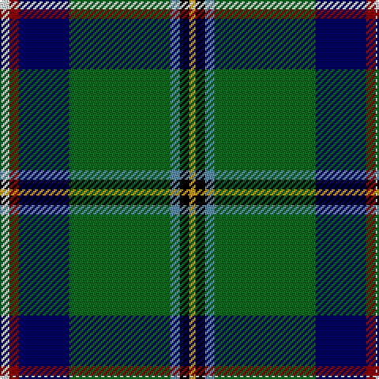

In pattern [WRBGBKY](/stripes/wrbgbky/).

This was sourced from register-of-tartans.  It is a [7 stripe tartan](/stripes/stripes7/).

Original link https://www.tartanregister.gov.uk/tartanDetails.aspx?ref=4495

## Attestations

This cloth appears in 2 source records; the oldest owns this page.

- 01/01/1988 — Washington State (register-of-tartans, [record](https://www.tartanregister.gov.uk/tartanDetails.aspx?ref=4495))
- 1988 — Washington State (US State) (tartans-authority, [record](http://www.tartansauthority.com/tartan-ferret/display/2133/))

## Register references

External register numbers recorded for this tartan.

- Scottish Register of Tartans: [4495](https://www.tartanregister.gov.uk/tartanDetails.aspx?ref=4495)
- Scottish Tartans Authority (ITI): 2133
- Scottish Tartans World Register: 2133

## Thread count
W/6 DR6 DB32 G64 B6 K6 DY/4

## Palette
Each colour and the base-6 reference it is a variant of.

| Colour | Shade | Base |
|---|---|---|
| B | <code style="background-color:#5C8CA8;">#5C8CA8</code> `oklch(61.7% 0.067 235.0)` <small>#5C8CA8</small> | B <code style="background-color:#2A418A;">#2A418A</code> |
| DB | <code style="background-color:#000064;">#000064</code> `oklch(22.7% 0.158 264.1)` <small>#000064</small> | B <code style="background-color:#2A418A;">#2A418A</code> |
| DBa | <code style="background-color:#00248C;">#00248C</code> `oklch(32.9% 0.174 263.4)` <small>#00248C</small> | B <code style="background-color:#2A418A;">#2A418A</code> |
| DG | <code style="background-color:#003014;">#003014</code> `oklch(27.1% 0.071 152.1)` <small>#003014</small> | G <code style="background-color:#006100;">#006100</code> |
| DR | <code style="background-color:#8C0000;">#8C0000</code> `oklch(40.2% 0.165 29.2)` <small>#8C0000</small> | R <code style="background-color:#CC0000;">#CC0000</code> |
| DY | <code style="background-color:#C89800;">#C89800</code> `oklch(70.6% 0.144 85.9)` <small>#C89800</small> | Y <code style="background-color:#F2BF00;">#F2BF00</code> |
| G | <code style="background-color:#006818;">#006818</code> `oklch(45.0% 0.142 145.0)` <small>#006818</small> | G <code style="background-color:#006100;">#006100</code> |
| K | <code style="background-color:#000000;">#000000</code> `oklch(0.0% 0.000 0.0)` <small>#000000</small> | K <code style="background-color:#000000;">#000000</code> |
| LB | <code style="background-color:#98C8E8;">#98C8E8</code> `oklch(81.0% 0.068 237.9)` <small>#98C8E8</small> | W <code style="background-color:#F7F7F7;">#F7F7F7</code> |
| LP | <code style="background-color:#A8ACE8;">#A8ACE8</code> `oklch(76.3% 0.086 281.2)` <small>#A8ACE8</small> | W <code style="background-color:#F7F7F7;">#F7F7F7</code> |
| N | <code style="background-color:#C8C8C8;">#C8C8C8</code> `oklch(83.3% 0.000 89.9)` <small>#C8C8C8</small> | W <code style="background-color:#F7F7F7;">#F7F7F7</code> |
| W | <code style="background-color:#F8F8F8;">#F8F8F8</code> `oklch(97.9% 0.000 89.9)` <small>#F8F8F8</small> | W <code style="background-color:#F7F7F7;">#F7F7F7</code> |

# Sample pattern

## Nearest tartans

The nearest existing variants by ΔTartan distance.

1. [Scottish Ambulance Service (Corporat](/setts/s9/r3t16k12g2k2dg32t2dg2lb3~x2/) — ΔT 0.96
1. [Brooke](/setts/s9/b2lb1b2k16g20k14r2w2ly2~x2/) — ΔT 1.07
1. [Washington District Tartan Tartan Number: 2148. Earliest known date: 1988 The Washington State tartan was a project of the Vancouver U.S.A. Country Dancers. It was designed by Margaret McLeod van Nus and Frank Cannonito in order to commemorate the Washington State Centennial celebrations. Governor Booth Gardner signed the bill into law, adopting the design on behalf of the House of Representatives in 1991. The tartan is accredited by the Scottish Tartans Society. See products available Copyright © Blair Urquhart, Comrie, 2015](/setts/s7/w3r4db13g37t3k3ly2~x2/) — ΔT 1.08
1. [Young Enterprise Scotland](/setts/s7/ly3k8o3g4g4dt22ly2~x2/) — ΔT 1.24
1. [Wishart, hunting](/setts/s7/k2db2g16db2ly1db13w2~x2/) — ΔT 1.28
1. [Canadian Centennial](/setts/s8/r3w6r2g32db36k2db4ly2~x2/) — ΔT 1.31
1. [Washington](/setts/s7/w3r4db13g37b3k3ly2~x2/) — ΔT 1.31
1. [Nova Scotia](/setts/s9/w2db20dg2g2dg2g4dg8ly2r1~x2/) — ΔT 1.34
1. [Vipont](/setts/s7/r4g14k3lp3g12db36w4~x2/) — ΔT 1.41
1. [Royal British Legion (Corporate)](/setts/s7/r3lb2g20k3db8g2lb2~x2/) — ΔT 1.43

## Neighbour map

Every grey dot is one of 14299 variants placed by the first two principal components of the ΔTartan feature space (44% of its variance). Red is this tartan; blue dots are its nearest — click one to open its page.

<svg viewBox="0 0 640 380" role="img" style="max-width:100%;height:auto;border:1px solid #e0e0e0;border-radius:4px;display:block" xmlns="http://www.w3.org/2000/svg"><image href="/nn/cloud.v1.png" width="640" height="380"/><a href="/setts/s9/r3t16k12g2k2dg32t2dg2lb3~x2/"><circle cx="185.1" cy="104.2" r="4" fill="#3465a4"><title>Scottish Ambulance Service (Corporat</title></circle></a><a href="/setts/s9/b2lb1b2k16g20k14r2w2ly2~x2/"><circle cx="207.4" cy="100.0" r="4" fill="#3465a4"><title>Brooke</title></circle></a><a href="/setts/s7/w3r4db13g37t3k3ly2~x2/"><circle cx="283.5" cy="115.3" r="4" fill="#3465a4"><title>Washington District Tartan Tartan Number: 2148. Earliest known date: 1988 The Washington State tartan was a project of the Vancouver U.S.A. Country Dancers. It was designed by Margaret McLeod van Nus and Frank Cannonito in order to commemorate the Washington State Centennial celebrations. Governor Booth Gardner signed the bill into law, adopting the design on behalf of the House of Representatives in 1991. The tartan is accredited by the Scottish Tartans Society. See products available Copyright © Blair Urquhart, Comrie, 2015</title></circle></a><a href="/setts/s7/ly3k8o3g4g4dt22ly2~x2/"><circle cx="171.4" cy="139.9" r="4" fill="#3465a4"><title>Young Enterprise Scotland</title></circle></a><a href="/setts/s7/k2db2g16db2ly1db13w2~x2/"><circle cx="194.4" cy="139.0" r="4" fill="#3465a4"><title>Wishart, hunting</title></circle></a><a href="/setts/s8/r3w6r2g32db36k2db4ly2~x2/"><circle cx="243.3" cy="120.5" r="4" fill="#3465a4"><title>Canadian Centennial</title></circle></a><a href="/setts/s7/w3r4db13g37b3k3ly2~x2/"><circle cx="270.2" cy="108.2" r="4" fill="#3465a4"><title>Washington</title></circle></a><a href="/setts/s9/w2db20dg2g2dg2g4dg8ly2r1~x2/"><circle cx="231.7" cy="115.2" r="4" fill="#3465a4"><title>Nova Scotia</title></circle></a><a href="/setts/s7/r4g14k3lp3g12db36w4~x2/"><circle cx="221.1" cy="154.1" r="4" fill="#3465a4"><title>Vipont</title></circle></a><a href="/setts/s7/r3lb2g20k3db8g2lb2~x2/"><circle cx="219.2" cy="160.6" r="4" fill="#3465a4"><title>Royal British Legion (Corporate)</title></circle></a><circle cx="225.1" cy="118.6" r="5" fill="#c00000"/></svg>

ID: /setts/s7/w3r3db16g32t3k3ly2~x2/
