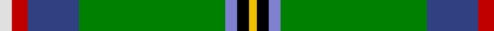
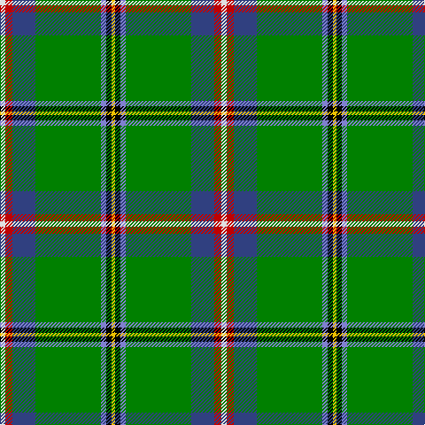

In pattern [WRBGBKY](/patterns/wrbgbky/).

This was sourced from weddslist.  It is a [7 stripes tartan](/stripes/stripes7/).

Original link http://www.weddslist.com/cgi-bin/tartans/pg.pl?source=sts

## Thread count
LN/6 R8 Ba26 G74 B6 K6 Y/4

## Palette
Each colour and its ΔE from the base-6 reference it is a variant of.

| Colour | Shade | Base | ΔE (OKLab) |
|---|---|---|---|
| B | <code style="background-color:#8080D0;">#8080D0</code> `#8080D0` | B <code style="background-color:#2A418A;">#2A418A</code> | 0.24 |
| Ba | <code style="background-color:#304080;">#304080</code> `#304080` | B <code style="background-color:#2A418A;">#2A418A</code> | 0.02 |
| G | <code style="background-color:#008000;">#008000</code> `#008000` | G <code style="background-color:#006100;">#006100</code> | 0.10 |
| K | <code style="background-color:#000000;">#000000</code> `#000000` | K <code style="background-color:#000000;">#000000</code> | 0.00 |
| LN | <code style="background-color:#E0E0E0;">#E0E0E0</code> `#E0E0E0` | W <code style="background-color:#F7F7F7;">#F7F7F7</code> | 0.07 |
| R | <code style="background-color:#C00000;">#C00000</code> `#C00000` | R <code style="background-color:#CC0000;">#CC0000</code> | 0.03 |
| Y | <code style="background-color:#F0C000;">#F0C000</code> `#F0C000` | Y <code style="background-color:#F2BF00;">#F2BF00</code> | 0.00 |

# Sample pattern

## Nearest tartans

The nearest existing variants by ΔTartan distance.

1. [Washington District Tartan Tartan Number: 2148. Earliest known date: 1988 The Washington State tartan was a project of the Vancouver U.S.A. Country Dancers. It was designed by Margaret McLeod van Nus and Frank Cannonito in order to commemorate the Washington State Centennial celebrations. Governor Booth Gardner signed the bill into law, adopting the design on behalf of the House of Representatives in 1991. The tartan is accredited by the Scottish Tartans Society. See products available Copyright © Blair Urquhart, Comrie, 2015](/setts/s7/w3r4b13g37ba3k3y2~b2c2c80-ba2888c4-g006818-k101010-rc80000-we0e0e0-ye8c000~x2/) — ΔT 0.71
1. [Muskoka Canadian Tartan Tartan Number: 1799. Earliest known date: pre 2003 A note in the Highland Society of London collection reads, 'Murray (Tullibardine) This piece of cloth was made in 1794'. The sample is woven at 54 threads to the inch. The full sett measures 15 and one quarter inches. (A. Nisbet, 1988). See products available Copyright © Blair Urquhart, Comrie, 2015](/setts/s8/w4g10b24g42r3y4ra4y2~b5c8ca8-g006818-rc80000-ra880000-we0e0e0-ye8c000/) — ΔT 1.13
1. [Lambert Kai (Personal)](/setts/s8/k3g34b10g5r2k8ga2w3~b1474b4-g006818-ga604000-k101010-rc8002c-wfcfcfc~x2/) — ΔT 1.14
1. [Washington State](/setts/s7/w3r3b16g32ba3k3y2~b000064-ba5c8ca8-g006818-k000000-r8c0000-wf8f8f8-yc89800~x2/) — ΔT 1.31
1. [Nor Westers Commemorative Tartan Tartan Number: 1067. Earliest known date: 1963 Named after the Nor Westers Mountain Range in Ontario. Designed by Miss Evelyn B Halliday in February 1963 to commemorate the naming of the range in that year. Variation See products available Copyright © Blair Urquhart, Comrie, 2015](/setts/s9/k1g23k1y3k1w8r1b5k1~b5c8ca8-g006818-k101010-rc80000-we0e0e0-ye8c000~x2/) — ΔT 1.33
1. [Nor Westers Tartan Tartan Number: 1069. Earliest known date: 1963 Named after the Nor Westers Mountain Range in Ontario. Designed by Miss Evelyn B Halliday in February 1963 to commemorate the naming of the range in that year See products available Copyright © Blair Urquhart, Comrie, 2015](/setts/s9/k1g15ga1y2ga1w6r1b3k1~b2c2c80-g006818-ga604000-k101010-rc80000-we0e0e0-ye8c000~x2/) — ΔT 1.36
1. [Highland, Green (Corporate)](/setts/s10/b4g13ba5y3bb6y3ba5bc6g28w2~b780078-ba2c2c80-bb5c8ca8-bc5c5c5c-g006818-wfcfcfc-ye8c000~x2/) — ΔT 1.40
1. [Nor Westers](/setts/s9/k1g23k1y3k1w8r1b5k1~b5480b0-g008000-k000000-rc00000-we0e0e0-yf0c000~x2/) — ΔT 1.52
1. [St Brigid's Parish Triple Celebratio](/setts/s9/b2g12k1ba5w3ba5k1ga30y2~b38409c-ba1474b4-g604000-ga006818-k101010-wfcfcfc-yfccc00~x2/) — ΔT 1.54
1. [Offally County Crest (Fashion)](/setts/s11/y24k8w4k6g76k8wa14g4k9g12ya10~g006818-k101010-wf0bcbc-wae0e0e0-ye8c000-yabc8c00/) — ΔT 1.55

## Neighbour map

Every grey dot is one of 15726 variants placed by the first two principal components of the ΔTartan feature space (44% of its variance). Red is this tartan; blue dots are its nearest — click one to open its page.

<svg viewBox="0 0 640 380" role="img" style="max-width:100%;height:auto;border:1px solid #e0e0e0;border-radius:4px;display:block" xmlns="http://www.w3.org/2000/svg"><image href="/nn/cloud.v1.png" width="640" height="380"/><a href="/setts/s7/w3r4b13g37ba3k3y2~b2c2c80-ba2888c4-g006818-k101010-rc80000-we0e0e0-ye8c000~x2/"><circle cx="280.7" cy="112.5" r="4" fill="#3465a4"><title>Washington District Tartan Tartan Number: 2148. Earliest known date: 1988 The Washington State tartan was a project of the Vancouver U.S.A. Country Dancers. It was designed by Margaret McLeod van Nus and Frank Cannonito in order to commemorate the Washington State Centennial celebrations. Governor Booth Gardner signed the bill into law, adopting the design on behalf of the House of Representatives in 1991. The tartan is accredited by the Scottish Tartans Society. See products available Copyright © Blair Urquhart, Comrie, 2015</title></circle></a><a href="/setts/s8/w4g10b24g42r3y4ra4y2~b5c8ca8-g006818-rc80000-ra880000-we0e0e0-ye8c000/"><circle cx="290.7" cy="113.3" r="4" fill="#3465a4"><title>Muskoka Canadian Tartan Tartan Number: 1799. Earliest known date: pre 2003 A note in the Highland Society of London collection reads, 'Murray (Tullibardine) This piece of cloth was made in 1794'. The sample is woven at 54 threads to the inch. The full sett measures 15 and one quarter inches. (A. Nisbet, 1988). See products available Copyright © Blair Urquhart, Comrie, 2015</title></circle></a><a href="/setts/s8/k3g34b10g5r2k8ga2w3~b1474b4-g006818-ga604000-k101010-rc8002c-wfcfcfc~x2/"><circle cx="297.5" cy="133.2" r="4" fill="#3465a4"><title>Lambert Kai (Personal)</title></circle></a><a href="/setts/s7/w3r3b16g32ba3k3y2~b000064-ba5c8ca8-g006818-k000000-r8c0000-wf8f8f8-yc89800~x2/"><circle cx="221.5" cy="116.9" r="4" fill="#3465a4"><title>Washington State</title></circle></a><a href="/setts/s9/k1g23k1y3k1w8r1b5k1~b5c8ca8-g006818-k101010-rc80000-we0e0e0-ye8c000~x2/"><circle cx="250.3" cy="87.9" r="4" fill="#3465a4"><title>Nor Westers Commemorative Tartan Tartan Number: 1067. Earliest known date: 1963 Named after the Nor Westers Mountain Range in Ontario. Designed by Miss Evelyn B Halliday in February 1963 to commemorate the naming of the range in that year. Variation See products available Copyright © Blair Urquhart, Comrie, 2015</title></circle></a><a href="/setts/s9/k1g15ga1y2ga1w6r1b3k1~b2c2c80-g006818-ga604000-k101010-rc80000-we0e0e0-ye8c000~x2/"><circle cx="183.8" cy="90.1" r="4" fill="#3465a4"><title>Nor Westers Tartan Tartan Number: 1069. Earliest known date: 1963 Named after the Nor Westers Mountain Range in Ontario. Designed by Miss Evelyn B Halliday in February 1963 to commemorate the naming of the range in that year See products available Copyright © Blair Urquhart, Comrie, 2015</title></circle></a><a href="/setts/s10/b4g13ba5y3bb6y3ba5bc6g28w2~b780078-ba2c2c80-bb5c8ca8-bc5c5c5c-g006818-wfcfcfc-ye8c000~x2/"><circle cx="230.3" cy="124.3" r="4" fill="#3465a4"><title>Highland, Green (Corporate)</title></circle></a><a href="/setts/s9/k1g23k1y3k1w8r1b5k1~b5480b0-g008000-k000000-rc00000-we0e0e0-yf0c000~x2/"><circle cx="239.1" cy="84.2" r="4" fill="#3465a4"><title>Nor Westers</title></circle></a><a href="/setts/s9/b2g12k1ba5w3ba5k1ga30y2~b38409c-ba1474b4-g604000-ga006818-k101010-wfcfcfc-yfccc00~x2/"><circle cx="256.0" cy="84.6" r="4" fill="#3465a4"><title>St Brigid's Parish Triple Celebratio</title></circle></a><a href="/setts/s11/y24k8w4k6g76k8wa14g4k9g12ya10~g006818-k101010-wf0bcbc-wae0e0e0-ye8c000-yabc8c00/"><circle cx="233.6" cy="94.9" r="4" fill="#3465a4"><title>Offally County Crest (Fashion)</title></circle></a><circle cx="267.4" cy="106.7" r="5" fill="#c00000"/></svg>

ID: /setts/s7/w3r4b13g37ba3k3y2~b304080-ba8080d0-g008000-k000000-rc00000-we0e0e0-yf0c000~x2/
