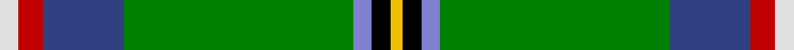

This page is one **sett** — a single exact thread-count. It belongs to the [tartan](/tartans/w3r4db13g37b3k3ly2/)
(the same proportion at any scale), whose colour order is pattern [WRBGBKY](/stripes/wrbgbky/).

Sourced from weddslist.  It is a [7 stripe tartan](/stripes/stripes7/).

Original link http://www.weddslist.com/cgi-bin/tartans/pg.pl?source=sts

## Thread count
LN/6 R8 Ba26 G74 B6 K6 Y/4

## Palette

Palette: <strong>Tartan Register</strong> <small style="color:#888">(2 of 7 colours)</small>
<table><thead><tr><th>Colour</th><th>Threads</th><th>Shade</th><th>Base</th><th>OKLCh</th></tr></thead><tbody><tr><td>LN/</td><td style="text-align:right;font-variant-numeric:tabular-nums">6</td><td><code style="background-color:#E0E0E0;">#E0E0E0</code> <small style="color:#888">#E0E0E0</small></td><td>W <code style="background-color:#F7F7F7;">#F7F7F7</code></td><td><small style="color:#888">oklch(90.7% 0.000 89.9)</small></td></tr><tr><td>R</td><td style="text-align:right;font-variant-numeric:tabular-nums">8</td><td><code style="background-color:#C00000;">#C00000</code> <small style="color:#888">#C00000</small></td><td>R <code style="background-color:#CC0000;">#CC0000</code></td><td><small style="color:#888">oklch(50.7% 0.208 29.2)</small></td></tr><tr><td>Ba</td><td style="text-align:right;font-variant-numeric:tabular-nums">26</td><td><code style="background-color:#304080;">#304080</code> <small style="color:#888">#304080</small></td><td>B <code style="background-color:#2A418A;">#2A418A</code></td><td><small style="color:#888">oklch(39.4% 0.109 270.2)</small></td></tr><tr><td>G</td><td style="text-align:right;font-variant-numeric:tabular-nums">74</td><td><code style="background-color:#008000;">#008000</code> <small style="color:#888">#008000</small></td><td>G <code style="background-color:#006100;">#006100</code></td><td><small style="color:#888">oklch(52.0% 0.177 142.5)</small></td></tr><tr><td>B</td><td style="text-align:right;font-variant-numeric:tabular-nums">6</td><td><code style="background-color:#8080D0;">#8080D0</code> <small style="color:#888">#8080D0</small></td><td>B <code style="background-color:#2A418A;">#2A418A</code></td><td><small style="color:#888">oklch(63.4% 0.119 282.5)</small></td></tr><tr><td>K</td><td style="text-align:right;font-variant-numeric:tabular-nums">6</td><td><code style="background-color:#000000;">#000000</code> <small style="color:#888">#000000</small></td><td>K <code style="background-color:#000000;">#000000</code></td><td><small style="color:#888">oklch(0.0% 0.000 0.0)</small></td></tr><tr><td>Y/</td><td style="text-align:right;font-variant-numeric:tabular-nums">4</td><td><code style="background-color:#F0C000;">#F0C000</code> <small style="color:#888">#F0C000</small></td><td>Y <code style="background-color:#F2BF00;">#F2BF00</code></td><td><small style="color:#888">oklch(82.7% 0.169 90.5)</small></td></tr></tbody></table>

# Sample pattern

## Nearest tartans

The nearest existing variants by ΔTartan distance, with this tartan at the top so the swatches line up against it.

ΔTartan

Tartan

Sett

—

<a href="/ttd/edit/#slug=w3r4db13g37b3k3ly2~x2">Washington</a> <a class="nn-out" href="/setts/s7/w3r4db13g37b3k3ly2~x2/" title="open its dictionary page">↗</a>

0.71

<a href="/ttd/edit/#slug=w3r4db13g37t3k3ly2~x2">Washington District Tartan Tartan Number: 2148. Earliest known date: 1988 The Washington State tartan was a project of the Vancouver U.S.A. Country Dancers. It was designed by Margaret McLeod van Nus and Frank Cannonito in order to commemorate the Washington State Centennial celebrations. Governor Booth Gardner signed the bill into law, adopting the design on behalf of the House of Representatives in 1991. The tartan is accredited by the Scottish Tartans Society. See products available Copyright © Blair Urquhart, Comrie, 2015</a> <a class="nn-out" href="/setts/s7/w3r4db13g37t3k3ly2~x2/" title="open its dictionary page">↗</a>

1.12

<a href="/ttd/edit/#slug=w4g10t24g42r3ly4r4ly2">Muskoka Canadian Tartan Tartan Number: 1799. Earliest known date: pre 2003 A note in the Highland Society of London collection reads, 'Murray (Tullibardine) This piece of cloth was made in 1794'. The sample is woven at 54 threads to the inch. The full sett measures 15 and one quarter inches. (A. Nisbet, 1988). See products available Copyright © Blair Urquhart, Comrie, 2015</a> <a class="nn-out" href="/setts/s8/w4g10t24g42r3ly4r4ly2/" title="open its dictionary page">↗</a>

1.15

<a href="/ttd/edit/#slug=k3g34b10g5r2k8dy2w3~x2">Lambert Kai (Personal)</a> <a class="nn-out" href="/setts/s8/k3g34b10g5r2k8dy2w3~x2/" title="open its dictionary page">↗</a>

1.31

<a href="/ttd/edit/#slug=w3r3db16g32t3k3ly2~x2">Washington State</a> <a class="nn-out" href="/setts/s7/w3r3db16g32t3k3ly2~x2/" title="open its dictionary page">↗</a>

1.36

<a href="/ttd/edit/#slug=k1g15dy1ly2dy1w6r1db3k1~x2">Nor Westers Tartan Tartan Number: 1069. Earliest known date: 1963 Named after the Nor Westers Mountain Range in Ontario. Designed by Miss Evelyn B Halliday in February 1963 to commemorate the naming of the range in that year See products available Copyright © Blair Urquhart, Comrie, 2015</a> <a class="nn-out" href="/setts/s9/k1g15dy1ly2dy1w6r1db3k1~x2/" title="open its dictionary page">↗</a>

1.40

<a href="/ttd/edit/#slug=dp4g13db5ly3t6ly3db5n6g28w2~x2">Highland, Green (Corporate)</a> <a class="nn-out" href="/setts/s10/dp4g13db5ly3t6ly3db5n6g28w2~x2/" title="open its dictionary page">↗</a>

1.53

<a href="/ttd/edit/#slug=k1g23k1ly3k1w8r1t5k1~x2">Nor Westers</a> <a class="nn-out" href="/setts/s9/k1g23k1ly3k1w8r1t5k1~x2/" title="open its dictionary page">↗</a>

1.53

<a href="/ttd/edit/#slug=db2dy12k1b5w3b5k1g30ly2~x2">St Brigid's Parish Triple Celebratio</a> <a class="nn-out" href="/setts/s9/db2dy12k1b5w3b5k1g30ly2~x2/" title="open its dictionary page">↗</a>

1.55

<a href="/ttd/edit/#slug=ly24k8lp4k6g76k8w14g4k9g12lo10">Offally County Crest (Fashion)</a> <a class="nn-out" href="/setts/s11/ly24k8lp4k6g76k8w14g4k9g12lo10/" title="open its dictionary page">↗</a>

1.57

<a href="/ttd/edit/#slug=g36dg5db17w2g14y3p2~x2">Mounth, The, (rejected)</a> <a class="nn-out" href="/setts/s7/g36dg5db17w2g14y3p2~x2/" title="open its dictionary page">↗</a>

## Neighbour map

Every grey dot is one of 14299 variants placed by the first two principal components of the ΔTartan feature space (44% of its variance). Red is this tartan; blue dots are its nearest — click one to open its page.

<svg viewBox="0 0 640 380" role="img" style="max-width:100%;height:auto;border:1px solid #e0e0e0;border-radius:4px;display:block" xmlns="http://www.w3.org/2000/svg"><image href="/nn/cloud.v1.png" width="640" height="380"/><a href="/setts/s7/w3r4db13g37t3k3ly2~x2/"><circle cx="283.5" cy="115.3" r="4" fill="#3465a4"><title>Washington District Tartan Tartan Number: 2148. Earliest known date: 1988 The Washington State tartan was a project of the Vancouver U.S.A. Country Dancers. It was designed by Margaret McLeod van Nus and Frank Cannonito in order to commemorate the Washington State Centennial celebrations. Governor Booth Gardner signed the bill into law, adopting the design on behalf of the House of Representatives in 1991. The tartan is accredited by the Scottish Tartans Society. See products available Copyright © Blair Urquhart, Comrie, 2015</title></circle></a><a href="/setts/s8/w4g10t24g42r3ly4r4ly2/"><circle cx="293.0" cy="117.8" r="4" fill="#3465a4"><title>Muskoka Canadian Tartan Tartan Number: 1799. Earliest known date: pre 2003 A note in the Highland Society of London collection reads, 'Murray (Tullibardine) This piece of cloth was made in 1794'. The sample is woven at 54 threads to the inch. The full sett measures 15 and one quarter inches. (A. Nisbet, 1988). See products available Copyright © Blair Urquhart, Comrie, 2015</title></circle></a><a href="/setts/s8/k3g34b10g5r2k8dy2w3~x2/"><circle cx="300.4" cy="135.7" r="4" fill="#3465a4"><title>Lambert Kai (Personal)</title></circle></a><a href="/setts/s7/w3r3db16g32t3k3ly2~x2/"><circle cx="225.1" cy="118.6" r="4" fill="#3465a4"><title>Washington State</title></circle></a><a href="/setts/s9/k1g15dy1ly2dy1w6r1db3k1~x2/"><circle cx="186.7" cy="91.2" r="4" fill="#3465a4"><title>Nor Westers Tartan Tartan Number: 1069. Earliest known date: 1963 Named after the Nor Westers Mountain Range in Ontario. Designed by Miss Evelyn B Halliday in February 1963 to commemorate the naming of the range in that year See products available Copyright © Blair Urquhart, Comrie, 2015</title></circle></a><a href="/setts/s10/dp4g13db5ly3t6ly3db5n6g28w2~x2/"><circle cx="233.0" cy="128.8" r="4" fill="#3465a4"><title>Highland, Green (Corporate)</title></circle></a><a href="/setts/s9/k1g23k1ly3k1w8r1t5k1~x2/"><circle cx="242.1" cy="83.6" r="4" fill="#3465a4"><title>Nor Westers</title></circle></a><a href="/setts/s9/db2dy12k1b5w3b5k1g30ly2~x2/"><circle cx="258.9" cy="90.5" r="4" fill="#3465a4"><title>St Brigid's Parish Triple Celebratio</title></circle></a><a href="/setts/s11/ly24k8lp4k6g76k8w14g4k9g12lo10/"><circle cx="236.4" cy="95.0" r="4" fill="#3465a4"><title>Offally County Crest (Fashion)</title></circle></a><a href="/setts/s7/g36dg5db17w2g14y3p2~x2/"><circle cx="322.3" cy="150.5" r="4" fill="#3465a4"><title>Mounth, The, (rejected)</title></circle></a><circle cx="270.2" cy="108.2" r="5" fill="#c00000"/></svg>

ID: /setts/s7/w3r4db13g37b3k3ly2~x2/
