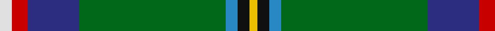
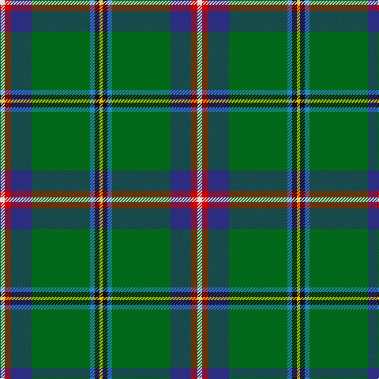

This page is one **sett** — a single exact thread-count. It belongs to the [tartan](/tartans/ln3r4db13g37b3k3y2/)
(the same proportion at any scale), whose colour order is pattern [WRBGBKY](/stripes/wrbgbky/).

Sourced from house-of-tartan.  It is a [7 stripe tartan](/stripes/stripes7/).

Original link http://www.house-of-tartan.scotland.net/house/TartanViewjs.asp?colr=Def&tnam=2148

## Thread count
LN/6 R8 DB26 G74 B6 K6 Y/4

## Palette
Each colour and the base-6 reference it is a variant of.

| Colour | Shade | Base |
|---|---|---|
| B | <code style="background-color:#2888C4;">#2888C4</code> `oklch(60.1% 0.125 241.5)` <small>#2888C4</small> | B <code style="background-color:#2A418A;">#2A418A</code> |
| DB | <code style="background-color:#2C2C80;">#2C2C80</code> `oklch(35.0% 0.138 276.6)` <small>#2C2C80</small> | B <code style="background-color:#2A418A;">#2A418A</code> |
| G | <code style="background-color:#006818;">#006818</code> `oklch(45.0% 0.142 145.0)` <small>#006818</small> | G <code style="background-color:#006100;">#006100</code> |
| K | <code style="background-color:#101010;">#101010</code> `oklch(17.3% 0.000 89.9)` <small>#101010</small> | K <code style="background-color:#000000;">#000000</code> |
| LN | <code style="background-color:#E0E0E0;">#E0E0E0</code> `oklch(90.7% 0.000 89.9)` <small>#E0E0E0</small> | W <code style="background-color:#F7F7F7;">#F7F7F7</code> |
| R | <code style="background-color:#C80000;">#C80000</code> `oklch(52.3% 0.215 29.2)` <small>#C80000</small> | R <code style="background-color:#CC0000;">#CC0000</code> |
| Y | <code style="background-color:#E8C000;">#E8C000</code> `oklch(81.9% 0.168 93.7)` <small>#E8C000</small> | Y <code style="background-color:#F2BF00;">#F2BF00</code> |

# Sample pattern

## Nearest tartans

The nearest existing variants by ΔTartan distance, with this tartan at the top so the swatches line up against it.

ΔTartan

Tartan

Sett

—

<a href="/ttd/edit/#slug=w3r4db13g37t3k3ly2~x2">Washington District Tartan Tartan Number: 2148. Earliest known date: 1988 The Washington State tartan was a project of the Vancouver U.S.A. Country Dancers. It was designed by Margaret McLeod van Nus and Frank Cannonito in order to commemorate the Washington State Centennial celebrations. Governor Booth Gardner signed the bill into law, adopting the design on behalf of the House of Representatives in 1991. The tartan is accredited by the Scottish Tartans Society. See products available Copyright © Blair Urquhart, Comrie, 2015</a> <a class="nn-out" href="/setts/s7/w3r4db13g37t3k3ly2~x2/" title="open its dictionary page">↗</a>

0.71

<a href="/ttd/edit/#slug=w3r4db13g37b3k3ly2~x2">Washington</a> <a class="nn-out" href="/setts/s7/w3r4db13g37b3k3ly2~x2/" title="open its dictionary page">↗</a>

1.01

<a href="/ttd/edit/#slug=k3g34b10g5r2k8dy2w3~x2">Lambert Kai (Personal)</a> <a class="nn-out" href="/setts/s8/k3g34b10g5r2k8dy2w3~x2/" title="open its dictionary page">↗</a>

1.08

<a href="/ttd/edit/#slug=w3r3db16g32t3k3ly2~x2">Washington State</a> <a class="nn-out" href="/setts/s7/w3r3db16g32t3k3ly2~x2/" title="open its dictionary page">↗</a>

1.13

<a href="/ttd/edit/#slug=w4g10t24g42r3ly4r4ly2">Muskoka Canadian Tartan Tartan Number: 1799. Earliest known date: pre 2003 A note in the Highland Society of London collection reads, 'Murray (Tullibardine) This piece of cloth was made in 1794'. The sample is woven at 54 threads to the inch. The full sett measures 15 and one quarter inches. (A. Nisbet, 1988). See products available Copyright © Blair Urquhart, Comrie, 2015</a> <a class="nn-out" href="/setts/s8/w4g10t24g42r3ly4r4ly2/" title="open its dictionary page">↗</a>

1.25

<a href="/ttd/edit/#slug=dp4g13db5ly3t6ly3db5n6g28w2~x2">Highland, Green (Corporate)</a> <a class="nn-out" href="/setts/s10/dp4g13db5ly3t6ly3db5n6g28w2~x2/" title="open its dictionary page">↗</a>

1.40

<a href="/ttd/edit/#slug=db2dy12k1b5w3b5k1g30ly2~x2">St Brigid's Parish Triple Celebratio</a> <a class="nn-out" href="/setts/s9/db2dy12k1b5w3b5k1g30ly2~x2/" title="open its dictionary page">↗</a>

1.43

<a href="/ttd/edit/#slug=db6k17y4g51ly3g4~x2">U.S. Army (Military)</a> <a class="nn-out" href="/setts/s6/db6k17y4g51ly3g4~x2/" title="open its dictionary page">↗</a>

1.44

<a href="/ttd/edit/#slug=r3w6r2g32db36k2db4ly2~x2">Canadian Centennial</a> <a class="nn-out" href="/setts/s8/r3w6r2g32db36k2db4ly2~x2/" title="open its dictionary page">↗</a>

1.48

<a href="/ttd/edit/#slug=g22r3k1g2r3t16k3ly2~x4">Stirling, University of Corporate Univ Tartan Tartan Number: 2297. Earliest known date: 1994 This is the accepted University design. See products available Copyright © Blair Urquhart, Comrie, 2015</a> <a class="nn-out" href="/setts/s8/g22r3k1g2r3t16k3ly2~x4/" title="open its dictionary page">↗</a>

1.50

<a href="/ttd/edit/#slug=ly3g6dg32r4ly2r2dp7dg2w2~x2">Pienaar (Personal)</a> <a class="nn-out" href="/setts/s9/ly3g6dg32r4ly2r2dp7dg2w2~x2/" title="open its dictionary page">↗</a>

## Neighbour map

Every grey dot is one of 14299 variants placed by the first two principal components of the ΔTartan feature space (44% of its variance). Red is this tartan; blue dots are its nearest — click one to open its page.

<svg viewBox="0 0 640 380" role="img" style="max-width:100%;height:auto;border:1px solid #e0e0e0;border-radius:4px;display:block" xmlns="http://www.w3.org/2000/svg"><image href="/nn/cloud.v1.png" width="640" height="380"/><a href="/setts/s7/w3r4db13g37b3k3ly2~x2/"><circle cx="270.2" cy="108.2" r="4" fill="#3465a4"><title>Washington</title></circle></a><a href="/setts/s8/k3g34b10g5r2k8dy2w3~x2/"><circle cx="300.4" cy="135.7" r="4" fill="#3465a4"><title>Lambert Kai (Personal)</title></circle></a><a href="/setts/s7/w3r3db16g32t3k3ly2~x2/"><circle cx="225.1" cy="118.6" r="4" fill="#3465a4"><title>Washington State</title></circle></a><a href="/setts/s8/w4g10t24g42r3ly4r4ly2/"><circle cx="293.0" cy="117.8" r="4" fill="#3465a4"><title>Muskoka Canadian Tartan Tartan Number: 1799. Earliest known date: pre 2003 A note in the Highland Society of London collection reads, 'Murray (Tullibardine) This piece of cloth was made in 1794'. The sample is woven at 54 threads to the inch. The full sett measures 15 and one quarter inches. (A. Nisbet, 1988). See products available Copyright © Blair Urquhart, Comrie, 2015</title></circle></a><a href="/setts/s10/dp4g13db5ly3t6ly3db5n6g28w2~x2/"><circle cx="233.0" cy="128.8" r="4" fill="#3465a4"><title>Highland, Green (Corporate)</title></circle></a><a href="/setts/s9/db2dy12k1b5w3b5k1g30ly2~x2/"><circle cx="258.9" cy="90.5" r="4" fill="#3465a4"><title>St Brigid's Parish Triple Celebratio</title></circle></a><a href="/setts/s6/db6k17y4g51ly3g4~x2/"><circle cx="339.8" cy="159.4" r="4" fill="#3465a4"><title>U.S. Army (Military)</title></circle></a><a href="/setts/s8/r3w6r2g32db36k2db4ly2~x2/"><circle cx="243.3" cy="120.5" r="4" fill="#3465a4"><title>Canadian Centennial</title></circle></a><a href="/setts/s8/g22r3k1g2r3t16k3ly2~x4/"><circle cx="250.4" cy="124.7" r="4" fill="#3465a4"><title>Stirling, University of Corporate Univ Tartan Tartan Number: 2297. Earliest known date: 1994 This is the accepted University design. See products available Copyright © Blair Urquhart, Comrie, 2015</title></circle></a><a href="/setts/s9/ly3g6dg32r4ly2r2dp7dg2w2~x2/"><circle cx="286.7" cy="112.0" r="4" fill="#3465a4"><title>Pienaar (Personal)</title></circle></a><circle cx="283.5" cy="115.3" r="5" fill="#c00000"/></svg>

ID: /setts/s7/w3r4db13g37t3k3ly2~x2/
