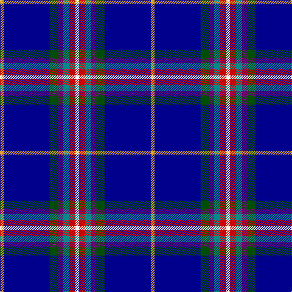

In pattern [WRGBGBY](/stripes/wrgbgby/).

This was sourced from register-of-tartans.  It is a [7 stripe tartan](/stripes/stripes7/).

Original link https://www.tartanregister.gov.uk/tartanDetails.aspx?ref=11383

## Register references

External register numbers recorded for this tartan.

- Scottish Register of Tartans: [11383](https://www.tartanregister.gov.uk/tartanDetails.aspx?ref=11383)

## Thread count
Y/6 DB76 G14 P8 B10 R10 W/6

## Palette
Each colour and the base-6 reference it is a variant of.

| Colour | Shade | Base |
|---|---|---|
| B | <code style="background-color:#048888;">#048888</code> `oklch(56.8% 0.096 194.8)` <small>#048888</small> | G <code style="background-color:#006100;">#006100</code> |
| DB | <code style="background-color:#00008C;">#00008C</code> `oklch(28.9% 0.200 264.1)` <small>#00008C</small> | B <code style="background-color:#2A418A;">#2A418A</code> |
| G | <code style="background-color:#004C00;">#004C00</code> `oklch(36.1% 0.123 142.5)` <small>#004C00</small> | G <code style="background-color:#006100;">#006100</code> |
| P | <code style="background-color:#6C0070;">#6C0070</code> `oklch(37.6% 0.174 326.5)` <small>#6C0070</small> | B <code style="background-color:#2A418A;">#2A418A</code> |
| R | <code style="background-color:#C80000;">#C80000</code> `oklch(52.3% 0.215 29.2)` <small>#C80000</small> | R <code style="background-color:#CC0000;">#CC0000</code> |
| W | <code style="background-color:#FFFFFF;">#FFFFFF</code> `oklch(100.0% 0.000 89.9)` <small>#FFFFFF</small> | W <code style="background-color:#F7F7F7;">#F7F7F7</code> |
| Y | <code style="background-color:#E0A126;">#E0A126</code> `oklch(75.1% 0.146 78.3)` <small>#E0A126</small> | Y <code style="background-color:#F2BF00;">#F2BF00</code> |

# Sample pattern

## Nearest tartans

The nearest existing variants by ΔTartan distance.

1. [U.S. Forces Thurso (Military)](/setts/s7/db40r3k10lo2lr15w2lr4~x2/) — ΔT 1.26
1. [Oren Peterson](/setts/s6/m1g2t10r1db15w1~x4/) — ΔT 1.29
1. [Ambulance Victoria](/setts/s10/db73k9ly3k5db13w3t7k5w7r16/) — ΔT 1.54
1. [Head of The Lakes](/setts/s10/g7lb2db28dg14dp5lb2dp5lb2db27b2~x2/) — ΔT 1.55
1. [Virginia International Tattoo Hixon](/setts/s8/lb8db10dt69w6dt6r8b19lb3/) — ΔT 1.59
1. [Wrigglesworth (Name)](/setts/s7/db30b10lb10db5m3ly3g3~x2/) — ΔT 1.59
1. [Unidentified, Lady's kilt](/setts/s8/db39o3k14o3t14ly4w2dr2~x2/) — ΔT 1.61
1. [Lambert, Patrice (Personal)](/setts/s8/w1dp3g6k1db12ly1db2ly1~x4/) — ΔT 1.68
1. [Lambert, Patrice (Personal)](/setts/s8/w1p3g6k1db12ly1db2ly1~x4/) — ΔT 1.68
1. [Marion (Personal)](/setts/s6/p5g8k5db32w2r2~x2/) — ΔT 1.69

## Neighbour map

Every grey dot is one of 14299 variants placed by the first two principal components of the ΔTartan feature space (44% of its variance). Red is this tartan; blue dots are its nearest — click one to open its page.

<svg viewBox="0 0 640 380" role="img" style="max-width:100%;height:auto;border:1px solid #e0e0e0;border-radius:4px;display:block" xmlns="http://www.w3.org/2000/svg"><image href="/nn/cloud.v1.png" width="640" height="380"/><a href="/setts/s7/db40r3k10lo2lr15w2lr4~x2/"><circle cx="259.8" cy="120.5" r="4" fill="#3465a4"><title>U.S. Forces Thurso (Military)</title></circle></a><a href="/setts/s6/m1g2t10r1db15w1~x4/"><circle cx="246.2" cy="144.0" r="4" fill="#3465a4"><title>Oren Peterson</title></circle></a><a href="/setts/s10/db73k9ly3k5db13w3t7k5w7r16/"><circle cx="231.1" cy="66.6" r="4" fill="#3465a4"><title>Ambulance Victoria</title></circle></a><a href="/setts/s10/g7lb2db28dg14dp5lb2dp5lb2db27b2~x2/"><circle cx="286.6" cy="145.1" r="4" fill="#3465a4"><title>Head of The Lakes</title></circle></a><a href="/setts/s8/lb8db10dt69w6dt6r8b19lb3/"><circle cx="299.5" cy="110.2" r="4" fill="#3465a4"><title>Virginia International Tattoo Hixon</title></circle></a><a href="/setts/s7/db30b10lb10db5m3ly3g3~x2/"><circle cx="238.7" cy="159.6" r="4" fill="#3465a4"><title>Wrigglesworth (Name)</title></circle></a><a href="/setts/s8/db39o3k14o3t14ly4w2dr2~x2/"><circle cx="207.9" cy="101.0" r="4" fill="#3465a4"><title>Unidentified, Lady's kilt</title></circle></a><a href="/setts/s8/w1dp3g6k1db12ly1db2ly1~x4/"><circle cx="235.4" cy="144.8" r="4" fill="#3465a4"><title>Lambert, Patrice (Personal)</title></circle></a><a href="/setts/s8/w1p3g6k1db12ly1db2ly1~x4/"><circle cx="203.3" cy="133.0" r="4" fill="#3465a4"><title>Lambert, Patrice (Personal)</title></circle></a><a href="/setts/s6/p5g8k5db32w2r2~x2/"><circle cx="318.5" cy="152.6" r="4" fill="#3465a4"><title>Marion (Personal)</title></circle></a><circle cx="258.0" cy="120.6" r="5" fill="#c00000"/></svg>

ID: /setts/s7/w3r5g5dp4dg7db38lo3~x2/
