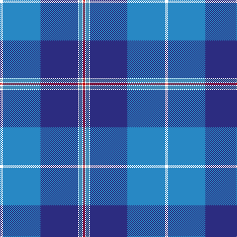

In pattern [RWBWBBW](/stripes/rwbwbbw/).

This was sourced from register-of-tartans.  It is a [7 stripe tartan](/stripes/stripes7/).

Original link https://www.tartanregister.gov.uk/tartanDetails.aspx?ref=321

## Attestations

This cloth appears in 2 source records; the oldest owns this page.

- 01/10/2005 — Bousie (Personal) (register-of-tartans, [record](https://www.tartanregister.gov.uk/tartanDetails.aspx?ref=321))
- 2005 October — Bousie (Personal) (tartans-authority, [record](http://www.tartansauthority.com/tartan-ferret/display/6795/))

## Register references

External register numbers recorded for this tartan.

- Scottish Register of Tartans: [321](https://www.tartanregister.gov.uk/tartanDetails.aspx?ref=321)
- Scottish Tartans Authority (ITI): 6795

## Thread count
W/6 B76 DB76 W2 Ba6 W2 R/4

## Palette
Each colour and its ΔE from the base-6 reference it is a variant of.

| Colour | Shade | Base | ΔE (OKLab) |
|---|---|---|---|
| B | <code style="background-color:#2888C4;">#2888C4</code> `#2888C4` | B <code style="background-color:#2A418A;">#2A418A</code> | 0.21 |
| Ba | <code style="background-color:#5C8CA8;">#5C8CA8</code> `#5C8CA8` | B <code style="background-color:#2A418A;">#2A418A</code> | 0.23 |
| Bb | <code style="background-color:#1474B4;">#1474B4</code> `#1474B4` | B <code style="background-color:#2A418A;">#2A418A</code> | 0.15 |
| DB | <code style="background-color:#2C2C80;">#2C2C80</code> `#2C2C80` | B <code style="background-color:#2A418A;">#2A418A</code> | 0.06 |
| R | <code style="background-color:#C80000;">#C80000</code> `#C80000` | R <code style="background-color:#CC0000;">#CC0000</code> | 0.01 |
| W | <code style="background-color:#FFFFFF;">#FFFFFF</code> `#FFFFFF` | W <code style="background-color:#F7F7F7;">#F7F7F7</code> | 0.02 |

# Sample pattern

## Nearest tartans

The nearest existing variants by ΔTartan distance.

1. [Musselburgh](/setts/s9/t14lb1t3lo2t3lb1t4db24r3~x4/) — ΔT 1.33
1. [Raith Rovers F.C.](/setts/s8/db6w2g2w3db24r1db35r2~x2/) — ΔT 1.44
1. [Musselburgh](/setts/s9/t14w1t3ly2t3w1t4db24r3~x2/) — ΔT 1.47
1. [Kirkcaldy](/setts/s6/t23w3k10r2db45ly1~x2/) — ΔT 1.51
1. [MacRaes of America](/setts/s8/w8db4ly2db36t48db2t4r5~x2/) — ΔT 1.53
1. [Mead (Personal)](/setts/s10/b36k3r6k3dt10r5dt3ly4k1b2~x2/) — ΔT 1.55
1. [Blue Knights, The](/setts/s9/w3lg15db6db2db1db2db1db21ly2~x2/) — ΔT 1.57
1. [Commonwealth Games 1986 (Corp)](/setts/s11/db3w1db1w1db2w3db15t2db2t22r2~x2/) — ΔT 1.58
1. [Edinburgh '86](/setts/s11/db6w2db2w2db4w6db28b4db4b45r4/) — ΔT 1.60
1. [Rikaco Morning Dew 1 (Fashion)](/setts/s10/db4w2db1t24db10w1db2w5db3r2~x2/) — ΔT 1.60

## Neighbour map

Every grey dot is one of 14299 variants placed by the first two principal components of the ΔTartan feature space (44% of its variance). Red is this tartan; blue dots are its nearest — click one to open its page.

<svg viewBox="0 0 640 380" role="img" style="max-width:100%;height:auto;border:1px solid #e0e0e0;border-radius:4px;display:block" xmlns="http://www.w3.org/2000/svg"><image href="/nn/cloud.v1.png" width="640" height="380"/><a href="/setts/s9/t14lb1t3lo2t3lb1t4db24r3~x4/"><circle cx="273.9" cy="122.6" r="4" fill="#3465a4"><title>Musselburgh</title></circle></a><a href="/setts/s8/db6w2g2w3db24r1db35r2~x2/"><circle cx="315.0" cy="122.0" r="4" fill="#3465a4"><title>Raith Rovers F.C.</title></circle></a><a href="/setts/s9/t14w1t3ly2t3w1t4db24r3~x2/"><circle cx="311.6" cy="140.5" r="4" fill="#3465a4"><title>Musselburgh</title></circle></a><a href="/setts/s6/t23w3k10r2db45ly1~x2/"><circle cx="326.2" cy="116.9" r="4" fill="#3465a4"><title>Kirkcaldy</title></circle></a><a href="/setts/s8/w8db4ly2db36t48db2t4r5~x2/"><circle cx="284.0" cy="120.4" r="4" fill="#3465a4"><title>MacRaes of America</title></circle></a><a href="/setts/s10/b36k3r6k3dt10r5dt3ly4k1b2~x2/"><circle cx="311.4" cy="95.4" r="4" fill="#3465a4"><title>Mead (Personal)</title></circle></a><a href="/setts/s9/w3lg15db6db2db1db2db1db21ly2~x2/"><circle cx="247.3" cy="126.2" r="4" fill="#3465a4"><title>Blue Knights, The</title></circle></a><a href="/setts/s11/db3w1db1w1db2w3db15t2db2t22r2~x2/"><circle cx="293.1" cy="124.7" r="4" fill="#3465a4"><title>Commonwealth Games 1986 (Corp)</title></circle></a><a href="/setts/s11/db6w2db2w2db4w6db28b4db4b45r4/"><circle cx="305.6" cy="127.8" r="4" fill="#3465a4"><title>Edinburgh '86</title></circle></a><a href="/setts/s10/db4w2db1t24db10w1db2w5db3r2~x2/"><circle cx="233.8" cy="107.6" r="4" fill="#3465a4"><title>Rikaco Morning Dew 1 (Fashion)</title></circle></a><circle cx="319.7" cy="119.5" r="5" fill="#c00000"/></svg>

ID: /setts/s7/w3t38db38w1t3w1r2~x2/
