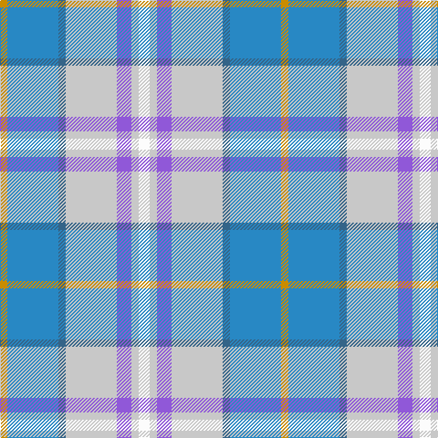

In pattern [WWBWBBY](/patterns/wwbwbby/).

This was sourced from tartans-authority.  It is a [7 stripes tartan](/stripes/stripes7/).

Original link http://www.tartansauthority.com/tartan-ferret/display/5343/

## Thread count
DY/8 Ba56 B8 N56 P16 N8 W/12

## Palette
Each colour and its ΔE from the base-6 reference it is a variant of.

| Colour | Shade | Base | ΔE (OKLab) |
|---|---|---|---|
| B | <code style="background-color:#346488;">#346488</code> `#346488` | B <code style="background-color:#2A418A;">#2A418A</code> | 0.11 |
| Ba | <code style="background-color:#2888C4;">#2888C4</code> `#2888C4` | B <code style="background-color:#2A418A;">#2A418A</code> | 0.21 |
| DY | <code style="background-color:#C88C00;">#C88C00</code> `#C88C00` | Y <code style="background-color:#F2BF00;">#F2BF00</code> | 0.15 |
| N | <code style="background-color:#C8C8C8;">#C8C8C8</code> `#C8C8C8` | W <code style="background-color:#F7F7F7;">#F7F7F7</code> | 0.14 |
| P | <code style="background-color:#9058D8;">#9058D8</code> `#9058D8` | B <code style="background-color:#2A418A;">#2A418A</code> | 0.21 |
| W | <code style="background-color:#FCFCFC;">#FCFCFC</code> `#FCFCFC` | W <code style="background-color:#F7F7F7;">#F7F7F7</code> | 0.01 |

# Sample pattern

## Nearest tartans

The nearest existing variants by ΔTartan distance.

1. [Curd (2013)](/setts/s8/b1y9w3ya3b9ya1g1r1x4~b5f749c-g649848-rc82828-we0e0e0-yafb8bb-yaf8e38c/) — ΔT 1.16
1. [Seaside](/setts/s12/w3wa2b4wa14ba2bb14y2bb14ba2wa14b4wa2x4~b9058d8-ba346488-bb2888c4-wfcfcfc-wac8c8c8-yc88c00/) — ΔT 1.19
1. [Deeside Plaid (Taobh Dhi) (District)](/setts/s7/y4b22g4r24ba6r4w3x2~b3850c8-ba780078-g006818-r888888-wfcfcfc-ye8c000/) — ΔT 1.36
1. [Bouguet, Adrian (Personal)](/setts/s11/w14b9w14y4g3wa3g3y4b14y2wb3x2~b5c8ca8-g005448-w98c8e8-wac8c8c8-wbffffff-yebb790/) — ΔT 1.42
1. [Atikokan](/setts/s7/y6b16w3r3ra3g3wa2x4~b0596fa-g309c18-rdc0000-rabe7832-wc0c0c0-wae0e0e0-ye8c000/) — ΔT 1.43
1. [Atikokan (District)](/setts/s7/y6b16w3g3r3ga3wa2x4~b2888c4-g886414-ga289c18-rc47c2c-wc0c0c0-wafcfcfc-yc48008/) — ΔT 1.62
1. [Ontex](/setts/s7/b4w1ba12y12r4bb1w2x4~b2c2c80-ba5c5c5c-bb2888c4-rb458ac-we0e0e0-ya0a0a0/) — ΔT 1.62
1. [Isle of Barra (District)](/setts/s6/b2w12ba11bb12k1g2x4~b780078-ba1474b4-bb2888c4-g289c18-k101010-we0e0e0/) — ΔT 1.66
1. [Atikokan](/setts/s7/y6b16w3r3ra3g3wa2x4~b8080d0-g30a010-rc00000-ra906030-wc0c0c0-wae0e0e0-yf0c000/) — ΔT 1.68
1. [Washington DC (Fashion)](/setts/s8/w5b32r5g6r5ra16r39y5x2~b1474b4-g006818-r888888-ra880000-we8ccb8-ybc8c00/) — ΔT 1.75

## Neighbour map

Every grey dot is one of 15726 variants placed by the first two principal components of the ΔTartan feature space (44% of its variance). Red is this tartan; blue dots are its nearest — click one to open its page.

<svg viewBox="0 0 640 380" role="img" style="max-width:100%;height:auto;border:1px solid #e0e0e0;border-radius:4px;display:block" xmlns="http://www.w3.org/2000/svg"><image href="/nn/cloud.v1.png" width="640" height="380"/><a href="/setts/s8/b1y9w3ya3b9ya1g1r1x4~b5f749c-g649848-rc82828-we0e0e0-yafb8bb-yaf8e38c/"><circle cx="163.0" cy="156.4" r="4" fill="#3465a4"><title>Curd (2013)</title></circle></a><a href="/setts/s12/w3wa2b4wa14ba2bb14y2bb14ba2wa14b4wa2x4~b9058d8-ba346488-bb2888c4-wfcfcfc-wac8c8c8-yc88c00/"><circle cx="176.1" cy="160.9" r="4" fill="#3465a4"><title>Seaside</title></circle></a><a href="/setts/s7/y4b22g4r24ba6r4w3x2~b3850c8-ba780078-g006818-r888888-wfcfcfc-ye8c000/"><circle cx="176.8" cy="172.0" r="4" fill="#3465a4"><title>Deeside Plaid (Taobh Dhi) (District)</title></circle></a><a href="/setts/s11/w14b9w14y4g3wa3g3y4b14y2wb3x2~b5c8ca8-g005448-w98c8e8-wac8c8c8-wbffffff-yebb790/"><circle cx="150.9" cy="177.9" r="4" fill="#3465a4"><title>Bouguet, Adrian (Personal)</title></circle></a><a href="/setts/s7/y6b16w3r3ra3g3wa2x4~b0596fa-g309c18-rdc0000-rabe7832-wc0c0c0-wae0e0e0-ye8c000/"><circle cx="137.5" cy="146.4" r="4" fill="#3465a4"><title>Atikokan</title></circle></a><a href="/setts/s7/y6b16w3g3r3ga3wa2x4~b2888c4-g886414-ga289c18-rc47c2c-wc0c0c0-wafcfcfc-yc48008/"><circle cx="165.9" cy="160.5" r="4" fill="#3465a4"><title>Atikokan (District)</title></circle></a><a href="/setts/s7/b4w1ba12y12r4bb1w2x4~b2c2c80-ba5c5c5c-bb2888c4-rb458ac-we0e0e0-ya0a0a0/"><circle cx="162.0" cy="160.6" r="4" fill="#3465a4"><title>Ontex</title></circle></a><a href="/setts/s6/b2w12ba11bb12k1g2x4~b780078-ba1474b4-bb2888c4-g289c18-k101010-we0e0e0/"><circle cx="111.7" cy="169.8" r="4" fill="#3465a4"><title>Isle of Barra (District)</title></circle></a><a href="/setts/s7/y6b16w3r3ra3g3wa2x4~b8080d0-g30a010-rc00000-ra906030-wc0c0c0-wae0e0e0-yf0c000/"><circle cx="154.2" cy="147.1" r="4" fill="#3465a4"><title>Atikokan</title></circle></a><a href="/setts/s8/w5b32r5g6r5ra16r39y5x2~b1474b4-g006818-r888888-ra880000-we8ccb8-ybc8c00/"><circle cx="214.2" cy="179.6" r="4" fill="#3465a4"><title>Washington DC (Fashion)</title></circle></a><circle cx="164.4" cy="175.7" r="5" fill="#c00000"/></svg>

ID: /setts/s7/w3wa2b4wa14ba2bb14y2x4~b9058d8-ba346488-bb2888c4-wfcfcfc-wac8c8c8-yc88c00/
