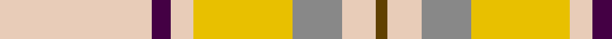
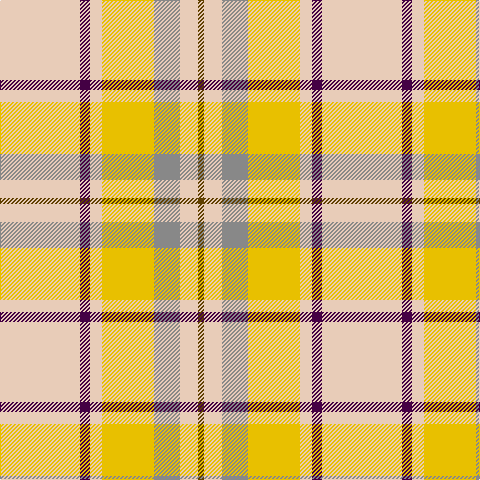

In pattern [GWRYWBW](/patterns/gwrywbw/).

This was sourced from tartans-authority.  It is a [7 stripes tartan](/stripes/stripes7/).

Original link http://www.tartansauthority.com/tartan-ferret/display/10577/

## Thread count
LR/80 DP10 LR12 Y52 N26 LR18 T/6

## Palette
Each colour and its ΔE from the base-6 reference it is a variant of.

| Colour | Shade | Base | ΔE (OKLab) |
|---|---|---|---|
| DP | <code style="background-color:#440044;">#440044</code> `#440044` | B <code style="background-color:#2A418A;">#2A418A</code> | 0.18 |
| LR | <code style="background-color:#E8CCB8;">#E8CCB8</code> `#E8CCB8` | W <code style="background-color:#F7F7F7;">#F7F7F7</code> | 0.12 |
| N | <code style="background-color:#888888;">#888888</code> `#888888` | R <code style="background-color:#CC0000;">#CC0000</code> | 0.24 |
| T | <code style="background-color:#604000;">#604000</code> `#604000` | G <code style="background-color:#006100;">#006100</code> | 0.14 |
| Y | <code style="background-color:#E8C000;">#E8C000</code> `#E8C000` | Y <code style="background-color:#F2BF00;">#F2BF00</code> | 0.02 |

# Sample pattern

## Nearest tartans

The nearest existing variants by ΔTartan distance.

1. [Cairngorm](/setts/s6/b2w2y7wa14b2w2x2~b505050-we0e0e0-wac0c0c0-yf0c000/) — ΔT 1.64
1. [Comrie, Gold (Dance)](/setts/s8/y42b2w2b2y5ya12w32r4x2~b1c0070-rc80000-wf0e0c8-ye8c000-yaecb034/) — ΔT 1.80
1. [Los Angeles (District)](/setts/s8/b4b24y5g2b3ba5y33ba2x2~b6098b8-ba2c2c80-g289c18-ye8c000/) — ΔT 1.82
1. [Cairngorm](/setts/s6/b2w2y7r14b2w2x2~b5c5c5c-r888888-wfcfcfc-yd4d07c/) — ΔT 1.82
1. [Pardo, Luis Alejandro Aguilar](/setts/s8/g4y3r2y22w22wa2w3k2x2~g006818-k101010-rc80000-w98c8e8-wafcfcfc-yd8b000/) — ΔT 1.84
1. [Banff, White (Fashion)](/setts/s7/w8y3w22r22b3ra2w4x2~b640c1c-r888888-ra9c0030-wfcfcfc-yfcfc00/) — ΔT 1.85
1. [Bagpipe Shop (Switzerland)](/setts/s5/b10w3y3g1r1x10~b646464-g4ca412-rff0000-wf8f4d0-ya4a8a8/) — ΔT 1.87
1. [Cairngorm Trade Tartan Tartan Number: 1314. Earliest known date: 1985 A sample of this tartan was recorded by the Scottish Tartans Society during the period 1970 to 1990. See products available Copyright © Blair Urquhart, Comrie, 2015](/setts/s6/b2w2y7wa14b2w2x2~b5c5c5c-we0e0e0-wac0c0c0-ye8c000/) — ΔT 1.87
1. [S.I.D.E. (Corporate)](/setts/s5/y15r9b30w3ba4x2~b5c8ca8-ba2c2c80-rc80000-we0e0e0-ye8c000/) — ΔT 1.88
1. [Trinity Bicycles (Corporate)](/setts/s5/g4w11g14wa30r4x2~g704400-rc80000-wb4c0c8-wac8c8bc/) — ΔT 1.89

## Neighbour map

Every grey dot is one of 15726 variants placed by the first two principal components of the ΔTartan feature space (44% of its variance). Red is this tartan; blue dots are its nearest — click one to open its page.

<svg viewBox="0 0 640 380" role="img" style="max-width:100%;height:auto;border:1px solid #e0e0e0;border-radius:4px;display:block" xmlns="http://www.w3.org/2000/svg"><image href="/nn/cloud.v1.png" width="640" height="380"/><a href="/setts/s6/b2w2y7wa14b2w2x2~b505050-we0e0e0-wac0c0c0-yf0c000/"><circle cx="262.2" cy="210.9" r="4" fill="#3465a4"><title>Cairngorm</title></circle></a><a href="/setts/s8/y42b2w2b2y5ya12w32r4x2~b1c0070-rc80000-wf0e0c8-ye8c000-yaecb034/"><circle cx="300.5" cy="126.5" r="4" fill="#3465a4"><title>Comrie, Gold (Dance)</title></circle></a><a href="/setts/s8/b4b24y5g2b3ba5y33ba2x2~b6098b8-ba2c2c80-g289c18-ye8c000/"><circle cx="253.8" cy="118.0" r="4" fill="#3465a4"><title>Los Angeles (District)</title></circle></a><a href="/setts/s6/b2w2y7r14b2w2x2~b5c5c5c-r888888-wfcfcfc-yd4d07c/"><circle cx="250.3" cy="209.9" r="4" fill="#3465a4"><title>Cairngorm</title></circle></a><a href="/setts/s8/g4y3r2y22w22wa2w3k2x2~g006818-k101010-rc80000-w98c8e8-wafcfcfc-yd8b000/"><circle cx="211.3" cy="130.0" r="4" fill="#3465a4"><title>Pardo, Luis Alejandro Aguilar</title></circle></a><a href="/setts/s7/w8y3w22r22b3ra2w4x2~b640c1c-r888888-ra9c0030-wfcfcfc-yfcfc00/"><circle cx="249.4" cy="153.5" r="4" fill="#3465a4"><title>Banff, White (Fashion)</title></circle></a><a href="/setts/s5/b10w3y3g1r1x10~b646464-g4ca412-rff0000-wf8f4d0-ya4a8a8/"><circle cx="276.6" cy="188.7" r="4" fill="#3465a4"><title>Bagpipe Shop (Switzerland)</title></circle></a><a href="/setts/s6/b2w2y7wa14b2w2x2~b5c5c5c-we0e0e0-wac0c0c0-ye8c000/"><circle cx="276.2" cy="216.8" r="4" fill="#3465a4"><title>Cairngorm Trade Tartan Tartan Number: 1314. Earliest known date: 1985 A sample of this tartan was recorded by the Scottish Tartans Society during the period 1970 to 1990. See products available Copyright © Blair Urquhart, Comrie, 2015</title></circle></a><a href="/setts/s5/y15r9b30w3ba4x2~b5c8ca8-ba2c2c80-rc80000-we0e0e0-ye8c000/"><circle cx="229.4" cy="193.2" r="4" fill="#3465a4"><title>S.I.D.E. (Corporate)</title></circle></a><a href="/setts/s5/g4w11g14wa30r4x2~g704400-rc80000-wb4c0c8-wac8c8bc/"><circle cx="233.7" cy="221.8" r="4" fill="#3465a4"><title>Trinity Bicycles (Corporate)</title></circle></a><circle cx="286.4" cy="165.5" r="5" fill="#c00000"/></svg>

ID: /setts/s7/w40b5w6y26r13w9g3x2~b440044-g604000-r888888-we8ccb8-ye8c000/
