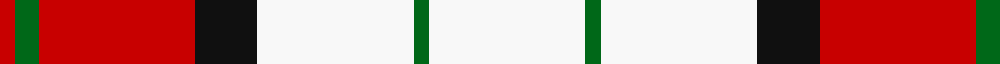

In pattern [RGRKWGW](/patterns/rgrkwgw/).

This was sourced from register-of-tartans.  It is a [7 stripes tartan](/stripes/stripes7/).

Original link https://www.tartanregister.gov.uk/tartanDetails.aspx?ref=437

## Attestations

This cloth appears in 2 source records; the oldest owns this page.

- 01/01/2006 — Bull-Dog Sauce (register-of-tartans, [record](https://www.tartanregister.gov.uk/tartanDetails.aspx?ref=437))
- pre 2006 — Bull-Dog Sauce (Corporate) (tartans-authority, [record](http://www.tartansauthority.com/tartan-ferret/display/7070/))

## Thread count
R/4 G6 R40 K16 W40 G4 W/40

## Palette
Each colour and its ΔE from the base-6 reference it is a variant of.

| Colour | Shade | Base | ΔE (OKLab) |
|---|---|---|---|
| G | <code style="background-color:#006818;">#006818</code> `#006818` | G <code style="background-color:#006100;">#006100</code> | 0.02 |
| K | <code style="background-color:#101010;">#101010</code> `#101010` | K <code style="background-color:#000000;">#000000</code> | 0.17 |
| R | <code style="background-color:#C80000;">#C80000</code> `#C80000` | R <code style="background-color:#CC0000;">#CC0000</code> | 0.01 |
| W | <code style="background-color:#F8F8F8;">#F8F8F8</code> `#F8F8F8` | W <code style="background-color:#F7F7F7;">#F7F7F7</code> | 0.00 |

# Sample pattern

## Nearest tartans

The nearest existing variants by ΔTartan distance.

1. [MacPherson Dress Burgundy (Dance)](/setts/s7/w8k4w50r42w6r16y6-k101010-r880000-we0e0e0-ye8c000/) — ΔT 1.11
1. [MacPherson, Red](/setts/s7/w10b6w52r40w6r16y6-b800080-rc00000-we0e0e0-yf0c000/) — ΔT 1.24
1. [MacPherson, Burgundy dress](/setts/s7/w8k4w50r42w6r16y6-k000000-rc00000-we0e0e0-yf0c000/) — ΔT 1.25
1. [Milne Dress Family Tartan Tartan Number: 634. Earliest known date: pre 2003 Milnes are usually regarded as being a Sept of the Gordons or of the Ogilvys. See products available Copyright © Blair Urquhart, Comrie, 2015](/setts/s8/w18b4w18r30w18b4w9ba4-b2c2c80-ba780078-rc80000-we0e0e0/) — ΔT 1.26
1. [Milne, dress](/setts/s8/w18b4w18r30w18b4w9ba4-b304080-ba800080-rc00000-we0e0e0/) — ΔT 1.27
1. [MacPherson Dress Red (Dance)](/setts/s7/w10b6w52r40w6r16y6-b780078-rc80000-we0e0e0-ye8c000/) — ΔT 1.29
1. [MacPherson Dress Burgandy Clan Tartan Tartan Number: 1832. Earliest known date: pre 2003 Examined by D.C.S. 1947 See products available Copyright © Blair Urquhart, Comrie, 2015](/setts/s7/w8k4w50r42w6r16y6-k101010-rc80000-we0e0e0-ye8c000/) — ΔT 1.35
1. [Orange Fanaticos](/setts/s7/w12y75k22wa12k22wa16w8-k101010-wadbee9-waffffff-yfc8100/) — ΔT 1.36
1. [MacPherson, dress red](/setts/s7/w8r4w50ra42w6ra16y6-r800000-rac00000-we0e0e0-yf0c000/) — ΔT 1.43
1. [Boswell Dress Personal Tartan Tartan Number: 6359. Earliest known date: 2004 A tartan for William Boswell of Balmuto in Fife. See products available Copyright © Blair Urquhart, Comrie, 2015](/setts/s8/w26r6w4k10w4r6w26b16-b2c2c80-k101010-rc80000-we0e0e0/) — ΔT 1.50

## Neighbour map

Every grey dot is one of 15726 variants placed by the first two principal components of the ΔTartan feature space (44% of its variance). Red is this tartan; blue dots are its nearest — click one to open its page.

<svg viewBox="0 0 640 380" role="img" style="max-width:100%;height:auto;border:1px solid #e0e0e0;border-radius:4px;display:block" xmlns="http://www.w3.org/2000/svg"><image href="/nn/cloud.v1.png" width="640" height="380"/><a href="/setts/s7/w8k4w50r42w6r16y6-k101010-r880000-we0e0e0-ye8c000/"><circle cx="265.0" cy="156.7" r="4" fill="#3465a4"><title>MacPherson Dress Burgundy (Dance)</title></circle></a><a href="/setts/s7/w10b6w52r40w6r16y6-b800080-rc00000-we0e0e0-yf0c000/"><circle cx="266.2" cy="172.5" r="4" fill="#3465a4"><title>MacPherson, Red</title></circle></a><a href="/setts/s7/w8k4w50r42w6r16y6-k000000-rc00000-we0e0e0-yf0c000/"><circle cx="272.9" cy="154.6" r="4" fill="#3465a4"><title>MacPherson, Burgundy dress</title></circle></a><a href="/setts/s8/w18b4w18r30w18b4w9ba4-b2c2c80-ba780078-rc80000-we0e0e0/"><circle cx="271.1" cy="192.9" r="4" fill="#3465a4"><title>Milne Dress Family Tartan Tartan Number: 634. Earliest known date: pre 2003 Milnes are usually regarded as being a Sept of the Gordons or of the Ogilvys. See products available Copyright © Blair Urquhart, Comrie, 2015</title></circle></a><a href="/setts/s8/w18b4w18r30w18b4w9ba4-b304080-ba800080-rc00000-we0e0e0/"><circle cx="272.1" cy="193.7" r="4" fill="#3465a4"><title>Milne, dress</title></circle></a><a href="/setts/s7/w10b6w52r40w6r16y6-b780078-rc80000-we0e0e0-ye8c000/"><circle cx="267.8" cy="172.6" r="4" fill="#3465a4"><title>MacPherson Dress Red (Dance)</title></circle></a><a href="/setts/s7/w8k4w50r42w6r16y6-k101010-rc80000-we0e0e0-ye8c000/"><circle cx="278.6" cy="156.0" r="4" fill="#3465a4"><title>MacPherson Dress Burgandy Clan Tartan Tartan Number: 1832. Earliest known date: pre 2003 Examined by D.C.S. 1947 See products available Copyright © Blair Urquhart, Comrie, 2015</title></circle></a><a href="/setts/s7/w12y75k22wa12k22wa16w8-k101010-wadbee9-waffffff-yfc8100/"><circle cx="188.4" cy="164.7" r="4" fill="#3465a4"><title>Orange Fanaticos</title></circle></a><a href="/setts/s7/w8r4w50ra42w6ra16y6-r800000-rac00000-we0e0e0-yf0c000/"><circle cx="281.9" cy="157.0" r="4" fill="#3465a4"><title>MacPherson, dress red</title></circle></a><a href="/setts/s8/w26r6w4k10w4r6w26b16-b2c2c80-k101010-rc80000-we0e0e0/"><circle cx="246.9" cy="194.2" r="4" fill="#3465a4"><title>Boswell Dress Personal Tartan Tartan Number: 6359. Earliest known date: 2004 A tartan for William Boswell of Balmuto in Fife. See products available Copyright © Blair Urquhart, Comrie, 2015</title></circle></a><circle cx="230.7" cy="171.4" r="5" fill="#c00000"/></svg>

ID: /setts/s7/w40g4w40k16r40g6r4-g006818-k101010-rc80000-wf8f8f8/
