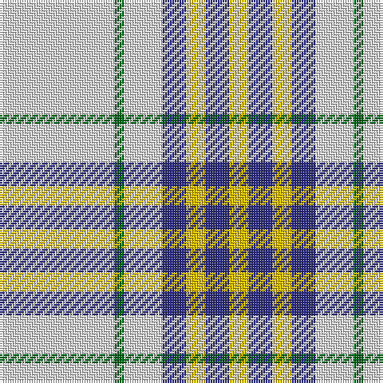

In pattern [WGWBYBY](/patterns/wgwbyby/).

This was sourced from tartans-authority.  It is a [7 stripes tartan](/stripes/stripes7/).

Original link http://www.tartansauthority.com/tartan-ferret/display/6002/

## Thread count
LN/48 G4 LN16 DB10 Y8 DB10 Y/8

## Palette
Each colour and its ΔE from the base-6 reference it is a variant of.

| Colour | Shade | Base | ΔE (OKLab) |
|---|---|---|---|
| DB | <code style="background-color:#2C2C80;">#2C2C80</code> `#2C2C80` | B <code style="background-color:#2C4084;">#2C4084</code> | 0.05 |
| G | <code style="background-color:#006818;">#006818</code> `#006818` | G <code style="background-color:#006400;">#006400</code> | 0.02 |
| LN | <code style="background-color:#E0E0E0;">#E0E0E0</code> `#E0E0E0` | W <code style="background-color:#F4F4F0;">#F4F4F0</code> | 0.06 |
| Y | <code style="background-color:#E8C000;">#E8C000</code> `#E8C000` | Y <code style="background-color:#E8C000;">#E8C000</code> | 0.00 |

# Sample pattern

## Nearest tartans

The nearest existing variants by ΔTartan distance.

1. [Banff, White (Fashion)](/setts/s7/w16y6w44r44b6ra4w8-b640c1c-r888888-ra9c0030-wfcfcfc-yfcfc00/) — ΔT 1.27
1. [Burns (Fashion)](/setts/s6/w60b24w4b12r12w4-b3c3c3c-rb0781c-wf8f4d0/) — ΔT 1.34
1. [Milne, Green (Dance)](/setts/s8/w48r8w48g68w48r8w20b8-b9058d8-g009468-rc80000-wf8f8f8/) — ΔT 1.36
1. [St. John's (Corporate)](/setts/s7/w12b6w90ba72w6y18b6-b1c0070-ba2888c4-we0e0e0-ye8c000/) — ΔT 1.47
1. [MacPherson Dress Blue (Dance) #2](/setts/s7/w10r6w52g42w6g16y6-g408060-r800028-we0e0e0-ye8c000/) — ΔT 1.47
1. [Grant of Acharrow](/setts/s12/w24k6w56g12k8w4k4w28r22g6r8w8-g008000-k000000-rc00000-we0e0e0/) — ΔT 1.50
1. [O'Neill](/setts/s9/w4g2w4r12w20g12w4r2w4-g008000-r806050-we0e0e0/) — ΔT 1.52
1. [MacPherson #10](/setts/s6/r4w56k24w4k12y4-k101010-rdc0000-we0e0e0-ye8c000/) — ΔT 1.53
1. [Alaska Highlanders P & D (Corporate)](/setts/s8/b18w54b4y8b4w20b4wa6-b2c2c80-w98c8e8-wafcfcfc-yfccc00/) — ΔT 1.54
1. [Milne dress green](/setts/s9/w28b6w28y2g40w30b6w14ba6-b3c82af-ba5a008c-g006428-we0e0e0-ye8c000/) — ΔT 1.54

## Neighbour map

Every grey dot is one of 15726 variants placed by the first two principal components of the ΔTartan feature space (44% of its variance). Red is this tartan; blue dots are its nearest — click one to open its page.

<svg viewBox="0 0 640 380" role="img" style="max-width:100%;height:auto;border:1px solid #e0e0e0;border-radius:4px;display:block" xmlns="http://www.w3.org/2000/svg"><image href="/nn/cloud.v1.png" width="640" height="380"/><a href="/setts/s7/w16y6w44r44b6ra4w8-b640c1c-r888888-ra9c0030-wfcfcfc-yfcfc00/"><circle cx="249.6" cy="152.0" r="4" fill="#3465a4"><title>Banff, White (Fashion)</title></circle></a><a href="/setts/s6/w60b24w4b12r12w4-b3c3c3c-rb0781c-wf8f4d0/"><circle cx="323.2" cy="169.7" r="4" fill="#3465a4"><title>Burns (Fashion)</title></circle></a><a href="/setts/s8/w48r8w48g68w48r8w20b8-b9058d8-g009468-rc80000-wf8f8f8/"><circle cx="299.8" cy="194.9" r="4" fill="#3465a4"><title>Milne, Green (Dance)</title></circle></a><a href="/setts/s7/w12b6w90ba72w6y18b6-b1c0070-ba2888c4-we0e0e0-ye8c000/"><circle cx="284.9" cy="154.0" r="4" fill="#3465a4"><title>St. John's (Corporate)</title></circle></a><a href="/setts/s7/w10r6w52g42w6g16y6-g408060-r800028-we0e0e0-ye8c000/"><circle cx="261.8" cy="190.2" r="4" fill="#3465a4"><title>MacPherson Dress Blue (Dance) #2</title></circle></a><a href="/setts/s12/w24k6w56g12k8w4k4w28r22g6r8w8-g008000-k000000-rc00000-we0e0e0/"><circle cx="304.8" cy="130.3" r="4" fill="#3465a4"><title>Grant of Acharrow</title></circle></a><a href="/setts/s9/w4g2w4r12w20g12w4r2w4-g008000-r806050-we0e0e0/"><circle cx="286.0" cy="192.9" r="4" fill="#3465a4"><title>O'Neill</title></circle></a><a href="/setts/s6/r4w56k24w4k12y4-k101010-rdc0000-we0e0e0-ye8c000/"><circle cx="300.4" cy="153.0" r="4" fill="#3465a4"><title>MacPherson #10</title></circle></a><a href="/setts/s8/b18w54b4y8b4w20b4wa6-b2c2c80-w98c8e8-wafcfcfc-yfccc00/"><circle cx="331.5" cy="154.1" r="4" fill="#3465a4"><title>Alaska Highlanders P &amp; D (Corporate)</title></circle></a><a href="/setts/s9/w28b6w28y2g40w30b6w14ba6-b3c82af-ba5a008c-g006428-we0e0e0-ye8c000/"><circle cx="295.3" cy="143.2" r="4" fill="#3465a4"><title>Milne dress green</title></circle></a><circle cx="304.0" cy="164.1" r="5" fill="#c00000"/></svg>

ID: /setts/s7/w48g4w16b10y8b10y8-b2c2c80-g006818-we0e0e0-ye8c000/
