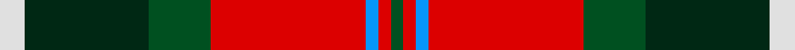
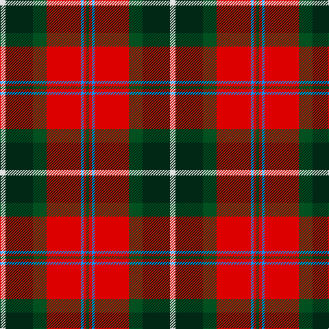

In pattern [GRBRGGW](/stripes/grbrggw/).

This was sourced from register-of-tartans.  It is a [7 stripe tartan](/stripes/stripes7/).

Original link https://www.tartanregister.gov.uk/tartanDetails.aspx?ref=471

## Register references

External register numbers recorded for this tartan.

- Scottish Register of Tartans: [471](https://www.tartanregister.gov.uk/tartanDetails.aspx?ref=471)
- Scottish Tartans Authority (ITI): 2315
- Scottish Tartans World Register: 2315

## Thread count
LN/8 DG40 G20 R50 B4 R4 G/4

## Palette
Each colour and the base-6 reference it is a variant of.

| Colour | Shade | Base |
|---|---|---|
| B | <code style="background-color:#0596FA;">#0596FA</code> `oklch(66.0% 0.180 248.9)` <small>#0596FA</small> | B <code style="background-color:#2A418A;">#2A418A</code> |
| DG | <code style="background-color:#002814;">#002814</code> `oklch(24.4% 0.059 156.5)` <small>#002814</small> | G <code style="background-color:#006100;">#006100</code> |
| G | <code style="background-color:#005020;">#005020</code> `oklch(37.7% 0.105 149.6)` <small>#005020</small> | G <code style="background-color:#006100;">#006100</code> |
| LN | <code style="background-color:#E0E0E0;">#E0E0E0</code> `oklch(90.7% 0.000 89.9)` <small>#E0E0E0</small> | W <code style="background-color:#F7F7F7;">#F7F7F7</code> |
| R | <code style="background-color:#DC0000;">#DC0000</code> `oklch(56.2% 0.230 29.2)` <small>#DC0000</small> | R <code style="background-color:#CC0000;">#CC0000</code> |

# Sample pattern

## Nearest tartans

The nearest existing variants by ΔTartan distance.

1. [Caledonian Brewery](/setts/s7/w4dg20g10r25b2r2g2~x2/) — ΔT 0.62
1. [MacLachlan #4](/setts/s7/r24w2ly3dg16k16w2ly3~x2/) — ΔT 0.73
1. [MacLachlan Old Clan Tartan Tartan Number: 1710. Earliest known date: 1790 It is the oldest MacLachlan tartan actually bearing the name. The sett has been refered to as Old MacLachlan, MacLachlan and Hunting MacLachlan. Although the sett did not appear in books until D.W. Stewart's Old & Rare Scottish Tartans of 1893, there are samples of it in the collections of Campbell of Craignish in 1790 and in the Highland Society of London (circa 1816). See products available Copyright © Blair Urquhart, Comrie, 2015](/setts/s7/r24w2ly3g16k16w2ly3~x2/) — ΔT 0.76
1. [Unidentified No 5](/setts/s8/k10ly2dg11r11w1r1w1k9~x2/) — ΔT 0.99
1. [Connolly Dress (Name)](/setts/s10/g6k2g3k2g6db8r20ly2r3g2~x2/) — ΔT 1.00
1. [Rose White Dress](/setts/s6/r24n4k4g4w13k2~x4/) — ΔT 1.02
1. [Graham of Montrose Red](/setts/s9/lb1k1r10g10k5lb5r10k1lb1~x4/) — ΔT 1.04
1. [Craik, of Assington](/setts/s8/db4r11db1g8r2g4k1ly2~x4/) — ΔT 1.05
1. [Ulster Ancestry](/setts/s9/do47r8k22r7w3r24do9r10ly3~x2/) — ΔT 1.08
1. [Caledonian Brewery Corporate Tartan Tartan Number: 2315. Earliest known date: pre 1997 Designed by Kinloch Anderson Ltd to commemorate the opening of the new Caledonian Brewery Malting Building. See products available Copyright © Blair Urquhart, Comrie, 2015](/setts/s7/lb4k13g6r16lb2r2g2~x2/) — ΔT 1.08

## Neighbour map

Every grey dot is one of 14299 variants placed by the first two principal components of the ΔTartan feature space (44% of its variance). Red is this tartan; blue dots are its nearest — click one to open its page.

<svg viewBox="0 0 640 380" role="img" style="max-width:100%;height:auto;border:1px solid #e0e0e0;border-radius:4px;display:block" xmlns="http://www.w3.org/2000/svg"><image href="/nn/cloud.v1.png" width="640" height="380"/><a href="/setts/s7/w4dg20g10r25b2r2g2~x2/"><circle cx="207.3" cy="158.5" r="4" fill="#3465a4"><title>Caledonian Brewery</title></circle></a><a href="/setts/s7/r24w2ly3dg16k16w2ly3~x2/"><circle cx="154.2" cy="152.5" r="4" fill="#3465a4"><title>MacLachlan #4</title></circle></a><a href="/setts/s7/r24w2ly3g16k16w2ly3~x2/"><circle cx="155.1" cy="154.7" r="4" fill="#3465a4"><title>MacLachlan Old Clan Tartan Tartan Number: 1710. Earliest known date: 1790 It is the oldest MacLachlan tartan actually bearing the name. The sett has been refered to as Old MacLachlan, MacLachlan and Hunting MacLachlan. Although the sett did not appear in books until D.W. Stewart's Old &amp; Rare Scottish Tartans of 1893, there are samples of it in the collections of Campbell of Craignish in 1790 and in the Highland Society of London (circa 1816). See products available Copyright © Blair Urquhart, Comrie, 2015</title></circle></a><a href="/setts/s8/k10ly2dg11r11w1r1w1k9~x2/"><circle cx="174.2" cy="169.9" r="4" fill="#3465a4"><title>Unidentified No 5</title></circle></a><a href="/setts/s10/g6k2g3k2g6db8r20ly2r3g2~x2/"><circle cx="209.9" cy="153.8" r="4" fill="#3465a4"><title>Connolly Dress (Name)</title></circle></a><a href="/setts/s6/r24n4k4g4w13k2~x4/"><circle cx="202.2" cy="151.4" r="4" fill="#3465a4"><title>Rose White Dress</title></circle></a><a href="/setts/s9/lb1k1r10g10k5lb5r10k1lb1~x4/"><circle cx="198.9" cy="172.2" r="4" fill="#3465a4"><title>Graham of Montrose Red</title></circle></a><a href="/setts/s8/db4r11db1g8r2g4k1ly2~x4/"><circle cx="188.5" cy="170.1" r="4" fill="#3465a4"><title>Craik, of Assington</title></circle></a><a href="/setts/s9/do47r8k22r7w3r24do9r10ly3~x2/"><circle cx="228.2" cy="142.3" r="4" fill="#3465a4"><title>Ulster Ancestry</title></circle></a><a href="/setts/s7/lb4k13g6r16lb2r2g2~x2/"><circle cx="172.2" cy="188.2" r="4" fill="#3465a4"><title>Caledonian Brewery Corporate Tartan Tartan Number: 2315. Earliest known date: pre 1997 Designed by Kinloch Anderson Ltd to commemorate the opening of the new Caledonian Brewery Malting Building. See products available Copyright © Blair Urquhart, Comrie, 2015</title></circle></a><circle cx="203.0" cy="153.8" r="5" fill="#c00000"/></svg>

ID: /setts/s7/w4dg20dg10r25b2r2dg2~x2/
