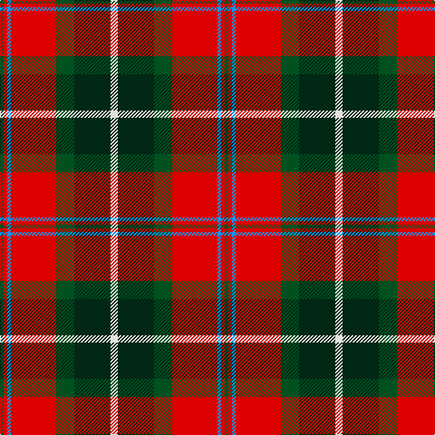

In pattern [GRBRGGW](/patterns/grbrggw/).

This was sourced from register-of-tartans.  It is a [7 stripes tartan](/stripes/stripes7/).

Original link https://www.tartanregister.gov.uk/tartanDetails.aspx?ref=471

## Thread count
G/4 R4 B4 R50 G20 DG40 LN/8

## Palette
Each colour and its ΔE from the base-6 reference it is a variant of.

| Colour | Shade | Base | ΔE (OKLab) |
|---|---|---|---|
| B | <code style="background-color:#0596FA;">#0596FA</code> `#0596FA` | B <code style="background-color:#2A418A;">#2A418A</code> | 0.27 |
| DG | <code style="background-color:#002814;">#002814</code> `#002814` | G <code style="background-color:#006100;">#006100</code> | 0.20 |
| G | <code style="background-color:#005020;">#005020</code> `#005020` | G <code style="background-color:#006100;">#006100</code> | 0.07 |
| LN | <code style="background-color:#E0E0E0;">#E0E0E0</code> `#E0E0E0` | W <code style="background-color:#F7F7F7;">#F7F7F7</code> | 0.07 |
| R | <code style="background-color:#DC0000;">#DC0000</code> `#DC0000` | R <code style="background-color:#CC0000;">#CC0000</code> | 0.03 |

# Sample pattern

## Nearest tartans

The nearest existing variants by ΔTartan distance.

1. [Caledonian Brewery](/setts/s7/w4g20ga10r25b2r2ga2x2~b8080d0-g003000-ga008000-rc00000-we0e0e0/) — ΔT 0.62
1. [MacLachlan #4](/setts/s7/r24w2y3g16k16w2y3x2~g005020-k101010-rdc0000-we0e0e0-ye8c000/) — ΔT 0.73
1. [MacLachlan Old Clan Tartan Tartan Number: 1710. Earliest known date: 1790 It is the oldest MacLachlan tartan actually bearing the name. The sett has been refered to as Old MacLachlan, MacLachlan and Hunting MacLachlan. Although the sett did not appear in books until D.W. Stewart's Old & Rare Scottish Tartans of 1893, there are samples of it in the collections of Campbell of Craignish in 1790 and in the Highland Society of London (circa 1816). See products available Copyright © Blair Urquhart, Comrie, 2015](/setts/s7/r24w2y3g16k16w2y3x2~g006818-k101010-rc80000-we0e0e0-ye8c000/) — ΔT 0.76
1. [Craik of Assington Personal Tartan Tartan Number: 494. Earliest known date: 1981 Restricted See products available Copyright © Blair Urquhart, Comrie, 2015](/setts/s8/b4r11b1g8r2g4k1y2x4~b2c2c80-g006818-k101010-rc80000-ye8c000/) — ΔT 0.91
1. [Unidentified No 5](/setts/s8/k10y2g11r11w1r1w1k9x2~g005020-k101010-rdc0000-we0e0e0-ye8c000/) — ΔT 0.99
1. [Connolly Dress (Name)](/setts/s10/g6k2g3k2g6b8r20y2r3g2x2~b2c2c80-g006818-k101010-rc80000-ye8c000/) — ΔT 1.00
1. [Rose White Dress](/setts/s6/r24b4k4g4w13k2x4~b447084-g006818-k101010-r880000-wf8f4d0/) — ΔT 1.02
1. [Unnamed No 5 Tartan Tartan Number: 1257. Earliest known date: 1870 This sett is taken from the records of Messrs Bolingbroke and Jones of Norwich, who were weavers around 1870. Some of the tartans have been adopted or modified in recent times as the copyright of the designs is now in the public domain. See products available Copyright © Blair Urquhart, Comrie, 2015](/setts/s8/k10y2g11r11w1r1w1k9x2~g006818-k101010-rc80000-we0e0e0-ye8c000/) — ΔT 1.04
1. [Graham of Montrose Red](/setts/s9/w1k1r10g10k5w5r10k1w1x4~g006818-k101010-r880000-wa8ace8/) — ΔT 1.04
1. [Blackstock Dress Family Tartan Tartan Number: 1881. Earliest known date: 1982 Commissioned by Herbert Earl Blackstock in 1983, President of the Clan Blackstock Society in the USA. Blackstocks were a 'Scotch-Irish' family who emigrated to the US from Ulster. Designed by kiltmaker and historian Bob Martin of Greenville, South Carolina. www.clanblackstocksociety.com See products available Copyright © Blair Urquhart, Comrie, 2015](/setts/s7/y2g7k6r12k1r1y2x4~g006818-k101010-rc80000-ye8c000/) — ΔT 1.05

## Neighbour map

Every grey dot is one of 15726 variants placed by the first two principal components of the ΔTartan feature space (44% of its variance). Red is this tartan; blue dots are its nearest — click one to open its page.

<svg viewBox="0 0 640 380" role="img" style="max-width:100%;height:auto;border:1px solid #e0e0e0;border-radius:4px;display:block" xmlns="http://www.w3.org/2000/svg"><image href="/nn/cloud.v1.png" width="640" height="380"/><a href="/setts/s7/w4g20ga10r25b2r2ga2x2~b8080d0-g003000-ga008000-rc00000-we0e0e0/"><circle cx="205.8" cy="159.3" r="4" fill="#3465a4"><title>Caledonian Brewery</title></circle></a><a href="/setts/s7/r24w2y3g16k16w2y3x2~g005020-k101010-rdc0000-we0e0e0-ye8c000/"><circle cx="152.6" cy="154.8" r="4" fill="#3465a4"><title>MacLachlan #4</title></circle></a><a href="/setts/s7/r24w2y3g16k16w2y3x2~g006818-k101010-rc80000-we0e0e0-ye8c000/"><circle cx="153.4" cy="156.6" r="4" fill="#3465a4"><title>MacLachlan Old Clan Tartan Tartan Number: 1710. Earliest known date: 1790 It is the oldest MacLachlan tartan actually bearing the name. The sett has been refered to as Old MacLachlan, MacLachlan and Hunting MacLachlan. Although the sett did not appear in books until D.W. Stewart's Old &amp; Rare Scottish Tartans of 1893, there are samples of it in the collections of Campbell of Craignish in 1790 and in the Highland Society of London (circa 1816). See products available Copyright © Blair Urquhart, Comrie, 2015</title></circle></a><a href="/setts/s8/b4r11b1g8r2g4k1y2x4~b2c2c80-g006818-k101010-rc80000-ye8c000/"><circle cx="194.2" cy="172.3" r="4" fill="#3465a4"><title>Craik of Assington Personal Tartan Tartan Number: 494. Earliest known date: 1981 Restricted See products available Copyright © Blair Urquhart, Comrie, 2015</title></circle></a><a href="/setts/s8/k10y2g11r11w1r1w1k9x2~g005020-k101010-rdc0000-we0e0e0-ye8c000/"><circle cx="172.1" cy="171.2" r="4" fill="#3465a4"><title>Unidentified No 5</title></circle></a><a href="/setts/s10/g6k2g3k2g6b8r20y2r3g2x2~b2c2c80-g006818-k101010-rc80000-ye8c000/"><circle cx="208.5" cy="153.3" r="4" fill="#3465a4"><title>Connolly Dress (Name)</title></circle></a><a href="/setts/s6/r24b4k4g4w13k2x4~b447084-g006818-k101010-r880000-wf8f4d0/"><circle cx="200.8" cy="156.1" r="4" fill="#3465a4"><title>Rose White Dress</title></circle></a><a href="/setts/s8/k10y2g11r11w1r1w1k9x2~g006818-k101010-rc80000-we0e0e0-ye8c000/"><circle cx="171.5" cy="171.9" r="4" fill="#3465a4"><title>Unnamed No 5 Tartan Tartan Number: 1257. Earliest known date: 1870 This sett is taken from the records of Messrs Bolingbroke and Jones of Norwich, who were weavers around 1870. Some of the tartans have been adopted or modified in recent times as the copyright of the designs is now in the public domain. See products available Copyright © Blair Urquhart, Comrie, 2015</title></circle></a><a href="/setts/s9/w1k1r10g10k5w5r10k1w1x4~g006818-k101010-r880000-wa8ace8/"><circle cx="197.3" cy="172.0" r="4" fill="#3465a4"><title>Graham of Montrose Red</title></circle></a><a href="/setts/s7/y2g7k6r12k1r1y2x4~g006818-k101010-rc80000-ye8c000/"><circle cx="206.3" cy="177.3" r="4" fill="#3465a4"><title>Blackstock Dress Family Tartan Tartan Number: 1881. Earliest known date: 1982 Commissioned by Herbert Earl Blackstock in 1983, President of the Clan Blackstock Society in the USA. Blackstocks were a 'Scotch-Irish' family who emigrated to the US from Ulster. Designed by kiltmaker and historian Bob Martin of Greenville, South Carolina. www.clanblackstocksociety.com See products available Copyright © Blair Urquhart, Comrie, 2015</title></circle></a><circle cx="201.5" cy="155.6" r="5" fill="#c00000"/></svg>

ID: /setts/s7/w4g20ga10r25b2r2ga2x2~b0596fa-g002814-ga005020-rdc0000-we0e0e0/
