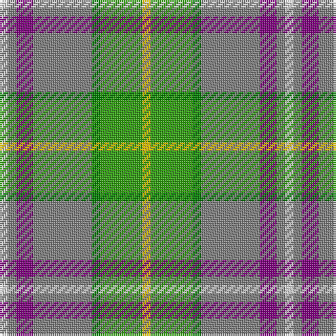

In pattern [WGBGGGY](/patterns/wgbgggy/).

This was sourced from weddslist.  It is a [7 stripes tartan](/stripes/stripes7/).

Original link http://www.weddslist.com/cgi-bin/tartans/pg.pl?source=sts

## Thread count
LN/4 N4 P8 N28 Ga4 G20 Y/4

## Palette
Each colour and its ΔE from the base-6 reference it is a variant of.

| Colour | Shade | Base | ΔE (OKLab) |
|---|---|---|---|
| G | <code style="background-color:#30A010;">#30A010</code> `#30A010` | G <code style="background-color:#006400;">#006400</code> | 0.19 |
| Ga | <code style="background-color:#008000;">#008000</code> `#008000` | G <code style="background-color:#006400;">#006400</code> | 0.09 |
| LN | <code style="background-color:#E0E0E0;">#E0E0E0</code> `#E0E0E0` | W <code style="background-color:#F4F4F0;">#F4F4F0</code> | 0.06 |
| N | <code style="background-color:#808080;">#808080</code> `#808080` | G <code style="background-color:#006400;">#006400</code> | 0.22 |
| P | <code style="background-color:#800080;">#800080</code> `#800080` | B <code style="background-color:#2C4084;">#2C4084</code> | 0.17 |
| Y | <code style="background-color:#F0C000;">#F0C000</code> `#F0C000` | Y <code style="background-color:#E8C000;">#E8C000</code> | 0.01 |

# Sample pattern

## Nearest tartans

The nearest existing variants by ΔTartan distance.

1. [Montessori School of Denver (School)](/setts/s6/g75r27ga9y21w9b33-b587484-g288444-ga6898b0-rcc3c34-we0e0e0-ye8c000/) — ΔT 0.75
1. [Royal Pharmaceutical, Society](/setts/s9/r6w4g38w12g4w12ra28rb8wa4-g008000-r806050-raa08060-rb802040-wc0c0c0-wae0e0e0/) — ΔT 1.07
1. [State Seal of Kansas (Fashion)](/setts/s9/y10g46b42ya60k20ya8g8ya32w6-b1474b4-g006818-k101010-we8ccb8-ybc8c00-yaa08858/) — ΔT 1.09
1. [Atikokan (District)](/setts/s7/y24b64w12g12r12ga12wa8-b2888c4-g886414-ga289c18-rc47c2c-wc0c0c0-wafcfcfc-yc48008/) — ΔT 1.29
1. [Gallagher Irish Fashion Tartan Tartan Number: 4053. Earliest known date: 2001 February See products available Copyright © Blair Urquhart, Comrie, 2015](/setts/s9/b8g82y8ga8y8ga18r36y8w8-b202060-g005448-ga008c54-rdc6854-we0e0e0-ya08858/) — ΔT 1.38
1. [Gallagher Ancient](/setts/s9/b8g82y8ga8y8ga18r36y8w8-b202060-g005448-ga008c54-re87878-we0e0e0-ya08858/) — ΔT 1.40
1. [State Seal of California (Fashion)](/setts/s10/y58ya6b38w6b6r6g34b6g8w6-b1474b4-g006818-rc80000-we8ccb8-ya08858-yafccc00/) — ΔT 1.42
1. [Lundy (Personal)](/setts/s7/w8k8g32ga32r4ga4wa4-g006818-ga048888-k101010-rc80000-w98c8e8-waf8f8f8/) — ΔT 1.44
1. [Ayrshire](/setts/s8/b8r4b40w4ra16g32y4g8-b304080-g008000-rc00000-ra806050-we0e0e0-yf0c000/) — ΔT 1.44
1. [Newfoundland](/setts/s7/r8g6ra16w6ra8g36y6-g008000-rc00000-ra806050-we0e0e0-yf0c000/) — ΔT 1.46

## Neighbour map

Every grey dot is one of 15726 variants placed by the first two principal components of the ΔTartan feature space (44% of its variance). Red is this tartan; blue dots are its nearest — click one to open its page.

<svg viewBox="0 0 640 380" role="img" style="max-width:100%;height:auto;border:1px solid #e0e0e0;border-radius:4px;display:block" xmlns="http://www.w3.org/2000/svg"><image href="/nn/cloud.v1.png" width="640" height="380"/><a href="/setts/s6/g75r27ga9y21w9b33-b587484-g288444-ga6898b0-rcc3c34-we0e0e0-ye8c000/"><circle cx="179.9" cy="196.4" r="4" fill="#3465a4"><title>Montessori School of Denver (School)</title></circle></a><a href="/setts/s9/r6w4g38w12g4w12ra28rb8wa4-g008000-r806050-raa08060-rb802040-wc0c0c0-wae0e0e0/"><circle cx="151.0" cy="160.8" r="4" fill="#3465a4"><title>Royal Pharmaceutical, Society</title></circle></a><a href="/setts/s9/y10g46b42ya60k20ya8g8ya32w6-b1474b4-g006818-k101010-we8ccb8-ybc8c00-yaa08858/"><circle cx="170.9" cy="176.3" r="4" fill="#3465a4"><title>State Seal of Kansas (Fashion)</title></circle></a><a href="/setts/s7/y24b64w12g12r12ga12wa8-b2888c4-g886414-ga289c18-rc47c2c-wc0c0c0-wafcfcfc-yc48008/"><circle cx="163.9" cy="163.3" r="4" fill="#3465a4"><title>Atikokan (District)</title></circle></a><a href="/setts/s9/b8g82y8ga8y8ga18r36y8w8-b202060-g005448-ga008c54-rdc6854-we0e0e0-ya08858/"><circle cx="205.1" cy="143.1" r="4" fill="#3465a4"><title>Gallagher Irish Fashion Tartan Tartan Number: 4053. Earliest known date: 2001 February See products available Copyright © Blair Urquhart, Comrie, 2015</title></circle></a><a href="/setts/s9/b8g82y8ga8y8ga18r36y8w8-b202060-g005448-ga008c54-re87878-we0e0e0-ya08858/"><circle cx="198.8" cy="140.0" r="4" fill="#3465a4"><title>Gallagher Ancient</title></circle></a><a href="/setts/s10/y58ya6b38w6b6r6g34b6g8w6-b1474b4-g006818-rc80000-we8ccb8-ya08858-yafccc00/"><circle cx="154.8" cy="149.1" r="4" fill="#3465a4"><title>State Seal of California (Fashion)</title></circle></a><a href="/setts/s7/w8k8g32ga32r4ga4wa4-g006818-ga048888-k101010-rc80000-w98c8e8-waf8f8f8/"><circle cx="153.1" cy="177.8" r="4" fill="#3465a4"><title>Lundy (Personal)</title></circle></a><a href="/setts/s8/b8r4b40w4ra16g32y4g8-b304080-g008000-rc00000-ra806050-we0e0e0-yf0c000/"><circle cx="187.5" cy="168.6" r="4" fill="#3465a4"><title>Ayrshire</title></circle></a><a href="/setts/s7/r8g6ra16w6ra8g36y6-g008000-rc00000-ra806050-we0e0e0-yf0c000/"><circle cx="223.2" cy="211.9" r="4" fill="#3465a4"><title>Newfoundland</title></circle></a><circle cx="186.9" cy="184.7" r="5" fill="#c00000"/></svg>

ID: /setts/s7/w4g4b8g28ga4gb20y4-b800080-g808080-ga008000-gb30a010-we0e0e0-yf0c000/
