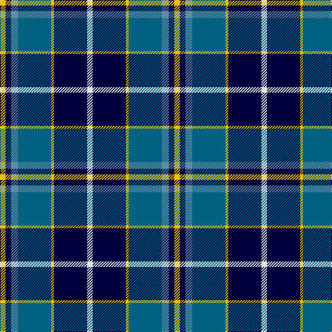

This page is one **sett** — a single exact thread-count. It belongs to the [tartan](/tartans/y4db4b5ba24y2db24ln4/)
(the same proportion at any scale), whose colour order is pattern [WKYBBKY](/stripes/wkybbky/).

Sourced from register-of-tartans.  It is a [7 stripe tartan](/stripes/stripes7/).

Original link https://www.tartanregister.gov.uk/tartanDetails.aspx?ref=2960

2 attestations — the source records this cloth was collapsed from (oldest owns this page)

<ul>
<li>01/01/2003 — Mina Perhonen (register-of-tartans, <a href="https://www.tartanregister.gov.uk/tartanDetails.aspx?ref=2960">record</a>)</li>
<li>pre 2003 — Mina Perhonen (Corporate) (tartans-authority, <a href="http://www.tartansauthority.com/tartan-ferret/display/5797/">record</a>)</li>
</ul>

## Register references

External register numbers recorded for this tartan.

- Scottish Register of Tartans: [2960](https://www.tartanregister.gov.uk/tartanDetails.aspx?ref=2960)
- Scottish Tartans Authority (ITI): 5797

## Thread count
Y/8 DB8 B10 Ba48 Y4 DB48 LN/8

## Palette
Each colour and the base-6 reference it is a variant of.

| Colour | Shade | Base |
|---|---|---|
| B | <code style="background-color:#5C8CA8;">#5C8CA8</code> `oklch(61.7% 0.067 235.0)` <small>#5C8CA8</small> | B <code style="background-color:#2A418A;">#2A418A</code> |
| Ba | <code style="background-color:#006080;">#006080</code> `oklch(45.8% 0.091 229.8)` <small>#006080</small> | B <code style="background-color:#2A418A;">#2A418A</code> |
| DB | <code style="background-color:#00003C;">#00003C</code> `oklch(16.1% 0.112 264.1)` <small>#00003C</small> | K <code style="background-color:#000000;">#000000</code> |
| LN | <code style="background-color:#E0E0E0;">#E0E0E0</code> `oklch(90.7% 0.000 89.9)` <small>#E0E0E0</small> | W <code style="background-color:#F7F7F7;">#F7F7F7</code> |
| Y | <code style="background-color:#E8C000;">#E8C000</code> `oklch(81.9% 0.168 93.7)` <small>#E8C000</small> | Y <code style="background-color:#F2BF00;">#F2BF00</code> |

# Sample pattern

## Nearest tartans

The nearest existing variants by ΔTartan distance, with this tartan at the top so the swatches line up against it.

ΔTartan

Tartan

Sett

—

<a href="/ttd/edit/#slug=w4k24ly2n24t5k4ly4~x2">Mina Perhonen</a> <a class="nn-out" href="/setts/s7/w4k24ly2n24t5k4ly4~x2/" title="open its dictionary page">↗</a>

0.70

<a href="/ttd/edit/#slug=g2db14lg6lr1g1lr6r1~x4">Loch Ness in Scotland</a> <a class="nn-out" href="/setts/s7/g2db14lg6lr1g1lr6r1~x4/" title="open its dictionary page">↗</a>

0.80

<a href="/ttd/edit/#slug=r2t2r2t21lg11k17lb2~x2">Loch Ness (Fashion)</a> <a class="nn-out" href="/setts/s7/r2t2r2t21lg11k17lb2~x2/" title="open its dictionary page">↗</a>

0.84

<a href="/ttd/edit/#slug=k17lb2k3db16t28db2t3lo2~x2">Banff and Buchan</a> <a class="nn-out" href="/setts/s8/k17lb2k3db16t28db2t3lo2~x2/" title="open its dictionary page">↗</a>

1.04

<a href="/ttd/edit/#slug=dg12b8db4ly2r1ly1db6~x4">F.I.A.T.A. Congress of 1990</a> <a class="nn-out" href="/setts/s7/dg12b8db4ly2r1ly1db6~x4/" title="open its dictionary page">↗</a>

1.05

<a href="/ttd/edit/#slug=lo6g28r4k20r3db45k5~x2">Nery</a> <a class="nn-out" href="/setts/s7/lo6g28r4k20r3db45k5~x2/" title="open its dictionary page">↗</a>

1.05

<a href="/ttd/edit/#slug=b24k4r3g24k4ly3~x2">(1) Skene</a> <a class="nn-out" href="/setts/s6/b24k4r3g24k4ly3~x2/" title="open its dictionary page">↗</a>

1.11

<a href="/ttd/edit/#slug=db12k4g4dp1g4k1w1~x4">Alexander - 2000 (Name)</a> <a class="nn-out" href="/setts/s7/db12k4g4dp1g4k1w1~x4/" title="open its dictionary page">↗</a>

1.13

<a href="/ttd/edit/#slug=db15lb2g2ly15r3db21r3g15~x2">Loyalhanna</a> <a class="nn-out" href="/setts/s8/db15lb2g2ly15r3db21r3g15~x2/" title="open its dictionary page">↗</a>

1.14

<a href="/ttd/edit/#slug=w7b10k7b7t7b45k21g21t4k4w7~x2">Utah State University</a> <a class="nn-out" href="/setts/s11/w7b10k7b7t7b45k21g21t4k4w7~x2/" title="open its dictionary page">↗</a>

1.14

<a href="/ttd/edit/#slug=db26w2db3db15t26db2t3ly4~x2">Banff, and Buchan</a> <a class="nn-out" href="/setts/s8/db26w2db3db15t26db2t3ly4~x2/" title="open its dictionary page">↗</a>

## Neighbour map

Every grey dot is one of 14299 variants placed by the first two principal components of the ΔTartan feature space (44% of its variance). Red is this tartan; blue dots are its nearest — click one to open its page.

<svg viewBox="0 0 640 380" role="img" style="max-width:100%;height:auto;border:1px solid #e0e0e0;border-radius:4px;display:block" xmlns="http://www.w3.org/2000/svg"><image href="/nn/cloud.v1.png" width="640" height="380"/><a href="/setts/s7/g2db14lg6lr1g1lr6r1~x4/"><circle cx="200.2" cy="156.6" r="4" fill="#3465a4"><title>Loch Ness in Scotland</title></circle></a><a href="/setts/s7/r2t2r2t21lg11k17lb2~x2/"><circle cx="169.5" cy="170.4" r="4" fill="#3465a4"><title>Loch Ness (Fashion)</title></circle></a><a href="/setts/s8/k17lb2k3db16t28db2t3lo2~x2/"><circle cx="199.5" cy="156.4" r="4" fill="#3465a4"><title>Banff and Buchan</title></circle></a><a href="/setts/s7/dg12b8db4ly2r1ly1db6~x4/"><circle cx="148.8" cy="188.9" r="4" fill="#3465a4"><title>F.I.A.T.A. Congress of 1990</title></circle></a><a href="/setts/s7/lo6g28r4k20r3db45k5~x2/"><circle cx="183.2" cy="167.7" r="4" fill="#3465a4"><title>Nery</title></circle></a><a href="/setts/s6/b24k4r3g24k4ly3~x2/"><circle cx="152.5" cy="188.5" r="4" fill="#3465a4"><title>(1) Skene</title></circle></a><a href="/setts/s7/db12k4g4dp1g4k1w1~x4/"><circle cx="223.1" cy="186.0" r="4" fill="#3465a4"><title>Alexander - 2000 (Name)</title></circle></a><a href="/setts/s8/db15lb2g2ly15r3db21r3g15~x2/"><circle cx="176.0" cy="176.8" r="4" fill="#3465a4"><title>Loyalhanna</title></circle></a><a href="/setts/s11/w7b10k7b7t7b45k21g21t4k4w7~x2/"><circle cx="169.1" cy="150.8" r="4" fill="#3465a4"><title>Utah State University</title></circle></a><a href="/setts/s8/db26w2db3db15t26db2t3ly4~x2/"><circle cx="182.2" cy="164.4" r="4" fill="#3465a4"><title>Banff, and Buchan</title></circle></a><circle cx="187.5" cy="168.3" r="5" fill="#c00000"/></svg>

ID: /setts/s7/w4k24ly2n24t5k4ly4~x2/
