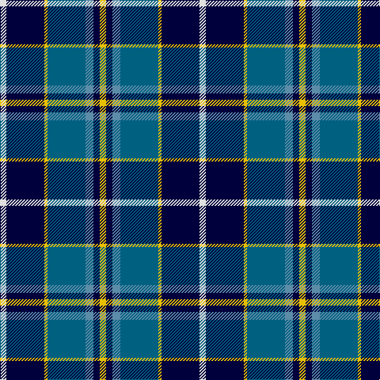

In pattern [WKYBBKY](/patterns/wkybbky/).

This was sourced from register-of-tartans.  It is a [7 stripes tartan](/stripes/stripes7/).

Original link https://www.tartanregister.gov.uk/tartanDetails.aspx?ref=2960

## Attestations

This cloth appears in 2 source records; the oldest owns this page.

- 01/01/2003 — Mina Perhonen (register-of-tartans, [record](https://www.tartanregister.gov.uk/tartanDetails.aspx?ref=2960))
- pre 2003 — Mina Perhonen (Corporate) (tartans-authority, [record](http://www.tartansauthority.com/tartan-ferret/display/5797/))

## Thread count
LN/8 DB48 Y4 Ba48 B10 DB8 Y/8

## Palette
Each colour and its ΔE from the base-6 reference it is a variant of.

| Colour | Shade | Base | ΔE (OKLab) |
|---|---|---|---|
| B | <code style="background-color:#5C8CA8;">#5C8CA8</code> `#5C8CA8` | B <code style="background-color:#2A418A;">#2A418A</code> | 0.23 |
| Ba | <code style="background-color:#006080;">#006080</code> `#006080` | B <code style="background-color:#2A418A;">#2A418A</code> | 0.10 |
| DB | <code style="background-color:#00003C;">#00003C</code> `#00003C` | K <code style="background-color:#000000;">#000000</code> | 0.20 |
| LN | <code style="background-color:#E0E0E0;">#E0E0E0</code> `#E0E0E0` | W <code style="background-color:#F7F7F7;">#F7F7F7</code> | 0.07 |
| Y | <code style="background-color:#E8C000;">#E8C000</code> `#E8C000` | Y <code style="background-color:#F2BF00;">#F2BF00</code> | 0.02 |

# Sample pattern

## Nearest tartans

The nearest existing variants by ΔTartan distance.

1. [Loch Ness in Scotland](/setts/s7/g2b14y6ya1g1ya6r1~b000064-g289c18-rc8002c-y48a4c0-yaa0a0a0~x4/) — ΔT 0.70
1. [Loch Ness (Fashion)](/setts/s7/r2b2r2b21y11k17w2~b5c8ca8-k00002c-rc80000-w98c8e8-y48a4c0~x2/) — ΔT 0.80
1. [Banff and Buchan](/setts/s8/k17w2k3b16ba28b2ba3y2~b000064-ba3c74a4-k000000-wc8c8c8-yc48800~x2/) — ΔT 0.84
1. [Nery](/setts/s7/y6g28r4k20r3b45k5~b00008c-g007800-k000000-r8c0000-yc88c00~x2/) — ΔT 1.04
1. [F.I.A.T.A. Congress of 1990](/setts/s7/g12b8ba4y2r1y1ba6~b3474fc-ba000064-g004c00-r8c0000-yc89800~x4/) — ΔT 1.04
1. [(1) Skene](/setts/s6/b24k4r3g24k4y3~b0004ff-g007d00-k000000-rbe414d-ydfb675~x2/) — ΔT 1.05
1. [Alexander - 2000 (Name)](/setts/s7/b12k4g4ba1g4k1w1~b1c0070-ba440044-g006818-k101010-wfcfcfc~x4/) — ΔT 1.11
1. [Leslie, Hebridean](/setts/s6/k6g15w2b22r2k4~b304080-g008000-k000000-rd03030-we0e0e0~x2/) — ΔT 1.12
1. [Loyalhanna](/setts/s8/b15w2g2y15r3b21r3g15~b00008c-g007800-r8c0000-wc8c8c8-ydcbc00~x2/) — ΔT 1.13
1. [Utah State University](/setts/s11/w7b10k7b7ba7b45k21g21ba4k4w7~b304faa-ba3ca7f7-g0d671f-k101010-wffffff~x2/) — ΔT 1.14

## Neighbour map

Every grey dot is one of 15726 variants placed by the first two principal components of the ΔTartan feature space (44% of its variance). Red is this tartan; blue dots are its nearest — click one to open its page.

<svg viewBox="0 0 640 380" role="img" style="max-width:100%;height:auto;border:1px solid #e0e0e0;border-radius:4px;display:block" xmlns="http://www.w3.org/2000/svg"><image href="/nn/cloud.v1.png" width="640" height="380"/><a href="/setts/s7/g2b14y6ya1g1ya6r1~b000064-g289c18-rc8002c-y48a4c0-yaa0a0a0~x4/"><circle cx="196.3" cy="156.2" r="4" fill="#3465a4"><title>Loch Ness in Scotland</title></circle></a><a href="/setts/s7/r2b2r2b21y11k17w2~b5c8ca8-k00002c-rc80000-w98c8e8-y48a4c0~x2/"><circle cx="165.8" cy="169.7" r="4" fill="#3465a4"><title>Loch Ness (Fashion)</title></circle></a><a href="/setts/s8/k17w2k3b16ba28b2ba3y2~b000064-ba3c74a4-k000000-wc8c8c8-yc48800~x2/"><circle cx="195.2" cy="155.7" r="4" fill="#3465a4"><title>Banff and Buchan</title></circle></a><a href="/setts/s7/y6g28r4k20r3b45k5~b00008c-g007800-k000000-r8c0000-yc88c00~x2/"><circle cx="179.0" cy="166.4" r="4" fill="#3465a4"><title>Nery</title></circle></a><a href="/setts/s7/g12b8ba4y2r1y1ba6~b3474fc-ba000064-g004c00-r8c0000-yc89800~x4/"><circle cx="144.6" cy="186.0" r="4" fill="#3465a4"><title>F.I.A.T.A. Congress of 1990</title></circle></a><a href="/setts/s6/b24k4r3g24k4y3~b0004ff-g007d00-k000000-rbe414d-ydfb675~x2/"><circle cx="147.7" cy="188.5" r="4" fill="#3465a4"><title>(1) Skene</title></circle></a><a href="/setts/s7/b12k4g4ba1g4k1w1~b1c0070-ba440044-g006818-k101010-wfcfcfc~x4/"><circle cx="219.4" cy="182.9" r="4" fill="#3465a4"><title>Alexander - 2000 (Name)</title></circle></a><a href="/setts/s6/k6g15w2b22r2k4~b304080-g008000-k000000-rd03030-we0e0e0~x2/"><circle cx="184.4" cy="184.9" r="4" fill="#3465a4"><title>Leslie, Hebridean</title></circle></a><a href="/setts/s8/b15w2g2y15r3b21r3g15~b00008c-g007800-r8c0000-wc8c8c8-ydcbc00~x2/"><circle cx="172.4" cy="177.6" r="4" fill="#3465a4"><title>Loyalhanna</title></circle></a><a href="/setts/s11/w7b10k7b7ba7b45k21g21ba4k4w7~b304faa-ba3ca7f7-g0d671f-k101010-wffffff~x2/"><circle cx="165.2" cy="149.6" r="4" fill="#3465a4"><title>Utah State University</title></circle></a><circle cx="183.4" cy="167.9" r="5" fill="#c00000"/></svg>

ID: /setts/s7/w4k24y2b24ba5k4y4~b006080-ba5c8ca8-k00003c-we0e0e0-ye8c000~x2/
