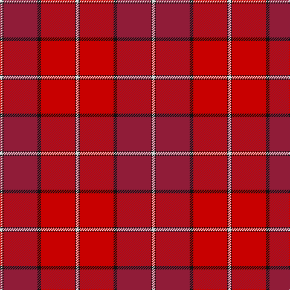

In pattern [WKRKRKW](/patterns/wkrkrkw/).

This was sourced from house-of-tartan.  It is a [7 stripes tartan](/stripes/stripes7/).

Original link http://www.house-of-tartan.scotland.net/house/TartanViewjs.asp?colr=Def&tnam=2057

## Thread count
LN/4 K2 DR56 K6 R56 K2 LN/4

## Palette
Each colour and its ΔE from the base-6 reference it is a variant of.

| Colour | Shade | Base | ΔE (OKLab) |
|---|---|---|---|
| DR | <code style="background-color:#901C38;">#901C38</code> `#901C38` | R <code style="background-color:#CC0000;">#CC0000</code> | 0.13 |
| K | <code style="background-color:#101010;">#101010</code> `#101010` | K <code style="background-color:#000000;">#000000</code> | 0.17 |
| LN | <code style="background-color:#E0E0E0;">#E0E0E0</code> `#E0E0E0` | W <code style="background-color:#F7F7F7;">#F7F7F7</code> | 0.07 |
| R | <code style="background-color:#C80000;">#C80000</code> `#C80000` | R <code style="background-color:#CC0000;">#CC0000</code> | 0.01 |

# Sample pattern

## Nearest tartans

The nearest existing variants by ΔTartan distance.

1. [Aberdeen Football Club (1990)](/setts/s7/w4k2r56k6ra56k2w4-k101010-r781c38-radc0000-we0e0e0/) — ΔT 0.94
1. [Aberdeen F.C.](/setts/s7/w4k2r56k6ra56k2w4-k000000-r802040-rac00000-we0e0e0/) — ΔT 1.05
1. [MacNab WI1](/setts/s8/r48g2w2g4ra48g4w2g2-g004c00-rff0000-rac80000-wd0d0d0/) — ΔT 1.48
1. [Barbour - Cardinal Red](/setts/s7/r6y4r36b16w2ra36r4-b2c2c80-rc80000-rab03000-wfcfcfc-yfccc00/) — ΔT 1.53
1. [MacPherson of Cluny](/setts/s11/r10b4r4g84r10b72r140b4y4r14g4-b800080-g008000-rc00000-yf0c000/) — ΔT 1.82
1. [St. Andrews School (Delaware) (Corp)](/setts/s7/r104b52w10b6w4b12r4-b680028-rc80000-wf8f8f8/) — ΔT 1.83
1. [Fueglistal (Aargau) (Personal)](/setts/s9/k6r12y26ra4y4ra64y2ra4y4-k101010-rc27c05-rac50000-y9da39d/) — ΔT 1.83
1. [MacDougal 4](/setts/s11/b8g16ba12b16r12g4r4g4r48g2r6-b800080-ba304080-g008000-rc00000/) — ΔT 1.86
1. [Buccleuch](/setts/s7/r107k9r5b41r5g51r14-b780078-g006818-k000000-rc80000/) — ΔT 1.87
1. [Morgan (Welsh Name)](/setts/s11/r4ra34b20ra4b8ra6y2ra5b2ra3r4-b441800-r901c38-rac80000-ye8c000/) — ΔT 1.88

## Neighbour map

Every grey dot is one of 15726 variants placed by the first two principal components of the ΔTartan feature space (44% of its variance). Red is this tartan; blue dots are its nearest — click one to open its page.

<svg viewBox="0 0 640 380" role="img" style="max-width:100%;height:auto;border:1px solid #e0e0e0;border-radius:4px;display:block" xmlns="http://www.w3.org/2000/svg"><image href="/nn/cloud.v1.png" width="640" height="380"/><a href="/setts/s7/w4k2r56k6ra56k2w4-k101010-r781c38-radc0000-we0e0e0/"><circle cx="344.4" cy="126.7" r="4" fill="#3465a4"><title>Aberdeen Football Club (1990)</title></circle></a><a href="/setts/s7/w4k2r56k6ra56k2w4-k000000-r802040-rac00000-we0e0e0/"><circle cx="339.9" cy="127.9" r="4" fill="#3465a4"><title>Aberdeen F.C.</title></circle></a><a href="/setts/s8/r48g2w2g4ra48g4w2g2-g004c00-rff0000-rac80000-wd0d0d0/"><circle cx="382.7" cy="130.0" r="4" fill="#3465a4"><title>MacNab WI1</title></circle></a><a href="/setts/s7/r6y4r36b16w2ra36r4-b2c2c80-rc80000-rab03000-wfcfcfc-yfccc00/"><circle cx="304.2" cy="159.8" r="4" fill="#3465a4"><title>Barbour - Cardinal Red</title></circle></a><a href="/setts/s11/r10b4r4g84r10b72r140b4y4r14g4-b800080-g008000-rc00000-yf0c000/"><circle cx="366.3" cy="99.1" r="4" fill="#3465a4"><title>MacPherson of Cluny</title></circle></a><a href="/setts/s7/r104b52w10b6w4b12r4-b680028-rc80000-wf8f8f8/"><circle cx="430.8" cy="145.0" r="4" fill="#3465a4"><title>St. Andrews School (Delaware) (Corp)</title></circle></a><a href="/setts/s9/k6r12y26ra4y4ra64y2ra4y4-k101010-rc27c05-rac50000-y9da39d/"><circle cx="412.8" cy="111.6" r="4" fill="#3465a4"><title>Fueglistal (Aargau) (Personal)</title></circle></a><a href="/setts/s11/b8g16ba12b16r12g4r4g4r48g2r6-b800080-ba304080-g008000-rc00000/"><circle cx="341.6" cy="135.7" r="4" fill="#3465a4"><title>MacDougal 4</title></circle></a><a href="/setts/s7/r107k9r5b41r5g51r14-b780078-g006818-k000000-rc80000/"><circle cx="363.9" cy="153.1" r="4" fill="#3465a4"><title>Buccleuch</title></circle></a><a href="/setts/s11/r4ra34b20ra4b8ra6y2ra5b2ra3r4-b441800-r901c38-rac80000-ye8c000/"><circle cx="401.5" cy="150.2" r="4" fill="#3465a4"><title>Morgan (Welsh Name)</title></circle></a><circle cx="367.1" cy="137.4" r="5" fill="#c00000"/></svg>

ID: /setts/s7/w4k2r56k6ra56k2w4-k101010-r901c38-rac80000-we0e0e0/
