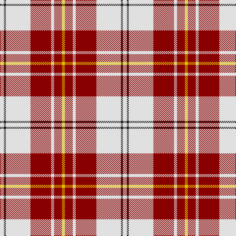

In pattern [WKWRWRY](/stripes/wkwrwry/).

This was sourced from register-of-tartans.  It is a [7 stripe tartan](/stripes/stripes7/).

Original link https://www.tartanregister.gov.uk/tartanDetails.aspx?ref=2717

## Also known as

This cloth is also recorded under:

- MacPherson Dress Burgundy
- MacPherson Dress, Burgundy
- MacPherson, Burgundy dress

## Attestations

This cloth appears in 4 source records; the oldest owns this page.

- 01/01/1980 — MacPherson Dress Burgundy (Dance) (register-of-tartans, [record](https://www.tartanregister.gov.uk/tartanDetails.aspx?ref=2717))
- 1980 — MacPherson Dress, Burgundy (Dance) (tartans-authority, [record](http://www.tartansauthority.com/tartan-ferret/display/1832/))
- undated — MacPherson, Burgundy dress (weddslist, [record](http://www.weddslist.com/cgi-bin/tartans/pg.pl?source=sts))
- undated — MacPherson Dress Burgandy Clan Tartan Tartan Number: 1832. Earliest known date: pre 2003 Examined by D.C.S. 1947 See products available Copyright © Blair Urquhart, Comrie, 2015 (house-of-tartan, [record](http://www.house-of-tartan.scotland.net/house/TartanViewjs.asp?colr=Def&tnam=1832))

## Register references

External register numbers recorded for this tartan.

- Scottish Register of Tartans: [2717](https://www.tartanregister.gov.uk/tartanDetails.aspx?ref=2717)
- Scottish Tartans Authority (ITI): 1832
- Scottish Tartans World Register: 1832

## Thread count
LN/8 K4 LN50 DR42 LN6 DR16 Y/6

## Palette
Each colour and the base-6 reference it is a variant of.

| Colour | Shade | Base |
|---|---|---|
| DR | <code style="background-color:#880000;">#880000</code> `oklch(39.4% 0.162 29.2)` <small>#880000</small> | R <code style="background-color:#CC0000;">#CC0000</code> |
| K | <code style="background-color:#101010;">#101010</code> `oklch(17.3% 0.000 89.9)` <small>#101010</small> | K <code style="background-color:#000000;">#000000</code> |
| LN | <code style="background-color:#E0E0E0;">#E0E0E0</code> `oklch(90.7% 0.000 89.9)` <small>#E0E0E0</small> | W <code style="background-color:#F7F7F7;">#F7F7F7</code> |
| Y | <code style="background-color:#E8C000;">#E8C000</code> `oklch(81.9% 0.168 93.7)` <small>#E8C000</small> | Y <code style="background-color:#F2BF00;">#F2BF00</code> |

# Sample pattern

## Nearest tartans

The nearest existing variants by ΔTartan distance, with this tartan at the top so the swatches line up against it.

ΔTartan

Tartan

Sett

—

<a href="/ttd/edit/#slug=w4k2w25r21w3r8ly3~x2">MacPherson Dress Burgundy (Dance)</a> <a class="nn-out" href="/setts/s7/w4k2w25r21w3r8ly3~x2/" title="open its dictionary page">↗</a>

0.84

<a href="/ttd/edit/#slug=w3lg2w30r30n2r2lg3~x2">Torridon, Burgundy (Dance)</a> <a class="nn-out" href="/setts/s7/w3lg2w30r30n2r2lg3~x2/" title="open its dictionary page">↗</a>

0.85

<a href="/ttd/edit/#slug=w5k2w30r24w3r8dt3~x2">Arduaine, Red (Dance)</a> <a class="nn-out" href="/setts/s7/w5k2w30r24w3r8dt3~x2/" title="open its dictionary page">↗</a>

0.95

<a href="/ttd/edit/#slug=w5r2w34r34k2r2ly4~x2">Cunningham Dress Burgundy (Dance)</a> <a class="nn-out" href="/setts/s7/w5r2w34r34k2r2ly4~x2/" title="open its dictionary page">↗</a>

1.03

<a href="/ttd/edit/#slug=r8p2r24p5w25o2w8~x2">Lennox, dress</a> <a class="nn-out" href="/setts/s7/r8p2r24p5w25o2w8~x2/" title="open its dictionary page">↗</a>

1.04

<a href="/ttd/edit/#slug=w5p3w26r20w3r8ly3~x2">MacPherson, Red</a> <a class="nn-out" href="/setts/s7/w5p3w26r20w3r8ly3~x2/" title="open its dictionary page">↗</a>

1.07

<a href="/ttd/edit/#slug=k1r8g1r1w8r1k1~x6">Cameron, Hose</a> <a class="nn-out" href="/setts/s7/k1r8g1r1w8r1k1~x6/" title="open its dictionary page">↗</a>

1.08

<a href="/ttd/edit/#slug=r8dp2r24dp5w25dy2w8~x2">MacGiboney (Personal)</a> <a class="nn-out" href="/setts/s7/r8dp2r24dp5w25dy2w8~x2/" title="open its dictionary page">↗</a>

1.10

<a href="/ttd/edit/#slug=w5dp3w26r20w3r8ly3~x2">MacPherson Dress Red (Dance)</a> <a class="nn-out" href="/setts/s7/w5dp3w26r20w3r8ly3~x2/" title="open its dictionary page">↗</a>

1.10

<a href="/ttd/edit/#slug=r3r2db2r30w30db2w3~x2">Torridon, Cherry (Dance)</a> <a class="nn-out" href="/setts/s7/r3r2db2r30w30db2w3~x2/" title="open its dictionary page">↗</a>

1.11

<a href="/ttd/edit/#slug=w20g2w20k8r20g3r2~x2">Bull-Dog Sauce</a> <a class="nn-out" href="/setts/s7/w20g2w20k8r20g3r2~x2/" title="open its dictionary page">↗</a>

## Neighbour map

Every grey dot is one of 14299 variants placed by the first two principal components of the ΔTartan feature space (44% of its variance). Red is this tartan; blue dots are its nearest — click one to open its page.

<svg viewBox="0 0 640 380" role="img" style="max-width:100%;height:auto;border:1px solid #e0e0e0;border-radius:4px;display:block" xmlns="http://www.w3.org/2000/svg"><image href="/nn/cloud.v1.png" width="640" height="380"/><a href="/setts/s7/w3lg2w30r30n2r2lg3~x2/"><circle cx="276.3" cy="128.5" r="4" fill="#3465a4"><title>Torridon, Burgundy (Dance)</title></circle></a><a href="/setts/s7/w5k2w30r24w3r8dt3~x2/"><circle cx="296.8" cy="140.9" r="4" fill="#3465a4"><title>Arduaine, Red (Dance)</title></circle></a><a href="/setts/s7/w5r2w34r34k2r2ly4~x2/"><circle cx="280.9" cy="120.7" r="4" fill="#3465a4"><title>Cunningham Dress Burgundy (Dance)</title></circle></a><a href="/setts/s7/r8p2r24p5w25o2w8~x2/"><circle cx="249.8" cy="158.4" r="4" fill="#3465a4"><title>Lennox, dress</title></circle></a><a href="/setts/s7/w5p3w26r20w3r8ly3~x2/"><circle cx="265.2" cy="168.6" r="4" fill="#3465a4"><title>MacPherson, Red</title></circle></a><a href="/setts/s7/k1r8g1r1w8r1k1~x6/"><circle cx="236.5" cy="156.4" r="4" fill="#3465a4"><title>Cameron, Hose</title></circle></a><a href="/setts/s7/r8dp2r24dp5w25dy2w8~x2/"><circle cx="248.3" cy="156.4" r="4" fill="#3465a4"><title>MacGiboney (Personal)</title></circle></a><a href="/setts/s7/w5dp3w26r20w3r8ly3~x2/"><circle cx="266.7" cy="168.8" r="4" fill="#3465a4"><title>MacPherson Dress Red (Dance)</title></circle></a><a href="/setts/s7/r3r2db2r30w30db2w3~x2/"><circle cx="284.7" cy="126.3" r="4" fill="#3465a4"><title>Torridon, Cherry (Dance)</title></circle></a><a href="/setts/s7/w20g2w20k8r20g3r2~x2/"><circle cx="230.2" cy="166.8" r="4" fill="#3465a4"><title>Bull-Dog Sauce</title></circle></a><circle cx="264.9" cy="152.7" r="5" fill="#c00000"/></svg>

ID: /setts/s7/w4k2w25r21w3r8ly3~x2/
