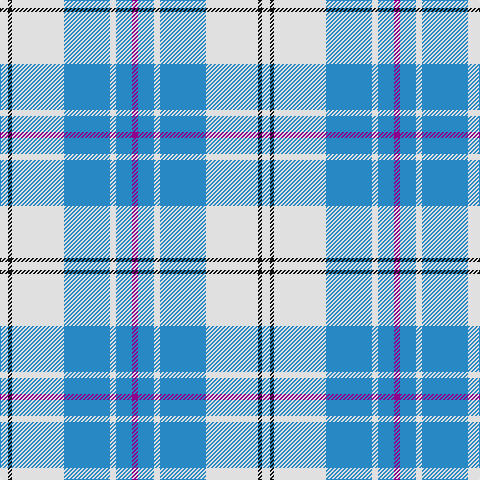

In pattern [BBWBWKW](/patterns/bbwbwkw/).

This was sourced from house-of-tartan.  It is a [7 stripes tartan](/stripes/stripes7/).

Original link http://www.house-of-tartan.scotland.net/house/TartanViewjs.asp?colr=Def&tnam=8183

## Thread count
LN/8 K4 LN52 B46 LN6 B16 P/6

## Palette
Each colour and its ΔE from the base-6 reference it is a variant of.

| Colour | Shade | Base | ΔE (OKLab) |
|---|---|---|---|
| B | <code style="background-color:#2888C4;">#2888C4</code> `#2888C4` | B <code style="background-color:#2A418A;">#2A418A</code> | 0.21 |
| K | <code style="background-color:#101010;">#101010</code> `#101010` | K <code style="background-color:#000000;">#000000</code> | 0.17 |
| LN | <code style="background-color:#E0E0E0;">#E0E0E0</code> `#E0E0E0` | W <code style="background-color:#F7F7F7;">#F7F7F7</code> | 0.07 |
| P | <code style="background-color:#8C008C;">#8C008C</code> `#8C008C` | B <code style="background-color:#2A418A;">#2A418A</code> | 0.19 |

# Sample pattern

## Nearest tartans

The nearest existing variants by ΔTartan distance.

1. [Lennox Turquoise Dress District Tartan Tartan Number: 8190. Earliest known date: pre 2003 Families with the surname 'Lennox' are usually considered related to Clans Stewart or MacFarlane. Some of this surname also choose to wear the distinctive and ancient 'Lennox' tartan. D W Stewart reproduced the sett from a 'lost' portrait of the Countess of Lennox dating from the 16th century./Threadcount and colours aren't 100% original. Generated manually./ See products available Copyright © Blair Urquhart, Comrie, 2015](/setts/s7/b8ba2b24ba5w26k2w8x2~b5c8ca8-ba2c2c80-k101010-we0e0e0/) — ΔT 0.64
1. [St. John's (Corporate)](/setts/s7/w2b1w15ba12w1y3b1x6~b1c0070-ba2888c4-we0e0e0-ye8c000/) — ΔT 0.83
1. [Galloway (Dance)](/setts/s6/g3r2b35w35b2r3x2~b1474b4-g007800-rc80000-wfcfcfc/) — ΔT 1.07
1. [Galloway (Dance)](/setts/s10/g3r2b35w35b2r3b2w35b35r2x2~b1474b4-g007800-rc80000-wfcfcfc/) — ΔT 1.12
1. [Silver (Personal)](/setts/s9/w24b24y6w1ba4w20b10y3w4x2~b2474b4-ba202060-we0e0e0-y7c98bc/) — ΔT 1.22
1. [Longniddry, dress (Turquoise)](/setts/s8/b42k2w2k2b5ba12w32b4x2~b5480b0-ba606080-k000000-we0e0e0/) — ΔT 1.24
1. [Torridon, Royal Blue (Dance)](/setts/s7/b3ba2w2ba30w30r2w3x2~b003c64-ba0c5488-rc80000-wf0e0c8/) — ΔT 1.32
1. [St John's](/setts/s12/w2b1w15ba12w1y3b1y3w1ba12w15b1x6~b1c0070-ba2888c4-we0e0e0-ye8c000/) — ΔT 1.33
1. [Alaska Highlanders P & D (Corporate)](/setts/s8/b9w27b2y4b2w10b2wa3x2~b2c2c80-w98c8e8-wafcfcfc-yfccc00/) — ΔT 1.36
1. [MacPherson, Blue & White](/setts/s7/w5r3w26b21w3b8y3x2~b304080-rc00000-we0e0e0-yf0c000/) — ΔT 1.38

## Neighbour map

Every grey dot is one of 15726 variants placed by the first two principal components of the ΔTartan feature space (44% of its variance). Red is this tartan; blue dots are its nearest — click one to open its page.

<svg viewBox="0 0 640 380" role="img" style="max-width:100%;height:auto;border:1px solid #e0e0e0;border-radius:4px;display:block" xmlns="http://www.w3.org/2000/svg"><image href="/nn/cloud.v1.png" width="640" height="380"/><a href="/setts/s7/b8ba2b24ba5w26k2w8x2~b5c8ca8-ba2c2c80-k101010-we0e0e0/"><circle cx="247.4" cy="178.4" r="4" fill="#3465a4"><title>Lennox Turquoise Dress District Tartan Tartan Number: 8190. Earliest known date: pre 2003 Families with the surname 'Lennox' are usually considered related to Clans Stewart or MacFarlane. Some of this surname also choose to wear the distinctive and ancient 'Lennox' tartan. D W Stewart reproduced the sett from a 'lost' portrait of the Countess of Lennox dating from the 16th century./Threadcount and colours aren't 100% original. Generated manually./ See products available Copyright © Blair Urquhart, Comrie, 2015</title></circle></a><a href="/setts/s7/w2b1w15ba12w1y3b1x6~b1c0070-ba2888c4-we0e0e0-ye8c000/"><circle cx="285.2" cy="155.6" r="4" fill="#3465a4"><title>St. John's (Corporate)</title></circle></a><a href="/setts/s6/g3r2b35w35b2r3x2~b1474b4-g007800-rc80000-wfcfcfc/"><circle cx="269.0" cy="147.8" r="4" fill="#3465a4"><title>Galloway (Dance)</title></circle></a><a href="/setts/s10/g3r2b35w35b2r3b2w35b35r2x2~b1474b4-g007800-rc80000-wfcfcfc/"><circle cx="268.6" cy="134.5" r="4" fill="#3465a4"><title>Galloway (Dance)</title></circle></a><a href="/setts/s9/w24b24y6w1ba4w20b10y3w4x2~b2474b4-ba202060-we0e0e0-y7c98bc/"><circle cx="281.8" cy="150.9" r="4" fill="#3465a4"><title>Silver (Personal)</title></circle></a><a href="/setts/s8/b42k2w2k2b5ba12w32b4x2~b5480b0-ba606080-k000000-we0e0e0/"><circle cx="294.9" cy="138.7" r="4" fill="#3465a4"><title>Longniddry, dress (Turquoise)</title></circle></a><a href="/setts/s7/b3ba2w2ba30w30r2w3x2~b003c64-ba0c5488-rc80000-wf0e0c8/"><circle cx="282.7" cy="146.0" r="4" fill="#3465a4"><title>Torridon, Royal Blue (Dance)</title></circle></a><a href="/setts/s12/w2b1w15ba12w1y3b1y3w1ba12w15b1x6~b1c0070-ba2888c4-we0e0e0-ye8c000/"><circle cx="272.1" cy="138.9" r="4" fill="#3465a4"><title>St John's</title></circle></a><a href="/setts/s8/b9w27b2y4b2w10b2wa3x2~b2c2c80-w98c8e8-wafcfcfc-yfccc00/"><circle cx="331.3" cy="157.1" r="4" fill="#3465a4"><title>Alaska Highlanders P &amp; D (Corporate)</title></circle></a><a href="/setts/s7/w5r3w26b21w3b8y3x2~b304080-rc00000-we0e0e0-yf0c000/"><circle cx="239.7" cy="182.6" r="4" fill="#3465a4"><title>MacPherson, Blue &amp; White</title></circle></a><circle cx="276.2" cy="174.0" r="5" fill="#c00000"/></svg>

ID: /setts/s7/w4k2w26b23w3b8ba3x2~b2888c4-ba8c008c-k101010-we0e0e0/
