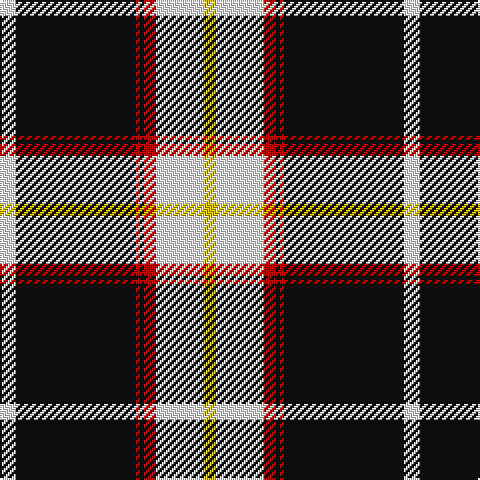

**Bands:** [WKRKRWY](/stripes/wkrkrwy/) · **Stripes:** [W K R K R W LY](/stripes/stripes7/) W K R K R W LY

This was sourced from register-of-tartans.  It is a [7 band tartan](/bands/bands7/).

Original link https://www.tartanregister.gov.uk/tartanDetails.aspx?ref=3509

## Attestations

This cloth appears in 2 source records; the oldest owns this page.

- 22/08/2003 — Richecourt, Baron of (Personal) (register-of-tartans, [record](https://www.tartanregister.gov.uk/tartanDetails.aspx?ref=3509))
- pre 2004 — Richecourt, Baron of (Personal) (tartans-authority, [record](http://www.tartansauthority.com/tartan-ferret/display/6225/))

## Register references

External register numbers recorded for this tartan.

- Scottish Register of Tartans: [3509](https://www.tartanregister.gov.uk/tartanDetails.aspx?ref=3509)
- Scottish Tartans Authority (ITI): 6225
- Scottish Tartans World Register: 2952

## Thread count
W/8 K60 R2 K2 R6 W24 Y/6

## Palette
Each colour and its ΔE from the base-6 reference it is a variant of.

| Colour | Shade | Base | ΔE (OKLab) |
|---|---|---|---|
| K | <code style="background-color:#101010;">#101010</code> `#101010` | K <code style="background-color:#000000;">#000000</code> | 0.17 |
| R | <code style="background-color:#C80000;">#C80000</code> `#C80000` | R <code style="background-color:#CC0000;">#CC0000</code> | 0.01 |
| W | <code style="background-color:#FCFCFC;">#FCFCFC</code> `#FCFCFC` | W <code style="background-color:#F7F7F7;">#F7F7F7</code> | 0.01 |
| Y | <code style="background-color:#E8C000;">#E8C000</code> `#E8C000` | Y <code style="background-color:#F2BF00;">#F2BF00</code> | 0.02 |

# Sample pattern

## Nearest tartans

The nearest existing variants by ΔTartan distance.

1. [MacPherson Dress](/setts/s7/lb3r1lb30k20lb3k9ly1/) — ΔT 0.78
1. [Colbert Check (Fashion)](/setts/s8/k62w10ly10k4w18k4lo3w4/) — ΔT 0.85
1. [MacPherson Dress](/setts/s7/lr3r1lr30k20lr3k9ly1~x2/) — ΔT 0.95
1. [Newcastle](/setts/s10/w8k1db2k4ly2k2ly2k24w8k2~x2/) — ΔT 0.99
1. [Phantom](/setts/s7/w3o10k38w11o6k2w3~x2/) — ΔT 1.06
1. [Gretna Football Club (Corporate)](/setts/s7/w36k8w36k95w4k4r6/) — ΔT 1.16
1. [Cardiff City Football Club (Corp)](/setts/s9/k4lo24k13lo2k4lo3k1lo3t2~x2/) — ΔT 1.17
1. [MacPherson Dress (1842)](/setts/s7/w3r1w30k20w3k9ly1~x2/) — ΔT 1.18
1. [Gleneagles](/setts/s7/k4o4w35o1k36o4k2/) — ΔT 1.18
1. [Gleneagles Gold (Dalgleish)](/setts/s7/k4lo4lb32lo1k32lo4k2~x4/) — ΔT 1.22

## Neighbour map

Every grey dot is one of 14313 variants placed by the first two principal components of the ΔTartan feature space (44% of its variance). Red is this tartan; blue dots are its nearest — click one to open its page.

<svg viewBox="0 0 640 380" role="img" style="max-width:100%;height:auto;border:1px solid #e0e0e0;border-radius:4px;display:block" xmlns="http://www.w3.org/2000/svg"><image href="/nn/cloud.v1.png" width="640" height="380"/><a href="/setts/s7/lb3r1lb30k20lb3k9ly1/"><circle cx="322.9" cy="125.5" r="4" fill="#3465a4"><title>MacPherson Dress</title></circle></a><a href="/setts/s8/k62w10ly10k4w18k4lo3w4/"><circle cx="339.9" cy="123.7" r="4" fill="#3465a4"><title>Colbert Check (Fashion)</title></circle></a><a href="/setts/s7/lr3r1lr30k20lr3k9ly1~x2/"><circle cx="329.5" cy="131.8" r="4" fill="#3465a4"><title>MacPherson Dress</title></circle></a><a href="/setts/s10/w8k1db2k4ly2k2ly2k24w8k2~x2/"><circle cx="331.8" cy="115.8" r="4" fill="#3465a4"><title>Newcastle</title></circle></a><a href="/setts/s7/w3o10k38w11o6k2w3~x2/"><circle cx="286.9" cy="140.4" r="4" fill="#3465a4"><title>Phantom</title></circle></a><a href="/setts/s7/w36k8w36k95w4k4r6/"><circle cx="346.7" cy="144.3" r="4" fill="#3465a4"><title>Gretna Football Club (Corporate)</title></circle></a><a href="/setts/s9/k4lo24k13lo2k4lo3k1lo3t2~x2/"><circle cx="335.8" cy="130.7" r="4" fill="#3465a4"><title>Cardiff City Football Club (Corp)</title></circle></a><a href="/setts/s7/w3r1w30k20w3k9ly1~x2/"><circle cx="322.9" cy="120.9" r="4" fill="#3465a4"><title>MacPherson Dress (1842)</title></circle></a><a href="/setts/s7/k4o4w35o1k36o4k2/"><circle cx="312.9" cy="125.2" r="4" fill="#3465a4"><title>Gleneagles</title></circle></a><a href="/setts/s7/k4lo4lb32lo1k32lo4k2~x4/"><circle cx="314.1" cy="135.5" r="4" fill="#3465a4"><title>Gleneagles Gold (Dalgleish)</title></circle></a><circle cx="330.1" cy="112.8" r="5" fill="#c00000"/></svg>

ID: /setts/s7/w4k30r1k1r3w12ly3~x2/
