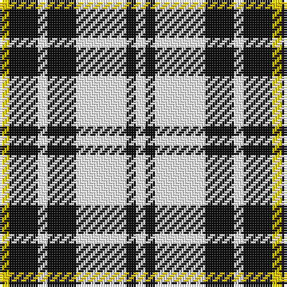

This page is one **sett** — a single exact thread-count. It belongs to the [tartan](/tartans/w4k4w21k12w4k12ly4/)
(the same proportion at any scale), whose colour order is pattern [WKWKWKY](/stripes/wkwkwky/).

Sourced from tartans-authority.  It is a [7 stripe tartan](/stripes/stripes7/).

Original link http://www.tartansauthority.com/tartan-ferret/display/8581/

## Register references

External register numbers recorded for this tartan.

- Scottish Register of Tartans: [8581](https://www.tartanregister.gov.uk/tartanDetails?ref=8581)
- Scottish Tartans Authority (ITI): 8581

## Thread count
Y/4 K12 W4 K12 W21 K4 W/4

## Palette

Palette: <strong>Tartan Register</strong>
<table><thead><tr><th>Colour</th><th>Threads</th><th>Shade</th><th>Base</th><th>OKLCh</th></tr></thead><tbody><tr><td>Y/</td><td style="text-align:right;font-variant-numeric:tabular-nums">4</td><td><code style="background-color:#FCCC00;">#FCCC00</code> <small style="color:#888">#FCCC00</small></td><td>Y <code style="background-color:#F2BF00;">#F2BF00</code></td><td><small style="color:#888">oklch(86.2% 0.176 91.5)</small></td></tr><tr><td>K</td><td style="text-align:right;font-variant-numeric:tabular-nums">12</td><td><code style="background-color:#101010;">#101010</code> <small style="color:#888">#101010</small></td><td>K <code style="background-color:#000000;">#000000</code></td><td><small style="color:#888">oklch(17.3% 0.000 89.9)</small></td></tr><tr><td>W</td><td style="text-align:right;font-variant-numeric:tabular-nums">4</td><td><code style="background-color:#FCFCFC;">#FCFCFC</code> <small style="color:#888">#FCFCFC</small></td><td>W <code style="background-color:#F7F7F7;">#F7F7F7</code></td><td><small style="color:#888">oklch(99.1% 0.000 89.9)</small></td></tr><tr><td>K</td><td style="text-align:right;font-variant-numeric:tabular-nums">12</td><td><code style="background-color:#101010;">#101010</code> <small style="color:#888">#101010</small></td><td>K <code style="background-color:#000000;">#000000</code></td><td><small style="color:#888">oklch(17.3% 0.000 89.9)</small></td></tr><tr><td>W</td><td style="text-align:right;font-variant-numeric:tabular-nums">21</td><td><code style="background-color:#FCFCFC;">#FCFCFC</code> <small style="color:#888">#FCFCFC</small></td><td>W <code style="background-color:#F7F7F7;">#F7F7F7</code></td><td><small style="color:#888">oklch(99.1% 0.000 89.9)</small></td></tr><tr><td>K</td><td style="text-align:right;font-variant-numeric:tabular-nums">4</td><td><code style="background-color:#101010;">#101010</code> <small style="color:#888">#101010</small></td><td>K <code style="background-color:#000000;">#000000</code></td><td><small style="color:#888">oklch(17.3% 0.000 89.9)</small></td></tr><tr><td>W/</td><td style="text-align:right;font-variant-numeric:tabular-nums">4</td><td><code style="background-color:#FCFCFC;">#FCFCFC</code> <small style="color:#888">#FCFCFC</small></td><td>W <code style="background-color:#F7F7F7;">#F7F7F7</code></td><td><small style="color:#888">oklch(99.1% 0.000 89.9)</small></td></tr></tbody></table>

# Sample pattern

## Nearest tartans

The nearest existing variants by ΔTartan distance, with this tartan at the top so the swatches line up against it.

ΔTartan

Tartan

Sett

—

<a href="/ttd/edit/#slug=w4k4w21k12w4k12ly4">Mazda</a> <a class="nn-out" href="/setts/s7/w4k4w21k12w4k12ly4/" title="open its dictionary page">↗</a>

1.31

<a href="/ttd/edit/#slug=w2k11w2k2w16k2w2k11lo2~x4">MacFie of Colonsay Dress (Fashion?)</a> <a class="nn-out" href="/setts/s9/w2k11w2k2w16k2w2k11lo2~x4/" title="open its dictionary page">↗</a>

1.35

<a href="/ttd/edit/#slug=k9r9k25w30k5w5r7">Rocket Dog (Fashion)</a> <a class="nn-out" href="/setts/s7/k9r9k25w30k5w5r7/" title="open its dictionary page">↗</a>

1.41

<a href="/ttd/edit/#slug=lb8dt2lb1dt2lb1dt2r3dt3lb1~x4">Canadian Winter Games 1987</a> <a class="nn-out" href="/setts/s9/lb8dt2lb1dt2lb1dt2r3dt3lb1~x4/" title="open its dictionary page">↗</a>

1.42

<a href="/ttd/edit/#slug=w2k1w6k6w2k1w1~x2">Scott (Abbreviated)</a> <a class="nn-out" href="/setts/s7/w2k1w6k6w2k1w1~x2/" title="open its dictionary page">↗</a>

1.45

<a href="/ttd/edit/#slug=w5k20w2r5w20r2~x2">Gangs of New York Fashion Check Tartan Tartan Number: 8248. Earliest known date: 8th July 2010 The period was the 1860s, a rather attractive time for men, all frock coats and top hats. Narrow-leg trousers and checks were fashionable. I accentuated Daniel's height and slenderness by extending his top hat, making his trousers thinner and his shoes longer. The other members of his gang were dressed along the same lines but not so finely: no one had the same presence as Bill the Butcher. See products available Copyright © Blair Urquhart, Comrie, 2015</a> <a class="nn-out" href="/setts/s6/w5k20w2r5w20r2~x2/" title="open its dictionary page">↗</a>

1.46

<a href="/ttd/edit/#slug=k22w16g2w14g2w16k22r3~x2">Kierson</a> <a class="nn-out" href="/setts/s8/k22w16g2w14g2w16k22r3~x2/" title="open its dictionary page">↗</a>

1.49

<a href="/ttd/edit/#slug=k3w1k1w6g1w1g1w1o3~x4">Puffin</a> <a class="nn-out" href="/setts/s9/k3w1k1w6g1w1g1w1o3~x4/" title="open its dictionary page">↗</a>

1.50

<a href="/ttd/edit/#slug=k6m2k12y3k6lb16y3lb16k2~x2">MacMillan</a> <a class="nn-out" href="/setts/s9/k6m2k12y3k6lb16y3lb16k2~x2/" title="open its dictionary page">↗</a>

1.52

<a href="/ttd/edit/#slug=k10ly2k10w2k2ly13w3~x2">Nooten-Boom (Personal)</a> <a class="nn-out" href="/setts/s7/k10ly2k10w2k2ly13w3~x2/" title="open its dictionary page">↗</a>

1.53

<a href="/ttd/edit/#slug=db20k5db18ly26k6~x2">Jahore</a> <a class="nn-out" href="/setts/s5/db20k5db18ly26k6~x2/" title="open its dictionary page">↗</a>

## Neighbour map

Every grey dot is one of 14359 variants placed by the first two principal components of the ΔTartan feature space (44% of its variance). Red is this tartan; blue dots are its nearest — click one to open its page.

<svg viewBox="0 0 640 380" role="img" style="max-width:100%;height:auto;border:1px solid #e0e0e0;border-radius:4px;display:block" xmlns="http://www.w3.org/2000/svg"><image href="/nn/cloud.v1.png" width="640" height="380"/><a href="/setts/s9/w2k11w2k2w16k2w2k11lo2~x4/"><circle cx="262.7" cy="183.1" r="4" fill="#3465a4"><title>MacFie of Colonsay Dress (Fashion?)</title></circle></a><a href="/setts/s7/k9r9k25w30k5w5r7/"><circle cx="188.1" cy="215.7" r="4" fill="#3465a4"><title>Rocket Dog (Fashion)</title></circle></a><a href="/setts/s9/lb8dt2lb1dt2lb1dt2r3dt3lb1~x4/"><circle cx="239.3" cy="200.0" r="4" fill="#3465a4"><title>Canadian Winter Games 1987</title></circle></a><a href="/setts/s7/w2k1w6k6w2k1w1~x2/"><circle cx="298.8" cy="232.3" r="4" fill="#3465a4"><title>Scott (Abbreviated)</title></circle></a><a href="/setts/s6/w5k20w2r5w20r2~x2/"><circle cx="249.8" cy="188.6" r="4" fill="#3465a4"><title>Gangs of New York Fashion Check Tartan Tartan Number: 8248. Earliest known date: 8th July 2010 The period was the 1860s, a rather attractive time for men, all frock coats and top hats. Narrow-leg trousers and checks were fashionable. I accentuated Daniel's height and slenderness by extending his top hat, making his trousers thinner and his shoes longer. The other members of his gang were dressed along the same lines but not so finely: no one had the same presence as Bill the Butcher. See products available Copyright © Blair Urquhart, Comrie, 2015</title></circle></a><a href="/setts/s8/k22w16g2w14g2w16k22r3~x2/"><circle cx="209.3" cy="183.8" r="4" fill="#3465a4"><title>Kierson</title></circle></a><a href="/setts/s9/k3w1k1w6g1w1g1w1o3~x4/"><circle cx="171.4" cy="182.2" r="4" fill="#3465a4"><title>Puffin</title></circle></a><a href="/setts/s9/k6m2k12y3k6lb16y3lb16k2~x2/"><circle cx="207.8" cy="187.9" r="4" fill="#3465a4"><title>MacMillan</title></circle></a><a href="/setts/s7/k10ly2k10w2k2ly13w3~x2/"><circle cx="234.8" cy="220.4" r="4" fill="#3465a4"><title>Nooten-Boom (Personal)</title></circle></a><a href="/setts/s5/db20k5db18ly26k6~x2/"><circle cx="205.7" cy="266.3" r="4" fill="#3465a4"><title>Jahore</title></circle></a><circle cx="206.7" cy="224.3" r="5" fill="#c00000"/></svg>

ID: /setts/s7/w4k4w21k12w4k12ly4/
