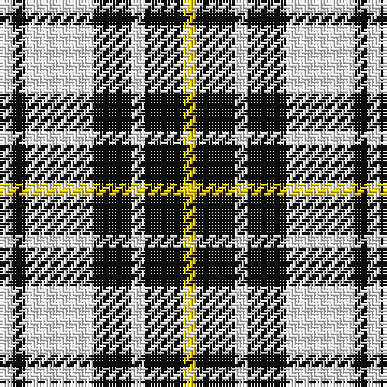

In pattern [WKWKWKY](/patterns/wkwkwky/).

This was sourced from tartans-authority.  It is a [7 stripes tartan](/stripes/stripes7/).

Original link http://www.tartansauthority.com/tartan-ferret/display/8581/

## Thread count
W/4 K4 W21 K12 W4 K12 Y/4

## Palette
Each colour and its ΔE from the base-6 reference it is a variant of.

| Colour | Shade | Base | ΔE (OKLab) |
|---|---|---|---|
| K | <code style="background-color:#101010;">#101010</code> `#101010` | K <code style="background-color:#000000;">#000000</code> | 0.17 |
| W | <code style="background-color:#FCFCFC;">#FCFCFC</code> `#FCFCFC` | W <code style="background-color:#F7F7F7;">#F7F7F7</code> | 0.01 |
| Y | <code style="background-color:#FCCC00;">#FCCC00</code> `#FCCC00` | Y <code style="background-color:#F2BF00;">#F2BF00</code> | 0.04 |

# Sample pattern

## Nearest tartans

The nearest existing variants by ΔTartan distance.

1. [MacFie of Colonsay Dress (Fashion?)](/setts/s9/w8k44w8k8w64k8w8k44y8-k101010-wfcfcfc-yd09800/) — ΔT 1.31
1. [Rocket Dog (Fashion)](/setts/s7/k9r9k25w30k5w5r7-k101010-rc80000-wf0e4cc/) — ΔT 1.35
1. [Canadian Winter Games 1987](/setts/s9/w32b8w4b8w4b8r12b12w4-b283c50-r8c0000-wc8c8c8/) — ΔT 1.41
1. [Scott (Abbreviated)](/setts/s7/w4k2w12k12w4k2w2-k101010-we0e0e0/) — ΔT 1.42
1. [Gangs of New York Fashion Check Tartan Tartan Number: 8248. Earliest known date: 8th July 2010 The period was the 1860s, a rather attractive time for men, all frock coats and top hats. Narrow-leg trousers and checks were fashionable. I accentuated Daniel's height and slenderness by extending his top hat, making his trousers thinner and his shoes longer. The other members of his gang were dressed along the same lines but not so finely: no one had the same presence as Bill the Butcher. See products available Copyright © Blair Urquhart, Comrie, 2015](/setts/s6/w10k40w4r10w40r4-k101010-rc80000-wf8e8d8/) — ΔT 1.45
1. [Kierson](/setts/s8/k44w32g4w28g4w32k44r6-g006818-k101010-r880000-wf8f8f8/) — ΔT 1.46
1. [Puffin](/setts/s9/k12w4k4w24g4w4g4w4r12-g008000-k000000-r806050-we0e0e0/) — ΔT 1.48
1. [MacMillan](/setts/s9/k12r4k24g6k12w32g6w32k4-g8c7038-k101010-r980044-wc0c0c0/) — ΔT 1.49
1. [Nooten-Boom (Personal)](/setts/s7/k20y4k20w4k4y26w6-k101010-we0e0e0-ye8c000/) — ΔT 1.52
1. [Jahore](/setts/s5/b40k10b36y52k12-b304080-k000000-yf0c000/) — ΔT 1.52

## Neighbour map

Every grey dot is one of 15726 variants placed by the first two principal components of the ΔTartan feature space (44% of its variance). Red is this tartan; blue dots are its nearest — click one to open its page.

<svg viewBox="0 0 640 380" role="img" style="max-width:100%;height:auto;border:1px solid #e0e0e0;border-radius:4px;display:block" xmlns="http://www.w3.org/2000/svg"><image href="/nn/cloud.v1.png" width="640" height="380"/><a href="/setts/s9/w8k44w8k8w64k8w8k44y8-k101010-wfcfcfc-yd09800/"><circle cx="262.7" cy="185.3" r="4" fill="#3465a4"><title>MacFie of Colonsay Dress (Fashion?)</title></circle></a><a href="/setts/s7/k9r9k25w30k5w5r7-k101010-rc80000-wf0e4cc/"><circle cx="188.8" cy="218.0" r="4" fill="#3465a4"><title>Rocket Dog (Fashion)</title></circle></a><a href="/setts/s9/w32b8w4b8w4b8r12b12w4-b283c50-r8c0000-wc8c8c8/"><circle cx="239.0" cy="200.5" r="4" fill="#3465a4"><title>Canadian Winter Games 1987</title></circle></a><a href="/setts/s7/w4k2w12k12w4k2w2-k101010-we0e0e0/"><circle cx="300.7" cy="235.0" r="4" fill="#3465a4"><title>Scott (Abbreviated)</title></circle></a><a href="/setts/s6/w10k40w4r10w40r4-k101010-rc80000-wf8e8d8/"><circle cx="250.9" cy="191.6" r="4" fill="#3465a4"><title>Gangs of New York Fashion Check Tartan Tartan Number: 8248. Earliest known date: 8th July 2010 The period was the 1860s, a rather attractive time for men, all frock coats and top hats. Narrow-leg trousers and checks were fashionable. I accentuated Daniel's height and slenderness by extending his top hat, making his trousers thinner and his shoes longer. The other members of his gang were dressed along the same lines but not so finely: no one had the same presence as Bill the Butcher. See products available Copyright © Blair Urquhart, Comrie, 2015</title></circle></a><a href="/setts/s8/k44w32g4w28g4w32k44r6-g006818-k101010-r880000-wf8f8f8/"><circle cx="209.1" cy="185.8" r="4" fill="#3465a4"><title>Kierson</title></circle></a><a href="/setts/s9/k12w4k4w24g4w4g4w4r12-g008000-k000000-r806050-we0e0e0/"><circle cx="170.6" cy="184.1" r="4" fill="#3465a4"><title>Puffin</title></circle></a><a href="/setts/s9/k12r4k24g6k12w32g6w32k4-g8c7038-k101010-r980044-wc0c0c0/"><circle cx="207.1" cy="188.9" r="4" fill="#3465a4"><title>MacMillan</title></circle></a><a href="/setts/s7/k20y4k20w4k4y26w6-k101010-we0e0e0-ye8c000/"><circle cx="235.7" cy="222.4" r="4" fill="#3465a4"><title>Nooten-Boom (Personal)</title></circle></a><a href="/setts/s5/b40k10b36y52k12-b304080-k000000-yf0c000/"><circle cx="206.7" cy="267.4" r="4" fill="#3465a4"><title>Jahore</title></circle></a><circle cx="207.7" cy="226.9" r="5" fill="#c00000"/></svg>

ID: /setts/s7/w4k4w21k12w4k12y4-k101010-wfcfcfc-yfccc00/
