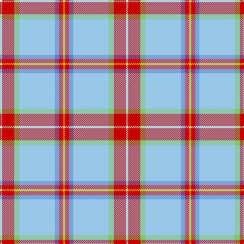

In pattern [WRYWBRY](/patterns/wrywbry/).

This was sourced from tartans-authority.  It is a [7 stripes tartan](/stripes/stripes7/).

Original link http://www.tartansauthority.com/tartan-ferret/display/7470/

## Attestations

This cloth appears in 2 source records; the oldest owns this page.

- Jan 2008 — Nicolson of the Isles (Personal) (tartans-authority, [record](http://www.tartansauthority.com/tartan-ferret/display/7470/))
- undated — Nicolson of the Isles (Personal) (register-of-tartans, [record](https://www.tartanregister.gov.uk/tartanDetails.aspx?ref=5515))

## Thread count
LN/4 R24 LG10 LB70 B8 R8 Y/4

## Palette
Each colour and its ΔE from the base-6 reference it is a variant of.

| Colour | Shade | Base | ΔE (OKLab) |
|---|---|---|---|
| B | <code style="background-color:#6080D0;">#6080D0</code> `#6080D0` | B <code style="background-color:#2C4084;">#2C4084</code> | 0.22 |
| LB | <code style="background-color:#98C8E8;">#98C8E8</code> `#98C8E8` | W <code style="background-color:#F4F4F0;">#F4F4F0</code> | 0.17 |
| LG | <code style="background-color:#80C86C;">#80C86C</code> `#80C86C` | Y <code style="background-color:#E8C000;">#E8C000</code> | 0.13 |
| LN | <code style="background-color:#E0E0E0;">#E0E0E0</code> `#E0E0E0` | W <code style="background-color:#F4F4F0;">#F4F4F0</code> | 0.06 |
| R | <code style="background-color:#C80000;">#C80000</code> `#C80000` | R <code style="background-color:#C80000;">#C80000</code> | 0.00 |
| Y | <code style="background-color:#E8C000;">#E8C000</code> `#E8C000` | Y <code style="background-color:#E8C000;">#E8C000</code> | 0.00 |

# Sample pattern

ID: /setts/s7/w4r24y10wa70b8r8ya4-b6080d0-rc80000-we0e0e0-wa98c8e8-y80c86c-yae8c000/
