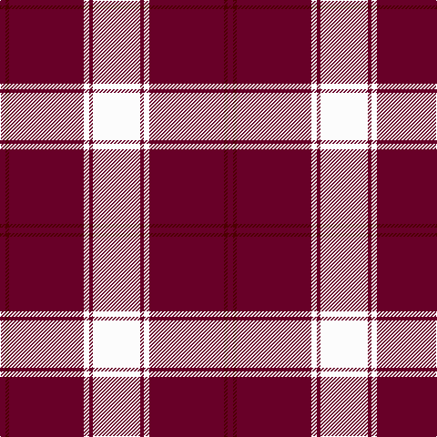

In pattern [BBBBWBW](/patterns/bbbbwbw/).

This was sourced from tartans-authority.  It is a [7 stripes tartan](/stripes/stripes7/).

Original link http://www.tartansauthority.com/tartan-ferret/display/4960/

## Thread count
DRa/6 DR4 DRa52 DRa30 W6 DRb4 W/52

## Palette
Each colour and its ΔE from the base-6 reference it is a variant of.

| Colour | Shade | Base | ΔE (OKLab) |
|---|---|---|---|
| DR | <code style="background-color:#4C0000;">#4C0000</code> `#4C0000` | B <code style="background-color:#2C4084;">#2C4084</code> | 0.24 |
| DRa | <code style="background-color:#680028;">#680028</code> `#680028` | B <code style="background-color:#2C4084;">#2C4084</code> | 0.20 |
| DRb | <code style="background-color:#680028;">#680028</code> `#680028` | B <code style="background-color:#2C4084;">#2C4084</code> | 0.20 |
| W | <code style="background-color:#FCFCFC;">#FCFCFC</code> `#FCFCFC` | W <code style="background-color:#F4F4F0;">#F4F4F0</code> | 0.03 |

# Sample pattern

## Nearest tartans

The nearest existing variants by ΔTartan distance.

1. [MacFie Dress](/setts/s9/w4r48g8r8w64r8g8r48y4-g006818-r880000-we0e0e0-yd09800/) — ΔT 1.23
1. [Buchanan 4](/setts/s6/k4w56r26w4r26w4-k000000-r900030-we0e0e0/) — ΔT 1.25
1. [MacPherson Dress Burgundy (Dance)](/setts/s7/w8k4w50r42w6r16y6-k101010-r880000-we0e0e0-ye8c000/) — ΔT 1.29
1. [Buchanan #5](/setts/s6/k4w56r26w4r26w4-k101010-r960028-we0e0e0/) — ΔT 1.35
1. [Instakilt, Pink (Fashion)](/setts/s7/r16w8r100k24r8k30ra10-k101010-rd84c70-rab468ac-wf8f8f8/) — ΔT 1.37
1. [Texas Lone Star](/setts/s7/r100b28w12b18y6b8r8-b000080-rff0000-wffffff-yffe600/) — ΔT 1.38
1. [Nisbet Dress Rose (Dance)](/setts/s6/r12w4r80k32w32g8-g006818-k101010-ra00048-we0e0e0/) — ΔT 1.41
1. [Nesbit, Rose](/setts/s6/r12w6r74k32w32g8-g006818-k101010-rd05054-we8ccb8/) — ΔT 1.44
1. [Cunningham Dress Burgundy (Dance)](/setts/s7/w10r4w68r68k4r4y8-k101010-r800028-wf8f8f8-ye8c000/) — ΔT 1.48
1. [Broberg (Scania) (Personal)](/setts/s4/r80w40k5y6-k101010-r800028-w98c8e8-yd87c00/) — ΔT 1.54

## Neighbour map

Every grey dot is one of 15726 variants placed by the first two principal components of the ΔTartan feature space (44% of its variance). Red is this tartan; blue dots are its nearest — click one to open its page.

<svg viewBox="0 0 640 380" role="img" style="max-width:100%;height:auto;border:1px solid #e0e0e0;border-radius:4px;display:block" xmlns="http://www.w3.org/2000/svg"><image href="/nn/cloud.v1.png" width="640" height="380"/><a href="/setts/s9/w4r48g8r8w64r8g8r48y4-g006818-r880000-we0e0e0-yd09800/"><circle cx="309.2" cy="137.2" r="4" fill="#3465a4"><title>MacFie Dress</title></circle></a><a href="/setts/s6/k4w56r26w4r26w4-k000000-r900030-we0e0e0/"><circle cx="320.4" cy="174.2" r="4" fill="#3465a4"><title>Buchanan 4</title></circle></a><a href="/setts/s7/w8k4w50r42w6r16y6-k101010-r880000-we0e0e0-ye8c000/"><circle cx="265.0" cy="156.7" r="4" fill="#3465a4"><title>MacPherson Dress Burgundy (Dance)</title></circle></a><a href="/setts/s6/k4w56r26w4r26w4-k101010-r960028-we0e0e0/"><circle cx="323.9" cy="174.9" r="4" fill="#3465a4"><title>Buchanan #5</title></circle></a><a href="/setts/s7/r16w8r100k24r8k30ra10-k101010-rd84c70-rab468ac-wf8f8f8/"><circle cx="366.6" cy="156.6" r="4" fill="#3465a4"><title>Instakilt, Pink (Fashion)</title></circle></a><a href="/setts/s7/r100b28w12b18y6b8r8-b000080-rff0000-wffffff-yffe600/"><circle cx="350.6" cy="127.8" r="4" fill="#3465a4"><title>Texas Lone Star</title></circle></a><a href="/setts/s6/r12w4r80k32w32g8-g006818-k101010-ra00048-we0e0e0/"><circle cx="301.0" cy="154.6" r="4" fill="#3465a4"><title>Nisbet Dress Rose (Dance)</title></circle></a><a href="/setts/s6/r12w6r74k32w32g8-g006818-k101010-rd05054-we8ccb8/"><circle cx="267.1" cy="175.0" r="4" fill="#3465a4"><title>Nesbit, Rose</title></circle></a><a href="/setts/s7/w10r4w68r68k4r4y8-k101010-r800028-wf8f8f8-ye8c000/"><circle cx="280.3" cy="125.0" r="4" fill="#3465a4"><title>Cunningham Dress Burgundy (Dance)</title></circle></a><a href="/setts/s4/r80w40k5y6-k101010-r800028-w98c8e8-yd87c00/"><circle cx="362.5" cy="185.1" r="4" fill="#3465a4"><title>Broberg (Scania) (Personal)</title></circle></a><circle cx="305.2" cy="155.8" r="5" fill="#c00000"/></svg>

ID: /setts/s7/w52b4w6b30b52ba4b6-b680028-ba4c0000-wfcfcfc/
