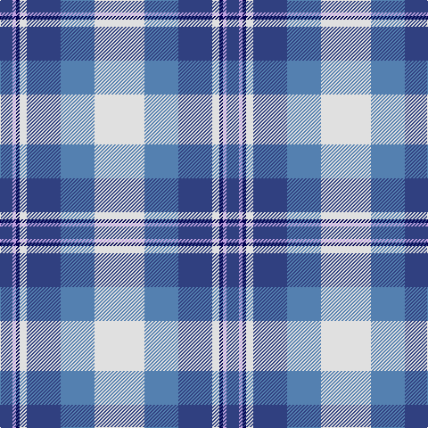

In pattern [BWBWBBW](/patterns/bwbwbbw/).

This was sourced from weddslist.  It is a [7 stripes tartan](/stripes/stripes7/).

Original link http://www.weddslist.com/cgi-bin/tartans/pg.pl?source=sts

## Thread count
B/14 LP4 DB4 LN8 B38 Ba38 LN/56

## Palette
Each colour and its ΔE from the base-6 reference it is a variant of.

| Colour | Shade | Base | ΔE (OKLab) |
|---|---|---|---|
| B | <code style="background-color:#304080;">#304080</code> `#304080` | B <code style="background-color:#2C4084;">#2C4084</code> | 0.01 |
| Ba | <code style="background-color:#5480B0;">#5480B0</code> `#5480B0` | B <code style="background-color:#2C4084;">#2C4084</code> | 0.20 |
| DB | <code style="background-color:#000050;">#000050</code> `#000050` | B <code style="background-color:#2C4084;">#2C4084</code> | 0.20 |
| LN | <code style="background-color:#E0E0E0;">#E0E0E0</code> `#E0E0E0` | W <code style="background-color:#F4F4F0;">#F4F4F0</code> | 0.06 |
| LP | <code style="background-color:#C0A0E0;">#C0A0E0</code> `#C0A0E0` | W <code style="background-color:#F4F4F0;">#F4F4F0</code> | 0.23 |

# Sample pattern

## Nearest tartans

The nearest existing variants by ΔTartan distance.

1. [St Andrews Dress, Earl of.. District Tartan Tartan Number: 45. Earliest known date: pre 2003 See products available Copyright © Blair Urquhart, Comrie, 2015](/setts/s7/w56b38ba38w8bb4wa4ba14-b5c8ca8-ba2c2c80-bb202060-we0e0e0-wac49cd8/) — ΔT 0.19
1. [St. Andrews Dress, Earl of (Danc](/setts/s7/w56b38ba38w8bb4bc4ba14-b5c8ca8-ba2c2c80-bb202060-bc9058d8-we0e0e0/) — ΔT 0.22
1. [Ferguson Dress Clan Tartan Tartan Number: 92. Earliest known date: 1980 See also 371 where the dark blue is changed to black. These are problably one and the same tartan. Dark blue being the correct colour. See products available Copyright © Blair Urquhart, Comrie, 2015](/setts/s7/b68ba48w36r6w36g4w6-b588ca8-ba202060-g006818-r880000-we0e0e0/) — ΔT 0.57
1. [Ferguson, dress](/setts/s7/b68ba48w36r6w36g4w6-b5480b0-ba000050-g008000-rc00000-we0e0e0/) — ΔT 0.69
1. [Earl of St. Andrews Dress (Dance)](/setts/s7/w40b28ba28w8bb4bc4ba14-b2c2c80-ba1870a4-bb003c64-bc5c8ca8-we0e0e0/) — ΔT 0.72
1. [Arran - 1989 (Fashion)](/setts/s8/b48k4b4k4b4ba32w36r8-b5c8ca8-ba202060-k101010-r888888-wfcfcfc/) — ΔT 0.85
1. [Allanton Dress (Fashion)](/setts/s6/g8w56b28y4ba34g8-b2c2c80-ba5c8ca8-g006818-we0e0e0-ye8c000/) — ΔT 0.90
1. [Manx Dress](/setts/s6/g8w56b16y4ba34g8-b780078-ba2c2c80-g006818-we0e0e0-ye8c000/) — ΔT 0.97
1. [Earl of St. Andrews Dress](/setts/s7/w40b28ba28w8bb4bc4ba14-b003478-ba3c3c64-bb000064-bc6478b0-wf8f8f8/) — ΔT 0.99
1. [Manx, dress](/setts/s6/g8w56b16y4ba34g8-b800080-ba304080-g008000-we0e0e0-yf0c000/) — ΔT 1.00

## Neighbour map

Every grey dot is one of 15726 variants placed by the first two principal components of the ΔTartan feature space (44% of its variance). Red is this tartan; blue dots are its nearest — click one to open its page.

<svg viewBox="0 0 640 380" role="img" style="max-width:100%;height:auto;border:1px solid #e0e0e0;border-radius:4px;display:block" xmlns="http://www.w3.org/2000/svg"><image href="/nn/cloud.v1.png" width="640" height="380"/><a href="/setts/s7/w56b38ba38w8bb4wa4ba14-b5c8ca8-ba2c2c80-bb202060-we0e0e0-wac49cd8/"><circle cx="166.2" cy="155.7" r="4" fill="#3465a4"><title>St Andrews Dress, Earl of.. District Tartan Tartan Number: 45. Earliest known date: pre 2003 See products available Copyright © Blair Urquhart, Comrie, 2015</title></circle></a><a href="/setts/s7/w56b38ba38w8bb4bc4ba14-b5c8ca8-ba2c2c80-bb202060-bc9058d8-we0e0e0/"><circle cx="166.2" cy="155.9" r="4" fill="#3465a4"><title>St. Andrews Dress, Earl of (Danc</title></circle></a><a href="/setts/s7/b68ba48w36r6w36g4w6-b588ca8-ba202060-g006818-r880000-we0e0e0/"><circle cx="164.4" cy="152.5" r="4" fill="#3465a4"><title>Ferguson Dress Clan Tartan Tartan Number: 92. Earliest known date: 1980 See also 371 where the dark blue is changed to black. These are problably one and the same tartan. Dark blue being the correct colour. See products available Copyright © Blair Urquhart, Comrie, 2015</title></circle></a><a href="/setts/s7/b68ba48w36r6w36g4w6-b5480b0-ba000050-g008000-rc00000-we0e0e0/"><circle cx="155.3" cy="150.5" r="4" fill="#3465a4"><title>Ferguson, dress</title></circle></a><a href="/setts/s7/w40b28ba28w8bb4bc4ba14-b2c2c80-ba1870a4-bb003c64-bc5c8ca8-we0e0e0/"><circle cx="140.3" cy="181.1" r="4" fill="#3465a4"><title>Earl of St. Andrews Dress (Dance)</title></circle></a><a href="/setts/s8/b48k4b4k4b4ba32w36r8-b5c8ca8-ba202060-k101010-r888888-wfcfcfc/"><circle cx="151.9" cy="142.8" r="4" fill="#3465a4"><title>Arran - 1989 (Fashion)</title></circle></a><a href="/setts/s6/g8w56b28y4ba34g8-b2c2c80-ba5c8ca8-g006818-we0e0e0-ye8c000/"><circle cx="159.2" cy="164.2" r="4" fill="#3465a4"><title>Allanton Dress (Fashion)</title></circle></a><a href="/setts/s6/g8w56b16y4ba34g8-b780078-ba2c2c80-g006818-we0e0e0-ye8c000/"><circle cx="178.7" cy="152.0" r="4" fill="#3465a4"><title>Manx Dress</title></circle></a><a href="/setts/s7/w40b28ba28w8bb4bc4ba14-b003478-ba3c3c64-bb000064-bc6478b0-wf8f8f8/"><circle cx="125.8" cy="173.0" r="4" fill="#3465a4"><title>Earl of St. Andrews Dress</title></circle></a><a href="/setts/s6/g8w56b16y4ba34g8-b800080-ba304080-g008000-we0e0e0-yf0c000/"><circle cx="181.9" cy="153.0" r="4" fill="#3465a4"><title>Manx, dress</title></circle></a><circle cx="170.5" cy="157.9" r="5" fill="#c00000"/></svg>

ID: /setts/s7/w56b38ba38w8bb4wa4ba14-b5480b0-ba304080-bb000050-we0e0e0-wac0a0e0/
