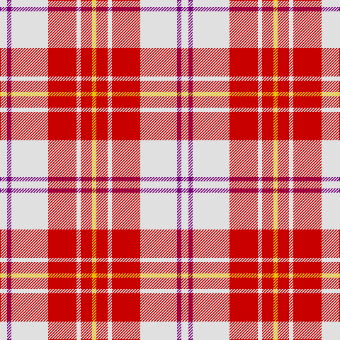

In pattern [WBWRWRY](/patterns/wbwrwry/).

This was sourced from register-of-tartans.  It is a [7 stripes tartan](/stripes/stripes7/).

Original link https://www.tartanregister.gov.uk/tartanDetails.aspx?ref=2721

## Attestations

This cloth appears in 3 source records; the oldest owns this page.

- 01/01/1980 — MacPherson Dress Red (Dance) (register-of-tartans, [record](https://www.tartanregister.gov.uk/tartanDetails.aspx?ref=2721))
- 1980 — MacPherson Dress, Red (Dance) (tartans-authority, [record](http://www.tartansauthority.com/tartan-ferret/display/1793/))
- undated — MacPherson Red Dress Clan Tartan Tartan Number: 1793. Earliest known date: Date unknown There are a great number of variations of the Dress MacPherson, many of them modern trade designs which are popular with country dancers. Hugh Macpherson of Edinburgh, kiltmaker and tartan designer some decades ago, supplied samples of these to the Scottish Tartan Society around 1980. See products available Copyright © Blair Urquhart, Comrie, 2015 (house-of-tartan, [record](http://www.house-of-tartan.scotland.net/house/TartanViewjs.asp?colr=Def&tnam=1793))

## Thread count
LN/10 P6 LN52 R40 LN6 R16 Y/6

## Palette
Each colour and its ΔE from the base-6 reference it is a variant of.

| Colour | Shade | Base | ΔE (OKLab) |
|---|---|---|---|
| LN | <code style="background-color:#E0E0E0;">#E0E0E0</code> `#E0E0E0` | W <code style="background-color:#F7F7F7;">#F7F7F7</code> | 0.07 |
| P | <code style="background-color:#780078;">#780078</code> `#780078` | B <code style="background-color:#2A418A;">#2A418A</code> | 0.17 |
| R | <code style="background-color:#C80000;">#C80000</code> `#C80000` | R <code style="background-color:#CC0000;">#CC0000</code> | 0.01 |
| Y | <code style="background-color:#E8C000;">#E8C000</code> `#E8C000` | Y <code style="background-color:#F2BF00;">#F2BF00</code> | 0.02 |

# Sample pattern

## Nearest tartans

The nearest existing variants by ΔTartan distance.

1. [MacPherson, Red](/setts/s7/w5b3w26r20w3r8y3x2~b800080-rc00000-we0e0e0-yf0c000/) — ΔT 0.08
1. [MacPherson, dress red](/setts/s7/w4r2w25ra21w3ra8y3x2~r800000-rac00000-we0e0e0-yf0c000/) — ΔT 0.61
1. [MacPherson Dress Burgandy Clan Tartan Tartan Number: 1832. Earliest known date: pre 2003 Examined by D.C.S. 1947 See products available Copyright © Blair Urquhart, Comrie, 2015](/setts/s7/w4k2w25r21w3r8y3x2~k101010-rc80000-we0e0e0-ye8c000/) — ΔT 0.62
1. [MacPherson, Burgundy dress](/setts/s7/w4k2w25r21w3r8y3x2~k000000-rc00000-we0e0e0-yf0c000/) — ΔT 0.71
1. [MacPherson Dress Red](/setts/s7/w4r2w25ra21w3ra8y3x2~r960000-radc0000-we0e0e0-ye8c000/) — ΔT 0.72
1. [Lennox Dress District Tartan Tartan Number: 1649. Earliest known date: 1986 Families with the surname 'Lennox' are usually considered related to Clans Stewart or MacFarlane. Some of this surname also choose to wear the distinctive and ancient 'Lennox' tartan. D W Stewart reproduced the sett from a 'lost' portrait of the Countess of Lennox dating from the 16th century. See products available Copyright © Blair Urquhart, Comrie, 2015](/setts/s7/r8ra2r24ra5w25g2w8x2~g604000-rc80000-raa00048-we0e0e0/) — ΔT 0.88
1. [MacGiboney (Personal)](/setts/s7/r8b2r24b5w25g2w8x2~b5a008c-g503c14-rdc0000-we0e0e0/) — ΔT 0.89
1. [Lennox, dress](/setts/s7/r8b2r24b5w25ra2w8x2~b800080-rc00000-ra806050-we0e0e0/) — ΔT 0.91
1. [Arduaine, Red (Dance)](/setts/s7/w5k2w30r24w3r8b3x2~b003c64-k101010-rc8002c-wf0e0c8/) — ΔT 0.93
1. [Lennox Dress #2](/setts/s7/r2ra1r10ra2w10b1w2x4~b2c2c80-rc80000-ra880000-we0e0e0/) — ΔT 0.93

## Neighbour map

Every grey dot is one of 15726 variants placed by the first two principal components of the ΔTartan feature space (44% of its variance). Red is this tartan; blue dots are its nearest — click one to open its page.

<svg viewBox="0 0 640 380" role="img" style="max-width:100%;height:auto;border:1px solid #e0e0e0;border-radius:4px;display:block" xmlns="http://www.w3.org/2000/svg"><image href="/nn/cloud.v1.png" width="640" height="380"/><a href="/setts/s7/w5b3w26r20w3r8y3x2~b800080-rc00000-we0e0e0-yf0c000/"><circle cx="265.2" cy="175.0" r="4" fill="#3465a4"><title>MacPherson, Red</title></circle></a><a href="/setts/s7/w4r2w25ra21w3ra8y3x2~r800000-rac00000-we0e0e0-yf0c000/"><circle cx="281.2" cy="159.6" r="4" fill="#3465a4"><title>MacPherson, dress red</title></circle></a><a href="/setts/s7/w4k2w25r21w3r8y3x2~k101010-rc80000-we0e0e0-ye8c000/"><circle cx="277.8" cy="158.7" r="4" fill="#3465a4"><title>MacPherson Dress Burgandy Clan Tartan Tartan Number: 1832. Earliest known date: pre 2003 Examined by D.C.S. 1947 See products available Copyright © Blair Urquhart, Comrie, 2015</title></circle></a><a href="/setts/s7/w4k2w25r21w3r8y3x2~k000000-rc00000-we0e0e0-yf0c000/"><circle cx="272.1" cy="157.5" r="4" fill="#3465a4"><title>MacPherson, Burgundy dress</title></circle></a><a href="/setts/s7/w4r2w25ra21w3ra8y3x2~r960000-radc0000-we0e0e0-ye8c000/"><circle cx="289.7" cy="160.2" r="4" fill="#3465a4"><title>MacPherson Dress Red</title></circle></a><a href="/setts/s7/r8ra2r24ra5w25g2w8x2~g604000-rc80000-raa00048-we0e0e0/"><circle cx="253.8" cy="164.6" r="4" fill="#3465a4"><title>Lennox Dress District Tartan Tartan Number: 1649. Earliest known date: 1986 Families with the surname 'Lennox' are usually considered related to Clans Stewart or MacFarlane. Some of this surname also choose to wear the distinctive and ancient 'Lennox' tartan. D W Stewart reproduced the sett from a 'lost' portrait of the Countess of Lennox dating from the 16th century. See products available Copyright © Blair Urquhart, Comrie, 2015</title></circle></a><a href="/setts/s7/r8b2r24b5w25g2w8x2~b5a008c-g503c14-rdc0000-we0e0e0/"><circle cx="248.2" cy="162.6" r="4" fill="#3465a4"><title>MacGiboney (Personal)</title></circle></a><a href="/setts/s7/r8b2r24b5w25ra2w8x2~b800080-rc00000-ra806050-we0e0e0/"><circle cx="249.6" cy="164.3" r="4" fill="#3465a4"><title>Lennox, dress</title></circle></a><a href="/setts/s7/w5k2w30r24w3r8b3x2~b003c64-k101010-rc8002c-wf0e0c8/"><circle cx="296.8" cy="148.1" r="4" fill="#3465a4"><title>Arduaine, Red (Dance)</title></circle></a><a href="/setts/s7/r2ra1r10ra2w10b1w2x4~b2c2c80-rc80000-ra880000-we0e0e0/"><circle cx="237.0" cy="163.9" r="4" fill="#3465a4"><title>Lennox Dress #2</title></circle></a><circle cx="266.7" cy="175.1" r="5" fill="#c00000"/></svg>

ID: /setts/s7/w5b3w26r20w3r8y3x2~b780078-rc80000-we0e0e0-ye8c000/
