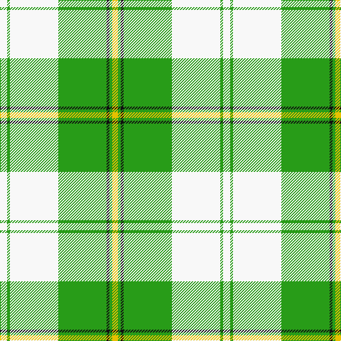

This page is one **sett** — a single exact thread-count. It belongs to the [tartan](/tartans/w5g2w34g34k2g2y4/)
(the same proportion at any scale), whose colour order is pattern [WGWGKGY](/stripes/wgwgkgy/).

Sourced from register-of-tartans.  It is a [7 stripe tartan](/stripes/stripes7/).

Original link https://www.tartanregister.gov.uk/tartanDetails.aspx?ref=848

## Also known as

This cloth is also recorded under:

- Cunningham Dress, Green

2 attestations — the source records this cloth was collapsed from (oldest owns this page)

<ul>
<li>01/01/1988 — Cunningham Dress Green (Dance) (register-of-tartans, <a href="https://www.tartanregister.gov.uk/tartanDetails.aspx?ref=848">record</a>)</li>
<li>1988 — Cunningham Dress, Green (Dance) (tartans-authority, <a href="http://www.tartansauthority.com/tartan-ferret/display/6532/">record</a>)</li>
</ul>

## Register references

External register numbers recorded for this tartan.

- Scottish Register of Tartans: [848](https://www.tartanregister.gov.uk/tartanDetails.aspx?ref=848)
- Scottish Tartans Authority (ITI): 6532

## Thread count
W/10 G4 W68 G68 K4 G4 Y/8

## Palette
Each colour and the base-6 reference it is a variant of.

| Colour | Shade | Base |
|---|---|---|
| G | <code style="background-color:#289C18;">#289C18</code> `oklch(60.6% 0.191 141.6)` <small>#289C18</small> | G <code style="background-color:#006100;">#006100</code> |
| K | <code style="background-color:#101010;">#101010</code> `oklch(17.3% 0.000 89.9)` <small>#101010</small> | K <code style="background-color:#000000;">#000000</code> |
| W | <code style="background-color:#F8F8F8;">#F8F8F8</code> `oklch(97.9% 0.000 89.9)` <small>#F8F8F8</small> | W <code style="background-color:#F7F7F7;">#F7F7F7</code> |
| Y | <code style="background-color:#E8C000;">#E8C000</code> `oklch(81.9% 0.168 93.7)` <small>#E8C000</small> | Y <code style="background-color:#F2BF00;">#F2BF00</code> |

# Sample pattern

## Nearest tartans

The nearest existing variants by ΔTartan distance, with this tartan at the top so the swatches line up against it.

ΔTartan

Tartan

Sett

—

<a href="/ttd/edit/#slug=w5g2w34g34k2g2ly4~x2">Cunningham Dress Green (Dance)</a> <a class="nn-out" href="/setts/s7/w5g2w34g34k2g2ly4~x2/" title="open its dictionary page">↗</a>

0.68

<a href="/ttd/edit/#slug=w2g1w20g20k1g1ly2~x4">Cunningham Dress Green (Dance) Fashion Tartan Tartan Number: 6532. Earliest known date: 01/01/1988 A dancers' tartan now woven by D C Dalgliesh of Selkirk /Threadcount and colours aren't 100% original. Generated manually./ See products available Copyright © Blair Urquhart, Comrie, 2015</a> <a class="nn-out" href="/setts/s7/w2g1w20g20k1g1ly2~x4/" title="open its dictionary page">↗</a>

1.24

<a href="/ttd/edit/#slug=g3r2g27dg3w30dg2w3~x2">Uist, Green (Dance)</a> <a class="nn-out" href="/setts/s7/g3r2g27dg3w30dg2w3~x2/" title="open its dictionary page">↗</a>

1.39

<a href="/ttd/edit/#slug=g1g1w1g15w15g1w1g1~x4">Bundy, Dress Black Personal)</a> <a class="nn-out" href="/setts/s8/g1g1w1g15w15g1w1g1~x4/" title="open its dictionary page">↗</a>

1.54

<a href="/ttd/edit/#slug=g42g2w2g2g5dg12w32g4~x2">Longniddry, Green</a> <a class="nn-out" href="/setts/s8/g42g2w2g2g5dg12w32g4~x2/" title="open its dictionary page">↗</a>

1.63

<a href="/ttd/edit/#slug=n4w2n1w36g21ly4~x2">Skye, Green (Dance)</a> <a class="nn-out" href="/setts/s6/n4w2n1w36g21ly4~x2/" title="open its dictionary page">↗</a>

1.66

<a href="/ttd/edit/#slug=w5r3w26g20w3g8ly3~x2">MacPherson Dress Green (Dance)</a> <a class="nn-out" href="/setts/s7/w5r3w26g20w3g8ly3~x2/" title="open its dictionary page">↗</a>

1.75

<a href="/ttd/edit/#slug=w38r12w37g32k3w4k3g32r4">MacDiarmid, dress</a> <a class="nn-out" href="/setts/s9/w38r12w37g32k3w4k3g32r4/" title="open its dictionary page">↗</a>

1.75

<a href="/ttd/edit/#slug=g42g2w2g2g5dt12w32g4~x2">Longniddry Green (Dance)</a> <a class="nn-out" href="/setts/s8/g42g2w2g2g5dt12w32g4~x2/" title="open its dictionary page">↗</a>

1.81

<a href="/ttd/edit/#slug=g3w29g3db3g3db6g13ly3r2~x2">Nova Scotia, dress</a> <a class="nn-out" href="/setts/s9/g3w29g3db3g3db6g13ly3r2~x2/" title="open its dictionary page">↗</a>

1.90

<a href="/ttd/edit/#slug=b6k3b37ly41w3ly6w3~x2">Tilburg Hunting (District)</a> <a class="nn-out" href="/setts/s7/b6k3b37ly41w3ly6w3~x2/" title="open its dictionary page">↗</a>

## Neighbour map

Every grey dot is one of 14299 variants placed by the first two principal components of the ΔTartan feature space (44% of its variance). Red is this tartan; blue dots are its nearest — click one to open its page.

<svg viewBox="0 0 640 380" role="img" style="max-width:100%;height:auto;border:1px solid #e0e0e0;border-radius:4px;display:block" xmlns="http://www.w3.org/2000/svg"><image href="/nn/cloud.v1.png" width="640" height="380"/><a href="/setts/s7/w2g1w20g20k1g1ly2~x4/"><circle cx="311.4" cy="141.6" r="4" fill="#3465a4"><title>Cunningham Dress Green (Dance) Fashion Tartan Tartan Number: 6532. Earliest known date: 01/01/1988 A dancers' tartan now woven by D C Dalgliesh of Selkirk /Threadcount and colours aren't 100% original. Generated manually./ See products available Copyright © Blair Urquhart, Comrie, 2015</title></circle></a><a href="/setts/s7/g3r2g27dg3w30dg2w3~x2/"><circle cx="267.4" cy="145.0" r="4" fill="#3465a4"><title>Uist, Green (Dance)</title></circle></a><a href="/setts/s8/g1g1w1g15w15g1w1g1~x4/"><circle cx="295.8" cy="143.7" r="4" fill="#3465a4"><title>Bundy, Dress Black Personal)</title></circle></a><a href="/setts/s8/g42g2w2g2g5dg12w32g4~x2/"><circle cx="280.9" cy="138.8" r="4" fill="#3465a4"><title>Longniddry, Green</title></circle></a><a href="/setts/s6/n4w2n1w36g21ly4~x2/"><circle cx="336.9" cy="121.0" r="4" fill="#3465a4"><title>Skye, Green (Dance)</title></circle></a><a href="/setts/s7/w5r3w26g20w3g8ly3~x2/"><circle cx="245.8" cy="183.0" r="4" fill="#3465a4"><title>MacPherson Dress Green (Dance)</title></circle></a><a href="/setts/s9/w38r12w37g32k3w4k3g32r4/"><circle cx="224.6" cy="162.0" r="4" fill="#3465a4"><title>MacDiarmid, dress</title></circle></a><a href="/setts/s8/g42g2w2g2g5dt12w32g4~x2/"><circle cx="266.5" cy="129.2" r="4" fill="#3465a4"><title>Longniddry Green (Dance)</title></circle></a><a href="/setts/s9/g3w29g3db3g3db6g13ly3r2~x2/"><circle cx="210.8" cy="120.6" r="4" fill="#3465a4"><title>Nova Scotia, dress</title></circle></a><a href="/setts/s7/b6k3b37ly41w3ly6w3~x2/"><circle cx="288.1" cy="161.3" r="4" fill="#3465a4"><title>Tilburg Hunting (District)</title></circle></a><circle cx="282.3" cy="140.6" r="5" fill="#c00000"/></svg>

ID: /setts/s7/w5g2w34g34k2g2ly4~x2/
