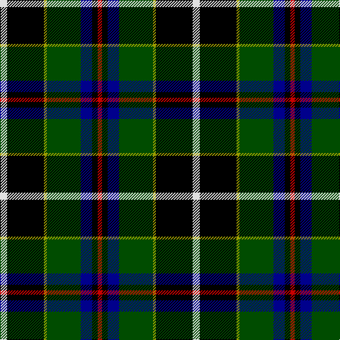

**Bands:** [RKBGYKW](/stripes/rkbgykw/) · **Stripes:** [R K DB DG LY K W](/stripes/stripes7/) R K DB DG LY K W

This was sourced from tartans-authority.  It is a [7 band tartan](/bands/bands7/).

Original link http://www.tartansauthority.com/tartan-ferret/display/1568/

## Thread count
LN/10 K52 LG4 G48 DB16 K8 R/6

## Palette
Each colour and its ΔE from the base-6 reference it is a variant of.

| Colour | Shade | Base | ΔE (OKLab) |
|---|---|---|---|
| DB | <code style="background-color:#00008C;">#00008C</code> `#00008C` | B <code style="background-color:#2A418A;">#2A418A</code> | 0.13 |
| G | <code style="background-color:#004C00;">#004C00</code> `#004C00` | G <code style="background-color:#006100;">#006100</code> | 0.07 |
| K | <code style="background-color:#000000;">#000000</code> `#000000` | K <code style="background-color:#000000;">#000000</code> | 0.00 |
| LG | <code style="background-color:#9C9C00;">#9C9C00</code> `#9C9C00` | Y <code style="background-color:#F2BF00;">#F2BF00</code> | 0.17 |
| LN | <code style="background-color:#E0E0E0;">#E0E0E0</code> `#E0E0E0` | W <code style="background-color:#F7F7F7;">#F7F7F7</code> | 0.07 |
| R | <code style="background-color:#C80000;">#C80000</code> `#C80000` | R <code style="background-color:#CC0000;">#CC0000</code> | 0.01 |

# Sample pattern

## Nearest tartans

The nearest existing variants by ΔTartan distance.

1. [Cornish, hunting](/setts/s7/w5k26ly2dg24k7k3r3~x2/) — ΔT 0.48
1. [James](/setts/s7/r5k12ly2dg25ly2db12t5~x2/) — ΔT 0.84
1. [MacNeil 7](/setts/s7/ly1k3g15k14db16r2w1~x2/) — ΔT 0.99
1. [MacCaskill](/setts/s7/k2ly1db15k15g15r1k2~x2/) — ΔT 1.03
1. [MacNeil](/setts/s7/lb1r2db16k14dg15k3ly1~x2/) — ΔT 1.14
1. [Cornish Hunting](/setts/s12/k26ly2dg24db8k4r3k4db8dg24ly2k26w5~x2/) — ΔT 1.22
1. [Cornish Hunting District Tartan Tartan Number: 1568. Earliest known date: 1984 The Cornish Hunting tartan was first produced in 1984, and was marketed by the firm, Cornovi Creations, Cornwall. It is based on the Cornish National tartan designed by E.E. Morton-Nance, who regarded tartan as the heritage of all Celts, not Scots alone. (P Smith and G Teall, District Tartans, 1992) The hunting sett replaces the 'National' yellow with dark green and the azure with a darker shade of blue. Cornish Hunting is a registered design (No. 514267). See products available Copyright © Blair Urquhart, Comrie, 2015](/setts/s7/w5k26ly2dg24dt7k3r3~x2/) — ΔT 1.24
1. [Arundel County (District)](/setts/s8/g2k3g16k4k1k4k5k2~x4/) — ΔT 1.27
1. [Jones, The](/setts/s7/r3w2dy10dg37k12db21w2~x2/) — ΔT 1.28
1. [MacNeil 5](/setts/s6/ly1k5g12k12db12w1~x4/) — ΔT 1.29

## Neighbour map

Every grey dot is one of 14313 variants placed by the first two principal components of the ΔTartan feature space (44% of its variance). Red is this tartan; blue dots are its nearest — click one to open its page.

<svg viewBox="0 0 640 380" role="img" style="max-width:100%;height:auto;border:1px solid #e0e0e0;border-radius:4px;display:block" xmlns="http://www.w3.org/2000/svg"><image href="/nn/cloud.v1.png" width="640" height="380"/><a href="/setts/s7/w5k26ly2dg24k7k3r3~x2/"><circle cx="175.7" cy="155.8" r="4" fill="#3465a4"><title>Cornish, hunting</title></circle></a><a href="/setts/s7/r5k12ly2dg25ly2db12t5~x2/"><circle cx="143.1" cy="165.1" r="4" fill="#3465a4"><title>James</title></circle></a><a href="/setts/s7/ly1k3g15k14db16r2w1~x2/"><circle cx="134.8" cy="148.0" r="4" fill="#3465a4"><title>MacNeil 7</title></circle></a><a href="/setts/s7/k2ly1db15k15g15r1k2~x2/"><circle cx="178.1" cy="167.4" r="4" fill="#3465a4"><title>MacCaskill</title></circle></a><a href="/setts/s7/lb1r2db16k14dg15k3ly1~x2/"><circle cx="150.4" cy="160.2" r="4" fill="#3465a4"><title>MacNeil</title></circle></a><a href="/setts/s12/k26ly2dg24db8k4r3k4db8dg24ly2k26w5~x2/"><circle cx="178.2" cy="144.7" r="4" fill="#3465a4"><title>Cornish Hunting</title></circle></a><a href="/setts/s7/w5k26ly2dg24dt7k3r3~x2/"><circle cx="196.1" cy="163.3" r="4" fill="#3465a4"><title>Cornish Hunting District Tartan Tartan Number: 1568. Earliest known date: 1984 The Cornish Hunting tartan was first produced in 1984, and was marketed by the firm, Cornovi Creations, Cornwall. It is based on the Cornish National tartan designed by E.E. Morton-Nance, who regarded tartan as the heritage of all Celts, not Scots alone. (P Smith and G Teall, District Tartans, 1992) The hunting sett replaces the 'National' yellow with dark green and the azure with a darker shade of blue. Cornish Hunting is a registered design (No. 514267). See products available Copyright © Blair Urquhart, Comrie, 2015</title></circle></a><a href="/setts/s8/g2k3g16k4k1k4k5k2~x4/"><circle cx="181.8" cy="147.8" r="4" fill="#3465a4"><title>Arundel County (District)</title></circle></a><a href="/setts/s7/r3w2dy10dg37k12db21w2~x2/"><circle cx="199.2" cy="153.8" r="4" fill="#3465a4"><title>Jones, The</title></circle></a><a href="/setts/s6/ly1k5g12k12db12w1~x4/"><circle cx="157.6" cy="198.7" r="4" fill="#3465a4"><title>MacNeil 5</title></circle></a><circle cx="165.7" cy="155.6" r="5" fill="#c00000"/></svg>

ID: /setts/s7/w5k26ly2dg24db8k4r3~x2/
