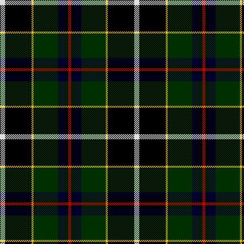

This page is one **sett** — a single exact thread-count. It belongs to the [tartan](/tartans/w5k26ly2dg24ki7k3r3/)
(the same proportion at any scale), whose colour order is pattern [RKKGYKW](/stripes/rkkgykw/).

Sourced from weddslist.  It is a [7 stripe tartan](/stripes/stripes7/).

Original link http://www.weddslist.com/cgi-bin/tartans/pg.pl?source=sts

## Thread count
LN/10 K52 Y4 DG48 DB14 K6 R/6

## Palette

Palette: <strong>Tartan Register</strong> <small style="color:#888">(2 of 6 colours)</small>
<table><thead><tr><th>Colour</th><th>Threads</th><th>Shade</th><th>Base</th><th>OKLCh</th></tr></thead><tbody><tr><td>LN/</td><td style="text-align:right;font-variant-numeric:tabular-nums">10</td><td><code style="background-color:#E0E0E0;">#E0E0E0</code> <small style="color:#888">#E0E0E0</small></td><td>W <code style="background-color:#F7F7F7;">#F7F7F7</code></td><td><small style="color:#888">oklch(90.7% 0.000 89.9)</small></td></tr><tr><td>K</td><td style="text-align:right;font-variant-numeric:tabular-nums">52</td><td><code style="background-color:#000000;">#000000</code> <small style="color:#888">#000000</small></td><td>K <code style="background-color:#000000;">#000000</code></td><td><small style="color:#888">oklch(0.0% 0.000 0.0)</small></td></tr><tr><td>Y</td><td style="text-align:right;font-variant-numeric:tabular-nums">4</td><td><code style="background-color:#F0C000;">#F0C000</code> <small style="color:#888">#F0C000</small></td><td>Y <code style="background-color:#F2BF00;">#F2BF00</code></td><td><small style="color:#888">oklch(82.7% 0.169 90.5)</small></td></tr><tr><td>DG</td><td style="text-align:right;font-variant-numeric:tabular-nums">48</td><td><code style="background-color:#003000;">#003000</code> <small style="color:#888">#003000</small></td><td>G <code style="background-color:#006100;">#006100</code></td><td><small style="color:#888">oklch(26.8% 0.091 142.5)</small></td></tr><tr><td>DB</td><td style="text-align:right;font-variant-numeric:tabular-nums">14</td><td><code style="background-color:#000030;">#000030</code> <small style="color:#888">#000030</small></td><td>K <code style="background-color:#000000;">#000000</code></td><td><small style="color:#888">oklch(14.0% 0.097 264.1)</small></td></tr><tr><td>K</td><td style="text-align:right;font-variant-numeric:tabular-nums">6</td><td><code style="background-color:#000000;">#000000</code> <small style="color:#888">#000000</small></td><td>K <code style="background-color:#000000;">#000000</code></td><td><small style="color:#888">oklch(0.0% 0.000 0.0)</small></td></tr><tr><td>R/</td><td style="text-align:right;font-variant-numeric:tabular-nums">6</td><td><code style="background-color:#C00000;">#C00000</code> <small style="color:#888">#C00000</small></td><td>R <code style="background-color:#CC0000;">#CC0000</code></td><td><small style="color:#888">oklch(50.7% 0.208 29.2)</small></td></tr></tbody></table>

# Sample pattern

## Nearest tartans

The nearest existing variants by ΔTartan distance, with this tartan at the top so the swatches line up against it.

ΔTartan

Tartan

Sett

—

<a href="/ttd/edit/#slug=w5k26ly2dg24ki7k3r3~x2">Cornish, hunting</a> <a class="nn-out" href="/setts/s7/w5k26ly2dg24ki7k3r3~x2/" title="open its dictionary page">↗</a>

0.48

<a href="/ttd/edit/#slug=w5k26ly2dg24db8k4r3~x2">Cornish Htg (District)</a> <a class="nn-out" href="/setts/s7/w5k26ly2dg24db8k4r3~x2/" title="open its dictionary page">↗</a>

0.98

<a href="/ttd/edit/#slug=r5k12ly2dg25ly2db12t5~x2">James</a> <a class="nn-out" href="/setts/s7/r5k12ly2dg25ly2db12t5~x2/" title="open its dictionary page">↗</a>

1.19

<a href="/ttd/edit/#slug=ly1k3dg15k14db16r2lb1~x2">MacNeil</a> <a class="nn-out" href="/setts/s7/ly1k3dg15k14db16r2lb1~x2/" title="open its dictionary page">↗</a>

1.26

<a href="/ttd/edit/#slug=k26ly2dg24db8k4r3k4db8dg24ly2k26w5~x2">Cornish Hunting</a> <a class="nn-out" href="/setts/s12/k26ly2dg24db8k4r3k4db8dg24ly2k26w5~x2/" title="open its dictionary page">↗</a>

1.27

<a href="/ttd/edit/#slug=k2r1g15k15db15ly1k2~x2">MacCaskill</a> <a class="nn-out" href="/setts/s7/k2r1g15k15db15ly1k2~x2/" title="open its dictionary page">↗</a>

1.29

<a href="/ttd/edit/#slug=w5k26ly2dg24dt7k3r3~x2">Cornish Hunting District Tartan Tartan Number: 1568. Earliest known date: 1984 The Cornish Hunting tartan was first produced in 1984, and was marketed by the firm, Cornovi Creations, Cornwall. It is based on the Cornish National tartan designed by E.E. Morton-Nance, who regarded tartan as the heritage of all Celts, not Scots alone. (P Smith and G Teall, District Tartans, 1992) The hunting sett replaces the 'National' yellow with dark green and the azure with a darker shade of blue. Cornish Hunting is a registered design (No. 514267). See products available Copyright © Blair Urquhart, Comrie, 2015</a> <a class="nn-out" href="/setts/s7/w5k26ly2dg24dt7k3r3~x2/" title="open its dictionary page">↗</a>

1.30

<a href="/ttd/edit/#slug=w1r2db16k14g15k3ly1~x2">MacNeil 7</a> <a class="nn-out" href="/setts/s7/w1r2db16k14g15k3ly1~x2/" title="open its dictionary page">↗</a>

1.31

<a href="/setts/s8/k2k5ki4k1ki4g16ki3g2~x4/">Arundel County (District)</a>

1.34

<a href="/ttd/edit/#slug=r5dg30k6ly2k3b5k12r8k3r3lr3~x2">King George (Nash)</a> <a class="nn-out" href="/setts/s11/r5dg30k6ly2k3b5k12r8k3r3lr3~x2/" title="open its dictionary page">↗</a>

1.36

<a href="/ttd/edit/#slug=r3w2dy10dg37k12db21w2~x2">Jones, The</a> <a class="nn-out" href="/setts/s7/r3w2dy10dg37k12db21w2~x2/" title="open its dictionary page">↗</a>

## Neighbour map

Every grey dot is one of 14359 variants placed by the first two principal components of the ΔTartan feature space (44% of its variance). Red is this tartan; blue dots are its nearest — click one to open its page.

<svg viewBox="0 0 640 380" role="img" style="max-width:100%;height:auto;border:1px solid #e0e0e0;border-radius:4px;display:block" xmlns="http://www.w3.org/2000/svg"><image href="/nn/cloud.v1.png" width="640" height="380"/><a href="/setts/s7/w5k26ly2dg24db8k4r3~x2/"><circle cx="165.7" cy="156.6" r="4" fill="#3465a4"><title>Cornish Htg (District)</title></circle></a><a href="/setts/s7/r5k12ly2dg25ly2db12t5~x2/"><circle cx="143.2" cy="166.2" r="4" fill="#3465a4"><title>James</title></circle></a><a href="/setts/s7/ly1k3dg15k14db16r2lb1~x2/"><circle cx="150.7" cy="161.4" r="4" fill="#3465a4"><title>MacNeil</title></circle></a><a href="/setts/s12/k26ly2dg24db8k4r3k4db8dg24ly2k26w5~x2/"><circle cx="178.3" cy="145.7" r="4" fill="#3465a4"><title>Cornish Hunting</title></circle></a><a href="/setts/s7/k2r1g15k15db15ly1k2~x2/"><circle cx="178.1" cy="168.4" r="4" fill="#3465a4"><title>MacCaskill</title></circle></a><a href="/setts/s7/w5k26ly2dg24dt7k3r3~x2/"><circle cx="196.0" cy="164.2" r="4" fill="#3465a4"><title>Cornish Hunting District Tartan Tartan Number: 1568. Earliest known date: 1984 The Cornish Hunting tartan was first produced in 1984, and was marketed by the firm, Cornovi Creations, Cornwall. It is based on the Cornish National tartan designed by E.E. Morton-Nance, who regarded tartan as the heritage of all Celts, not Scots alone. (P Smith and G Teall, District Tartans, 1992) The hunting sett replaces the 'National' yellow with dark green and the azure with a darker shade of blue. Cornish Hunting is a registered design (No. 514267). See products available Copyright © Blair Urquhart, Comrie, 2015</title></circle></a><a href="/setts/s7/w1r2db16k14g15k3ly1~x2/"><circle cx="134.8" cy="149.0" r="4" fill="#3465a4"><title>MacNeil 7</title></circle></a><a href="/setts/s8/k2k5ki4k1ki4g16ki3g2~x4/"><circle cx="181.9" cy="148.7" r="4" fill="#3465a4"><title>Arundel County (District)</title></circle></a><a href="/setts/s11/r5dg30k6ly2k3b5k12r8k3r3lr3~x2/"><circle cx="159.9" cy="121.6" r="4" fill="#3465a4"><title>King George (Nash)</title></circle></a><a href="/setts/s7/r3w2dy10dg37k12db21w2~x2/"><circle cx="199.2" cy="154.7" r="4" fill="#3465a4"><title>Jones, The</title></circle></a><circle cx="175.7" cy="156.9" r="5" fill="#c00000"/></svg>

ID: /setts/s7/w5k26ly2dg24ki7k3r3~x2/
