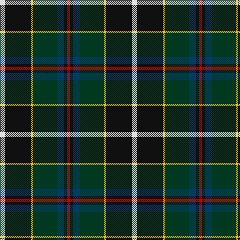

In pattern [RKBGYKW](/patterns/rkbgykw/).

This was sourced from house-of-tartan.  It is a [7 stripes tartan](/stripes/stripes7/).

Original link http://www.house-of-tartan.scotland.net/house/TartanViewjs.asp?colr=Def&tnam=1568

## Thread count
LN/10 K52 Y4 DG48 DB14 K6 R/6

## Palette
Each colour and its ΔE from the base-6 reference it is a variant of.

| Colour | Shade | Base | ΔE (OKLab) |
|---|---|---|---|
| DB | <code style="background-color:#003C64;">#003C64</code> `#003C64` | B <code style="background-color:#2A418A;">#2A418A</code> | 0.08 |
| DG | <code style="background-color:#003820;">#003820</code> `#003820` | G <code style="background-color:#006100;">#006100</code> | 0.15 |
| K | <code style="background-color:#101010;">#101010</code> `#101010` | K <code style="background-color:#000000;">#000000</code> | 0.17 |
| LN | <code style="background-color:#E0E0E0;">#E0E0E0</code> `#E0E0E0` | W <code style="background-color:#F7F7F7;">#F7F7F7</code> | 0.07 |
| R | <code style="background-color:#C80000;">#C80000</code> `#C80000` | R <code style="background-color:#CC0000;">#CC0000</code> | 0.01 |
| Y | <code style="background-color:#E8C000;">#E8C000</code> `#E8C000` | Y <code style="background-color:#F2BF00;">#F2BF00</code> | 0.02 |

# Sample pattern

## Nearest tartans

The nearest existing variants by ΔTartan distance.

1. [Jones, The](/setts/s7/r3w2g10ga37k12b21w2x2~b000050-g505020-ga004010-k000000-rc00000-we0e0e0/) — ΔT 0.78
1. [McComb](/setts/s7/b3r2b18k6g18y2ga3x2~b304080-g003000-ga008000-k000000-rc00000-yf0c000/) — ΔT 0.79
1. [James (Personal)](/setts/s7/r2k6y1g12y1b6ya2x4~b242470-g004828-k101010-rc80000-yb0b430-yab4bcc0/) — ΔT 0.81
1. [MacNeil - 1840 (Chief's sett)](/setts/s7/w2r3b33k33g33k6y2x2~b2c2c80-g006818-k101010-rc80000-wfcfcfc-ye8c000/) — ΔT 0.88
1. [Roderick Dhu](/setts/s9/b3k2r2k12g10y1k1g2w2x4~b3850c8-g006818-k101010-rc80000-wa8ace8-ye8c000/) — ΔT 0.91
1. [Colquhoun (Clan)](/setts/s7/b5k10b48k72w12g48r5~b1c1c50-g285800-k101010-rc80000-wfcfcfc/) — ΔT 0.94
1. [Christian Hunting (Personal)](/setts/s7/r3g2b27k19g27ba2y3x2~b2c2c80-ba780078-g006818-k101010-rc80000-ye8c000/) — ΔT 0.94
1. [James](/setts/s7/b5ba12y2g25y2k12r5x2~b5480b0-ba000050-g003000-k000000-rc00000-yf0c000/) — ΔT 0.98
1. [Milne-Murtaugh (Personal)](/setts/s7/r5b2k30ba26y2ba2bb4x2~b5c8ca8-ba5c5c5c-bb1c1c50-k101010-re87878-ye8c000/) — ΔT 1.01
1. [Royal Burgh of Peebles (District)](/setts/s7/r3g3b4g17k13ba26w3x2~b2c2c80-ba14283c-g006818-k101010-rc80000-wf8f8f8/) — ΔT 1.02

## Neighbour map

Every grey dot is one of 15726 variants placed by the first two principal components of the ΔTartan feature space (44% of its variance). Red is this tartan; blue dots are its nearest — click one to open its page.

<svg viewBox="0 0 640 380" role="img" style="max-width:100%;height:auto;border:1px solid #e0e0e0;border-radius:4px;display:block" xmlns="http://www.w3.org/2000/svg"><image href="/nn/cloud.v1.png" width="640" height="380"/><a href="/setts/s7/r3w2g10ga37k12b21w2x2~b000050-g505020-ga004010-k000000-rc00000-we0e0e0/"><circle cx="195.7" cy="149.7" r="4" fill="#3465a4"><title>Jones, The</title></circle></a><a href="/setts/s7/b3r2b18k6g18y2ga3x2~b304080-g003000-ga008000-k000000-rc00000-yf0c000/"><circle cx="173.8" cy="177.7" r="4" fill="#3465a4"><title>McComb</title></circle></a><a href="/setts/s7/r2k6y1g12y1b6ya2x4~b242470-g004828-k101010-rc80000-yb0b430-yab4bcc0/"><circle cx="160.4" cy="165.6" r="4" fill="#3465a4"><title>James (Personal)</title></circle></a><a href="/setts/s7/w2r3b33k33g33k6y2x2~b2c2c80-g006818-k101010-rc80000-wfcfcfc-ye8c000/"><circle cx="178.9" cy="155.8" r="4" fill="#3465a4"><title>MacNeil - 1840 (Chief's sett)</title></circle></a><a href="/setts/s9/b3k2r2k12g10y1k1g2w2x4~b3850c8-g006818-k101010-rc80000-wa8ace8-ye8c000/"><circle cx="184.0" cy="143.7" r="4" fill="#3465a4"><title>Roderick Dhu</title></circle></a><a href="/setts/s7/b5k10b48k72w12g48r5~b1c1c50-g285800-k101010-rc80000-wfcfcfc/"><circle cx="204.4" cy="178.9" r="4" fill="#3465a4"><title>Colquhoun (Clan)</title></circle></a><a href="/setts/s7/r3g2b27k19g27ba2y3x2~b2c2c80-ba780078-g006818-k101010-rc80000-ye8c000/"><circle cx="171.6" cy="161.6" r="4" fill="#3465a4"><title>Christian Hunting (Personal)</title></circle></a><a href="/setts/s7/b5ba12y2g25y2k12r5x2~b5480b0-ba000050-g003000-k000000-rc00000-yf0c000/"><circle cx="139.7" cy="162.9" r="4" fill="#3465a4"><title>James</title></circle></a><a href="/setts/s7/r5b2k30ba26y2ba2bb4x2~b5c8ca8-ba5c5c5c-bb1c1c50-k101010-re87878-ye8c000/"><circle cx="232.7" cy="141.8" r="4" fill="#3465a4"><title>Milne-Murtaugh (Personal)</title></circle></a><a href="/setts/s7/r3g3b4g17k13ba26w3x2~b2c2c80-ba14283c-g006818-k101010-rc80000-wf8f8f8/"><circle cx="152.2" cy="184.8" r="4" fill="#3465a4"><title>Royal Burgh of Peebles (District)</title></circle></a><circle cx="193.0" cy="159.9" r="5" fill="#c00000"/></svg>

ID: /setts/s7/w5k26y2g24b7k3r3x2~b003c64-g003820-k101010-rc80000-we0e0e0-ye8c000/
