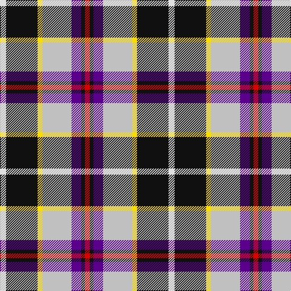

In pattern [RKBWYKW](/patterns/rkbwykw/).

This was sourced from register-of-tartans.  It is a [7 stripes tartan](/stripes/stripes7/).

Original link https://www.tartanregister.gov.uk/tartanDetails.aspx?ref=5942

## Thread count
LN/10 K52 Y8 N48 P16 K6 R/8

## Palette
Each colour and its ΔE from the base-6 reference it is a variant of.

| Colour | Shade | Base | ΔE (OKLab) |
|---|---|---|---|
| K | <code style="background-color:#101010;">#101010</code> `#101010` | K <code style="background-color:#000000;">#000000</code> | 0.17 |
| LN | <code style="background-color:#E0E0E0;">#E0E0E0</code> `#E0E0E0` | W <code style="background-color:#F7F7F7;">#F7F7F7</code> | 0.07 |
| N | <code style="background-color:#C0C0C0;">#C0C0C0</code> `#C0C0C0` | W <code style="background-color:#F7F7F7;">#F7F7F7</code> | 0.17 |
| P | <code style="background-color:#5A008C;">#5A008C</code> `#5A008C` | B <code style="background-color:#2A418A;">#2A418A</code> | 0.13 |
| R | <code style="background-color:#DC0000;">#DC0000</code> `#DC0000` | R <code style="background-color:#CC0000;">#CC0000</code> | 0.03 |
| Y | <code style="background-color:#FADC00;">#FADC00</code> `#FADC00` | Y <code style="background-color:#F2BF00;">#F2BF00</code> | 0.07 |

# Sample pattern

## Nearest tartans

The nearest existing variants by ΔTartan distance.

1. [Galvez-Brown (Personal)](/setts/s7/b36y5r12ra9ba5w12y7~b003c64-ba440044-r880000-rac80000-wfcfcfc-ybc8c00~x2/) — ΔT 0.78
1. [Culloden, Stirling](/setts/s8/r4ra2b15y2k14w14k2w4~b8080d0-k000000-rd03030-ra806050-we0e0e0-yf0c000~x2/) — ΔT 0.92
1. [Pengelly, The Cornish (Name)](/setts/s7/w5k26y4w24b8k3r4~b780078-k101010-rc80000-wcccccc-ye8c000~x2/) — ΔT 0.95
1. [Barbour -Modern](/setts/s7/w4y2w21k11wa2b21r2~b5c5c5c-k101010-rc80000-wc0c0c0-wafcfcfc-yfccc00~x2/) — ΔT 1.00
1. [Dean/Dundas (Personal)](/setts/s9/r17k5w4k6y5b31k5g6w3~b2c2c80-g289c18-k101010-rc80000-we0e0e0-yfccc00~x2/) — ΔT 1.05
1. [Ailsa, Craig](/setts/s8/r5w2b20y2k16w18k2w5~b304080-k000000-rc00000-we0e0e0-yf0c000~x2/) — ΔT 1.07
1. [Wallace Memorial Centenary](/setts/s7/w2y19k2b15g2r20y2~b14283c-g006818-k101010-rc80000-w98c8e8-y48a4c0~x2/) — ΔT 1.11
1. [Ailsa Craig Trade Tartan Tartan Number: 1673. Earliest known date: 1972 Nothing See products available Copyright © Blair Urquhart, Comrie, 2015](/setts/s8/r5w2b20y2k16w18k2w5~b2c2c80-k101010-rc80000-we0e0e0-ye8c000~x2/) — ΔT 1.11
1. [Iowa Dress (District)](/setts/s8/r4y3w12k16g5b20k4w2~b2c2c80-g006818-k101010-rc80000-wf8f8f8-ye8c000~x2/) — ΔT 1.13
1. [Galvez-Brown](/setts/s7/b36y5r12ra9ba5w12y7~b212160-ba551a8b-re3170d-raff0000-wffffff-yffb90f~x2/) — ΔT 1.14

## Neighbour map

Every grey dot is one of 15726 variants placed by the first two principal components of the ΔTartan feature space (44% of its variance). Red is this tartan; blue dots are its nearest — click one to open its page.

<svg viewBox="0 0 640 380" role="img" style="max-width:100%;height:auto;border:1px solid #e0e0e0;border-radius:4px;display:block" xmlns="http://www.w3.org/2000/svg"><image href="/nn/cloud.v1.png" width="640" height="380"/><a href="/setts/s7/b36y5r12ra9ba5w12y7~b003c64-ba440044-r880000-rac80000-wfcfcfc-ybc8c00~x2/"><circle cx="117.9" cy="164.3" r="4" fill="#3465a4"><title>Galvez-Brown (Personal)</title></circle></a><a href="/setts/s8/r4ra2b15y2k14w14k2w4~b8080d0-k000000-rd03030-ra806050-we0e0e0-yf0c000~x2/"><circle cx="58.9" cy="150.3" r="4" fill="#3465a4"><title>Culloden, Stirling</title></circle></a><a href="/setts/s7/w5k26y4w24b8k3r4~b780078-k101010-rc80000-wcccccc-ye8c000~x2/"><circle cx="150.0" cy="165.9" r="4" fill="#3465a4"><title>Pengelly, The Cornish (Name)</title></circle></a><a href="/setts/s7/w4y2w21k11wa2b21r2~b5c5c5c-k101010-rc80000-wc0c0c0-wafcfcfc-yfccc00~x2/"><circle cx="146.3" cy="144.3" r="4" fill="#3465a4"><title>Barbour -Modern</title></circle></a><a href="/setts/s9/r17k5w4k6y5b31k5g6w3~b2c2c80-g289c18-k101010-rc80000-we0e0e0-yfccc00~x2/"><circle cx="119.8" cy="132.0" r="4" fill="#3465a4"><title>Dean/Dundas (Personal)</title></circle></a><a href="/setts/s8/r5w2b20y2k16w18k2w5~b304080-k000000-rc00000-we0e0e0-yf0c000~x2/"><circle cx="113.6" cy="156.9" r="4" fill="#3465a4"><title>Ailsa, Craig</title></circle></a><a href="/setts/s7/w2y19k2b15g2r20y2~b14283c-g006818-k101010-rc80000-w98c8e8-y48a4c0~x2/"><circle cx="136.6" cy="151.8" r="4" fill="#3465a4"><title>Wallace Memorial Centenary</title></circle></a><a href="/setts/s8/r5w2b20y2k16w18k2w5~b2c2c80-k101010-rc80000-we0e0e0-ye8c000~x2/"><circle cx="118.7" cy="156.9" r="4" fill="#3465a4"><title>Ailsa Craig Trade Tartan Tartan Number: 1673. Earliest known date: 1972 Nothing See products available Copyright © Blair Urquhart, Comrie, 2015</title></circle></a><a href="/setts/s8/r4y3w12k16g5b20k4w2~b2c2c80-g006818-k101010-rc80000-wf8f8f8-ye8c000~x2/"><circle cx="65.2" cy="149.3" r="4" fill="#3465a4"><title>Iowa Dress (District)</title></circle></a><a href="/setts/s7/b36y5r12ra9ba5w12y7~b212160-ba551a8b-re3170d-raff0000-wffffff-yffb90f~x2/"><circle cx="109.4" cy="153.7" r="4" fill="#3465a4"><title>Galvez-Brown</title></circle></a><circle cx="115.9" cy="149.1" r="5" fill="#c00000"/></svg>

ID: /setts/s7/w5k26y4wa24b8k3r4~b5a008c-k101010-rdc0000-we0e0e0-wac0c0c0-yfadc00~x2/
