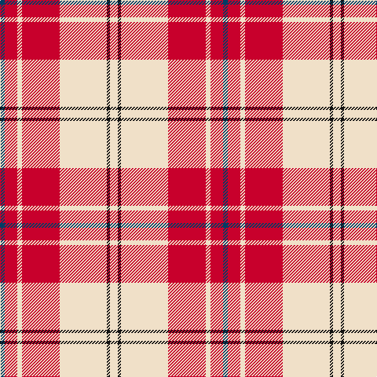

In pattern [BRWRWKW](/stripes/brwrwkw/).

This was sourced from tartans-authority.  It is a [7 stripe tartan](/stripes/stripes7/).

Original link http://www.tartansauthority.com/tartan-ferret/display/7572/

## Also known as

This cloth is also recorded under:

- Arduaine, Red

## Attestations

This cloth appears in 2 source records; the oldest owns this page.

- March 2008 — Arduaine, Red (Dance) (tartans-authority, [record](http://www.tartansauthority.com/tartan-ferret/display/7572/))
- undated — Arduaine Red (register-of-tartans, [record](https://www.tartanregister.gov.uk/tartanDetails.aspx?ref=5596))

## Register references

External register numbers recorded for this tartan.

- Scottish Register of Tartans: [5596](https://www.tartanregister.gov.uk/tartanDetails.aspx?ref=5596)
- Scottish Tartans Authority (ITI): 7572

## Thread count
W/10 K4 W60 R48 W6 R16 DB/6

## Palette
Each colour and the base-6 reference it is a variant of.

| Colour | Shade | Base |
|---|---|---|
| DB | <code style="background-color:#003C64;">#003C64</code> `oklch(34.5% 0.089 246.0)` <small>#003C64</small> | B <code style="background-color:#2A418A;">#2A418A</code> |
| K | <code style="background-color:#101010;">#101010</code> `oklch(17.3% 0.000 89.9)` <small>#101010</small> | K <code style="background-color:#000000;">#000000</code> |
| R | <code style="background-color:#C8002C;">#C8002C</code> `oklch(52.6% 0.212 22.0)` <small>#C8002C</small> | R <code style="background-color:#CC0000;">#CC0000</code> |
| W | <code style="background-color:#F0E0C8;">#F0E0C8</code> `oklch(91.3% 0.036 78.1)` <small>#F0E0C8</small> | W <code style="background-color:#F7F7F7;">#F7F7F7</code> |

# Sample pattern

## Nearest tartans

The nearest existing variants by ΔTartan distance.

1. [MacPherson Dress Red](/setts/s7/w4r2w25r21w3r8ly3~x2/) — ΔT 0.71
1. [Cunningham Dress](/setts/s7/w5r2w34r34k2r2db4~x2/) — ΔT 0.76
1. [Torridon, Cherry (Dance)](/setts/s7/r3r2db2r30w30db2w3~x2/) — ΔT 0.84
1. [MacPherson Dress Burgundy (Dance)](/setts/s7/w4k2w25r21w3r8ly3~x2/) — ΔT 0.85
1. [MacGiboney (Personal)](/setts/s7/r8dp2r24dp5w25dy2w8~x2/) — ΔT 0.89
1. [Lennox Dress District Tartan Tartan Number: 1649. Earliest known date: 1986 Families with the surname 'Lennox' are usually considered related to Clans Stewart or MacFarlane. Some of this surname also choose to wear the distinctive and ancient 'Lennox' tartan. D W Stewart reproduced the sett from a 'lost' portrait of the Countess of Lennox dating from the 16th century. See products available Copyright © Blair Urquhart, Comrie, 2015](/setts/s7/r8m2r24m5w25dy2w8~x2/) — ΔT 0.90
1. [Lennox, dress](/setts/s7/r8p2r24p5w25o2w8~x2/) — ΔT 0.91
1. [MacPherson, Red](/setts/s7/w5p3w26r20w3r8ly3~x2/) — ΔT 0.92
1. [MacPherson Dress Red (Dance)](/setts/s7/w5dp3w26r20w3r8ly3~x2/) — ΔT 0.93
1. [Torridon, Burgundy (Dance)](/setts/s7/w3lg2w30r30n2r2lg3~x2/) — ΔT 1.07

## Neighbour map

Every grey dot is one of 14299 variants placed by the first two principal components of the ΔTartan feature space (44% of its variance). Red is this tartan; blue dots are its nearest — click one to open its page.

<svg viewBox="0 0 640 380" role="img" style="max-width:100%;height:auto;border:1px solid #e0e0e0;border-radius:4px;display:block" xmlns="http://www.w3.org/2000/svg"><image href="/nn/cloud.v1.png" width="640" height="380"/><a href="/setts/s7/w4r2w25r21w3r8ly3~x2/"><circle cx="289.3" cy="154.3" r="4" fill="#3465a4"><title>MacPherson Dress Red</title></circle></a><a href="/setts/s7/w5r2w34r34k2r2db4~x2/"><circle cx="287.7" cy="117.8" r="4" fill="#3465a4"><title>Cunningham Dress</title></circle></a><a href="/setts/s7/r3r2db2r30w30db2w3~x2/"><circle cx="284.7" cy="126.3" r="4" fill="#3465a4"><title>Torridon, Cherry (Dance)</title></circle></a><a href="/setts/s7/w4k2w25r21w3r8ly3~x2/"><circle cx="264.9" cy="152.7" r="4" fill="#3465a4"><title>MacPherson Dress Burgundy (Dance)</title></circle></a><a href="/setts/s7/r8dp2r24dp5w25dy2w8~x2/"><circle cx="248.3" cy="156.4" r="4" fill="#3465a4"><title>MacGiboney (Personal)</title></circle></a><a href="/setts/s7/r8m2r24m5w25dy2w8~x2/"><circle cx="253.7" cy="158.8" r="4" fill="#3465a4"><title>Lennox Dress District Tartan Tartan Number: 1649. Earliest known date: 1986 Families with the surname 'Lennox' are usually considered related to Clans Stewart or MacFarlane. Some of this surname also choose to wear the distinctive and ancient 'Lennox' tartan. D W Stewart reproduced the sett from a 'lost' portrait of the Countess of Lennox dating from the 16th century. See products available Copyright © Blair Urquhart, Comrie, 2015</title></circle></a><a href="/setts/s7/r8p2r24p5w25o2w8~x2/"><circle cx="249.8" cy="158.4" r="4" fill="#3465a4"><title>Lennox, dress</title></circle></a><a href="/setts/s7/w5p3w26r20w3r8ly3~x2/"><circle cx="265.2" cy="168.6" r="4" fill="#3465a4"><title>MacPherson, Red</title></circle></a><a href="/setts/s7/w5dp3w26r20w3r8ly3~x2/"><circle cx="266.7" cy="168.8" r="4" fill="#3465a4"><title>MacPherson Dress Red (Dance)</title></circle></a><a href="/setts/s7/w3lg2w30r30n2r2lg3~x2/"><circle cx="276.3" cy="128.5" r="4" fill="#3465a4"><title>Torridon, Burgundy (Dance)</title></circle></a><circle cx="296.8" cy="140.9" r="5" fill="#c00000"/></svg>

ID: /setts/s7/w5k2w30r24w3r8dt3~x2/
