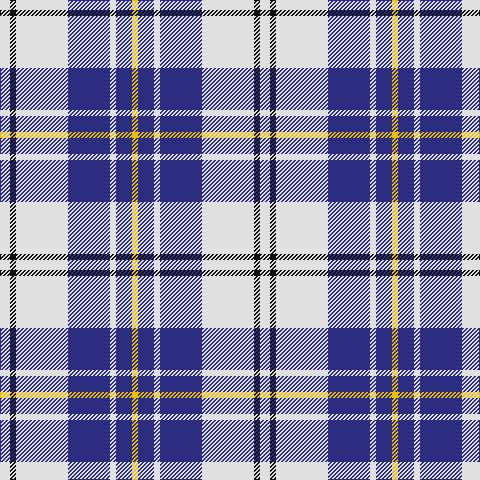

**Bands:** [WKWBWBY](/stripes/wkwbwby/) · **Stripes:** [W K W DB W DB LY](/stripes/stripes7/) W K W DB W DB LY

This was sourced from register-of-tartans.  It is a [7 band tartan](/bands/bands7/).

Original link https://www.tartanregister.gov.uk/tartanDetails.aspx?ref=2715

## Attestations

This cloth appears in 2 source records; the oldest owns this page.

- 01/01/1980 — MacPherson Dress Blue (Dance) (register-of-tartans, [record](https://www.tartanregister.gov.uk/tartanDetails.aspx?ref=2715))
- 1980 — MacPherson Dress, Royal Blue (Dance) (tartans-authority, [record](http://www.tartansauthority.com/tartan-ferret/display/1868/))

## Register references

External register numbers recorded for this tartan.

- Scottish Register of Tartans: [2715](https://www.tartanregister.gov.uk/tartanDetails.aspx?ref=2715)
- Scottish Tartans Authority (ITI): 1868
- Scottish Tartans World Register: 1868

## Thread count
LN/10 K6 LN52 DB42 LN6 DB16 Y/6

## Palette
Each colour and its ΔE from the base-6 reference it is a variant of.

| Colour | Shade | Base | ΔE (OKLab) |
|---|---|---|---|
| DB | <code style="background-color:#2C2C80;">#2C2C80</code> `#2C2C80` | B <code style="background-color:#2A418A;">#2A418A</code> | 0.06 |
| K | <code style="background-color:#101010;">#101010</code> `#101010` | K <code style="background-color:#000000;">#000000</code> | 0.17 |
| LN | <code style="background-color:#E0E0E0;">#E0E0E0</code> `#E0E0E0` | W <code style="background-color:#F7F7F7;">#F7F7F7</code> | 0.07 |
| Y | <code style="background-color:#E8C000;">#E8C000</code> `#E8C000` | Y <code style="background-color:#F2BF00;">#F2BF00</code> | 0.02 |

# Sample pattern

## Nearest tartans

The nearest existing variants by ΔTartan distance.

1. [MacPherson, Blue & White](/setts/s7/w5r3w26db21w3db8ly3~x2/) — ΔT 0.51
1. [Ailsa, Royal Blue (Dance)](/setts/s6/db8t3db28w32dt3w4~x2/) — ΔT 0.54
1. [Ailsa, Navy (Dance)](/setts/s6/db8w3db28w32k3w4~x2/) — ΔT 1.17
1. [Jeux Canada Games '87 (Corporate)](/setts/s9/w16db3w2db3w2db3r5db6w2~x4/) — ΔT 1.19
1. [Kile (No red line) (Personal)](/setts/s8/db20w3db3w3db3w3k5ly10~x2/) — ΔT 1.20
1. [MacPherson Dress (1951)](/setts/s7/ly3k9w3k20w30p3w3~x2/) — ΔT 1.26
1. [Clemens and August (Personal)](/setts/s8/w32db3r4db3r8db32w3db4~x2/) — ΔT 1.27
1. [Yorkshire, The Spirit of](/setts/s10/db19ly2db3w7db3w7db9w3db2w19~x2/) — ΔT 1.28
1. [Buchanan Dress Blue (Dance)](/setts/s6/w5db16w5db16w33r3~x2/) — ΔT 1.32
1. [Conquergood](/setts/s8/b2k1w2k5b5w11b2k2~x2/) — ΔT 1.33

## Neighbour map

Every grey dot is one of 14313 variants placed by the first two principal components of the ΔTartan feature space (44% of its variance). Red is this tartan; blue dots are its nearest — click one to open its page.

<svg viewBox="0 0 640 380" role="img" style="max-width:100%;height:auto;border:1px solid #e0e0e0;border-radius:4px;display:block" xmlns="http://www.w3.org/2000/svg"><image href="/nn/cloud.v1.png" width="640" height="380"/><a href="/setts/s7/w5r3w26db21w3db8ly3~x2/"><circle cx="242.2" cy="178.1" r="4" fill="#3465a4"><title>MacPherson, Blue &amp; White</title></circle></a><a href="/setts/s6/db8t3db28w32dt3w4~x2/"><circle cx="243.5" cy="175.8" r="4" fill="#3465a4"><title>Ailsa, Royal Blue (Dance)</title></circle></a><a href="/setts/s6/db8w3db28w32k3w4~x2/"><circle cx="279.5" cy="190.2" r="4" fill="#3465a4"><title>Ailsa, Navy (Dance)</title></circle></a><a href="/setts/s9/w16db3w2db3w2db3r5db6w2~x4/"><circle cx="256.7" cy="181.1" r="4" fill="#3465a4"><title>Jeux Canada Games '87 (Corporate)</title></circle></a><a href="/setts/s8/db20w3db3w3db3w3k5ly10~x2/"><circle cx="206.7" cy="182.2" r="4" fill="#3465a4"><title>Kile (No red line) (Personal)</title></circle></a><a href="/setts/s7/ly3k9w3k20w30p3w3~x2/"><circle cx="247.9" cy="163.8" r="4" fill="#3465a4"><title>MacPherson Dress (1951)</title></circle></a><a href="/setts/s8/w32db3r4db3r8db32w3db4~x2/"><circle cx="229.0" cy="148.3" r="4" fill="#3465a4"><title>Clemens and August (Personal)</title></circle></a><a href="/setts/s10/db19ly2db3w7db3w7db9w3db2w19~x2/"><circle cx="265.5" cy="184.2" r="4" fill="#3465a4"><title>Yorkshire, The Spirit of</title></circle></a><a href="/setts/s6/w5db16w5db16w33r3~x2/"><circle cx="284.0" cy="195.0" r="4" fill="#3465a4"><title>Buchanan Dress Blue (Dance)</title></circle></a><a href="/setts/s8/b2k1w2k5b5w11b2k2~x2/"><circle cx="201.7" cy="182.9" r="4" fill="#3465a4"><title>Conquergood</title></circle></a><circle cx="235.1" cy="177.4" r="5" fill="#c00000"/></svg>

ID: /setts/s7/w5k3w26db21w3db8ly3~x2/
