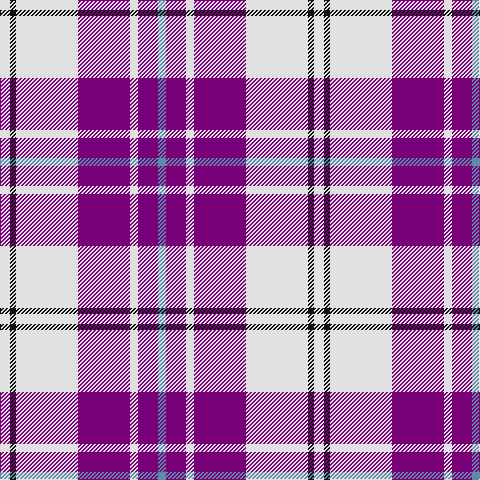

**Bands:** [BBWBWKW](/stripes/bbwbwkw/) · **Stripes:** [T DP W DP W K W](/stripes/stripes7/) T DP W DP W K W

This was sourced from register-of-tartans.  It is a [7 band tartan](/bands/bands7/).

Original link https://www.tartanregister.gov.uk/tartanDetails.aspx?ref=2719

## Also known as

This cloth is also recorded under:

- MacPherson Dress Purple
- MacPherson Dress, Purple
- MacPherson, dress

## Attestations

This cloth appears in 3 source records; the oldest owns this page.

- 01/01/1980 — MacPherson Dress Purple (register-of-tartans, [record](https://www.tartanregister.gov.uk/tartanDetails.aspx?ref=2719))
- 1980 — MacPherson Dress, Purple (Dance) (tartans-authority, [record](http://www.tartansauthority.com/tartan-ferret/display/94/))
- undated — MacPherson Dress (purple) Clan Tartan Tartan Number: 94. Earliest known date: c 1980 There are a great number of variations of the Dress MacPherson, many of them modern trade designs which are popular with country dancers. Hugh Macpherson of Edinburgh, kiltmaker and tartan designer some decades ago, supplied samples of these to the Scottish Tartan Society around 1980. See products available Copyright © Blair Urquhart, Comrie, 2015 (house-of-tartan, [record](http://www.house-of-tartan.scotland.net/house/TartanViewjs.asp?colr=Def&tnam=94))

## Register references

External register numbers recorded for this tartan.

- Scottish Register of Tartans: [2719](https://www.tartanregister.gov.uk/tartanDetails.aspx?ref=2719)
- Scottish Tartans Authority (ITI): 94
- Scottish Tartans World Register: 94

## Thread count
LN/10 K6 LN62 P52 LN8 P20 B/8

## Palette
Each colour and its ΔE from the base-6 reference it is a variant of.

| Colour | Shade | Base | ΔE (OKLab) |
|---|---|---|---|
| B | <code style="background-color:#5C8CA8;">#5C8CA8</code> `#5C8CA8` | B <code style="background-color:#2A418A;">#2A418A</code> | 0.23 |
| K | <code style="background-color:#101010;">#101010</code> `#101010` | K <code style="background-color:#000000;">#000000</code> | 0.17 |
| LN | <code style="background-color:#E0E0E0;">#E0E0E0</code> `#E0E0E0` | W <code style="background-color:#F7F7F7;">#F7F7F7</code> | 0.07 |
| P | <code style="background-color:#780078;">#780078</code> `#780078` | B <code style="background-color:#2A418A;">#2A418A</code> | 0.17 |

# Sample pattern

## Nearest tartans

The nearest existing variants by ΔTartan distance.

1. [MacPherson, dress (purple)](/setts/s7/w5k3w31p26w4p10t4~x2/) — ΔT 0.12
1. [Lennox Purple Dress District Tartan Tartan Number: 8189. Earliest known date: pre 2003 Families with the surname 'Lennox' are usually considered related to Clans Stewart or MacFarlane. Some of this surname also choose to wear the distinctive and ancient 'Lennox' tartan. D W Stewart reproduced the sett from a 'lost' portrait of the Countess of Lennox dating from the 16th century./Threadcount and colours aren't 100% original. Generated manually./ See products available Copyright © Blair Urquhart, Comrie, 2015](/setts/s7/dp8db2dp24db5w26k2w8~x2/) — ΔT 0.59
1. [Meridia Dance](/setts/s8/w8k6w54db16m6db8m49w6/) — ΔT 1.00
1. [Merida Dance](/setts/s8/w8k4w54db18m6db8m49w6/) — ΔT 1.09
1. [Cunningham Dress Purple (Dance)](/setts/s7/w5dp2w34dp34k2dp2t4~x2/) — ΔT 1.12
1. [MacRae - 2000 (Dress, Purple)](/setts/s4/k4w35dp35m4~x2/) — ΔT 1.31
1. [MacPherson, Blue & White](/setts/s7/w5r3w26db21w3db8ly3~x2/) — ΔT 1.33
1. [Clemens and August (Personal)](/setts/s8/w32db3r4db3r8db32w3db4~x2/) — ΔT 1.35
1. [Ailsa, Royal Blue (Dance)](/setts/s6/db8t3db28w32dt3w4~x2/) — ΔT 1.35
1. [MacPherson Dress Blue (Dance)](/setts/s7/w5k3w26db21w3db8ly3~x2/) — ΔT 1.35

## Neighbour map

Every grey dot is one of 14299 variants placed by the first two principal components of the ΔTartan feature space (44% of its variance). Red is this tartan; blue dots are its nearest — click one to open its page.

<svg viewBox="0 0 640 380" role="img" style="max-width:100%;height:auto;border:1px solid #e0e0e0;border-radius:4px;display:block" xmlns="http://www.w3.org/2000/svg"><image href="/nn/cloud.v1.png" width="640" height="380"/><a href="/setts/s7/w5k3w31p26w4p10t4~x2/"><circle cx="250.3" cy="163.0" r="4" fill="#3465a4"><title>MacPherson, dress (purple)</title></circle></a><a href="/setts/s7/dp8db2dp24db5w26k2w8~x2/"><circle cx="237.8" cy="159.9" r="4" fill="#3465a4"><title>Lennox Purple Dress District Tartan Tartan Number: 8189. Earliest known date: pre 2003 Families with the surname 'Lennox' are usually considered related to Clans Stewart or MacFarlane. Some of this surname also choose to wear the distinctive and ancient 'Lennox' tartan. D W Stewart reproduced the sett from a 'lost' portrait of the Countess of Lennox dating from the 16th century./Threadcount and colours aren't 100% original. Generated manually./ See products available Copyright © Blair Urquhart, Comrie, 2015</title></circle></a><a href="/setts/s8/w8k6w54db16m6db8m49w6/"><circle cx="205.8" cy="149.5" r="4" fill="#3465a4"><title>Meridia Dance</title></circle></a><a href="/setts/s8/w8k4w54db18m6db8m49w6/"><circle cx="218.5" cy="130.9" r="4" fill="#3465a4"><title>Merida Dance</title></circle></a><a href="/setts/s7/w5dp2w34dp34k2dp2t4~x2/"><circle cx="280.2" cy="123.8" r="4" fill="#3465a4"><title>Cunningham Dress Purple (Dance)</title></circle></a><a href="/setts/s4/k4w35dp35m4~x2/"><circle cx="224.5" cy="197.0" r="4" fill="#3465a4"><title>MacRae - 2000 (Dress, Purple)</title></circle></a><a href="/setts/s7/w5r3w26db21w3db8ly3~x2/"><circle cx="241.9" cy="177.8" r="4" fill="#3465a4"><title>MacPherson, Blue &amp; White</title></circle></a><a href="/setts/s8/w32db3r4db3r8db32w3db4~x2/"><circle cx="228.8" cy="148.1" r="4" fill="#3465a4"><title>Clemens and August (Personal)</title></circle></a><a href="/setts/s6/db8t3db28w32dt3w4~x2/"><circle cx="243.3" cy="175.5" r="4" fill="#3465a4"><title>Ailsa, Royal Blue (Dance)</title></circle></a><a href="/setts/s7/w5k3w26db21w3db8ly3~x2/"><circle cx="234.9" cy="177.1" r="4" fill="#3465a4"><title>MacPherson Dress Blue (Dance)</title></circle></a><circle cx="251.6" cy="164.2" r="5" fill="#c00000"/></svg>

ID: /setts/s7/w5k3w31dp26w4dp10t4~x2/
