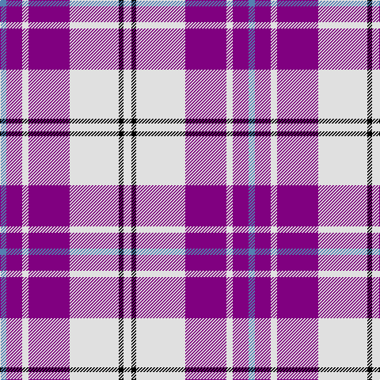

In pattern [BBWBWKW](/stripes/bbwbwkw/).

This was sourced from weddslist.  It is a [7 stripe tartan](/stripes/stripes7/).

Original link http://www.weddslist.com/cgi-bin/tartans/pg.pl?source=sts

## Also known as

This cloth is also recorded under:

- MacPherson Dress Purple
- MacPherson Dress, Purple
- MacPherson, dress

## Thread count
LN/10 K6 LN62 P52 LN8 P20 B/8

## Palette
Each colour and the base-6 reference it is a variant of.

| Colour | Shade | Base |
|---|---|---|
| B | <code style="background-color:#5480B0;">#5480B0</code> `oklch(58.8% 0.089 251.5)` <small>#5480B0</small> | B <code style="background-color:#2A418A;">#2A418A</code> |
| K | <code style="background-color:#000000;">#000000</code> `oklch(0.0% 0.000 0.0)` <small>#000000</small> | K <code style="background-color:#000000;">#000000</code> |
| LN | <code style="background-color:#E0E0E0;">#E0E0E0</code> `oklch(90.7% 0.000 89.9)` <small>#E0E0E0</small> | W <code style="background-color:#F7F7F7;">#F7F7F7</code> |
| P | <code style="background-color:#800080;">#800080</code> `oklch(42.1% 0.193 328.4)` <small>#800080</small> | B <code style="background-color:#2A418A;">#2A418A</code> |

# Sample pattern

## Nearest tartans

The nearest existing variants by ΔTartan distance.

1. [MacPherson Dress Purple](/setts/s7/w5k3w31dp26w4dp10t4~x2/) — ΔT 0.12
1. [Lennox Purple Dress District Tartan Tartan Number: 8189. Earliest known date: pre 2003 Families with the surname 'Lennox' are usually considered related to Clans Stewart or MacFarlane. Some of this surname also choose to wear the distinctive and ancient 'Lennox' tartan. D W Stewart reproduced the sett from a 'lost' portrait of the Countess of Lennox dating from the 16th century./Threadcount and colours aren't 100% original. Generated manually./ See products available Copyright © Blair Urquhart, Comrie, 2015](/setts/s7/dp8db2dp24db5w26k2w8~x2/) — ΔT 0.57
1. [Meridia Dance](/setts/s8/w8k6w54db16m6db8m49w6/) — ΔT 1.01
1. [Merida Dance](/setts/s8/w8k4w54db18m6db8m49w6/) — ΔT 1.08
1. [Cunningham Dress Purple (Dance)](/setts/s7/w5dp2w34dp34k2dp2t4~x2/) — ΔT 1.11
1. [MacRae - 2000 (Dress, Purple)](/setts/s4/k4w35dp35m4~x2/) — ΔT 1.29
1. [Cunningham Dress Purple (Dance) Fashion Tartan Tartan Number: 6531. Earliest known date: 01/01/1986 A dancers' tartan from D C Dalgliesh of Selkirk. See products available Copyright © Blair Urquhart, Comrie, 2015](/setts/s7/t2dp1k1dp20w20dp1w2~x4/) — ΔT 1.36
1. [Clemens and August (Personal)](/setts/s8/w32db3r4db3r8db32w3db4~x2/) — ΔT 1.39
1. [MacRae, Dress Purple (Dance)](/setts/s11/t1dp3k2w1dp8w1k2w9k1w3t1~x6/) — ΔT 1.41
1. [Ailsa, Royal Blue (Dance)](/setts/s6/db8t3db28w32dt3w4~x2/) — ΔT 1.42

## Neighbour map

Every grey dot is one of 14299 variants placed by the first two principal components of the ΔTartan feature space (44% of its variance). Red is this tartan; blue dots are its nearest — click one to open its page.

<svg viewBox="0 0 640 380" role="img" style="max-width:100%;height:auto;border:1px solid #e0e0e0;border-radius:4px;display:block" xmlns="http://www.w3.org/2000/svg"><image href="/nn/cloud.v1.png" width="640" height="380"/><a href="/setts/s7/w5k3w31dp26w4dp10t4~x2/"><circle cx="251.6" cy="164.2" r="4" fill="#3465a4"><title>MacPherson Dress Purple</title></circle></a><a href="/setts/s7/dp8db2dp24db5w26k2w8~x2/"><circle cx="237.8" cy="159.9" r="4" fill="#3465a4"><title>Lennox Purple Dress District Tartan Tartan Number: 8189. Earliest known date: pre 2003 Families with the surname 'Lennox' are usually considered related to Clans Stewart or MacFarlane. Some of this surname also choose to wear the distinctive and ancient 'Lennox' tartan. D W Stewart reproduced the sett from a 'lost' portrait of the Countess of Lennox dating from the 16th century./Threadcount and colours aren't 100% original. Generated manually./ See products available Copyright © Blair Urquhart, Comrie, 2015</title></circle></a><a href="/setts/s8/w8k6w54db16m6db8m49w6/"><circle cx="205.8" cy="149.5" r="4" fill="#3465a4"><title>Meridia Dance</title></circle></a><a href="/setts/s8/w8k4w54db18m6db8m49w6/"><circle cx="218.5" cy="130.9" r="4" fill="#3465a4"><title>Merida Dance</title></circle></a><a href="/setts/s7/w5dp2w34dp34k2dp2t4~x2/"><circle cx="280.2" cy="123.8" r="4" fill="#3465a4"><title>Cunningham Dress Purple (Dance)</title></circle></a><a href="/setts/s4/k4w35dp35m4~x2/"><circle cx="224.5" cy="197.0" r="4" fill="#3465a4"><title>MacRae - 2000 (Dress, Purple)</title></circle></a><a href="/setts/s7/t2dp1k1dp20w20dp1w2~x4/"><circle cx="301.0" cy="119.8" r="4" fill="#3465a4"><title>Cunningham Dress Purple (Dance) Fashion Tartan Tartan Number: 6531. Earliest known date: 01/01/1986 A dancers' tartan from D C Dalgliesh of Selkirk. See products available Copyright © Blair Urquhart, Comrie, 2015</title></circle></a><a href="/setts/s8/w32db3r4db3r8db32w3db4~x2/"><circle cx="228.8" cy="148.1" r="4" fill="#3465a4"><title>Clemens and August (Personal)</title></circle></a><a href="/setts/s11/t1dp3k2w1dp8w1k2w9k1w3t1~x6/"><circle cx="180.9" cy="142.5" r="4" fill="#3465a4"><title>MacRae, Dress Purple (Dance)</title></circle></a><a href="/setts/s6/db8t3db28w32dt3w4~x2/"><circle cx="243.3" cy="175.5" r="4" fill="#3465a4"><title>Ailsa, Royal Blue (Dance)</title></circle></a><circle cx="250.3" cy="163.0" r="5" fill="#c00000"/></svg>

ID: /setts/s7/w5k3w31p26w4p10t4~x2/
