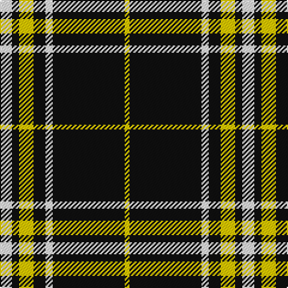

In pattern [WKYKWKY](/patterns/wkykwky/).

This was sourced from register-of-tartans.  It is a [7 stripes tartan](/stripes/stripes7/).

Original link https://www.tartanregister.gov.uk/tartanDetails.aspx?ref=11610

## Register references

External register numbers recorded for this tartan.

- Scottish Register of Tartans: [11610](https://www.tartanregister.gov.uk/tartanDetails.aspx?ref=11610)

## Thread count
W/10 K6 Y12 K10 W6 K60 Y/4

## Palette
Each colour and its ΔE from the base-6 reference it is a variant of.

| Colour | Shade | Base | ΔE (OKLab) |
|---|---|---|---|
| K | <code style="background-color:#101010;">#101010</code> `#101010` | K <code style="background-color:#000000;">#000000</code> | 0.17 |
| W | <code style="background-color:#FFFFFF;">#FFFFFF</code> `#FFFFFF` | W <code style="background-color:#F7F7F7;">#F7F7F7</code> | 0.02 |
| Y | <code style="background-color:#FCCC00;">#FCCC00</code> `#FCCC00` | Y <code style="background-color:#F2BF00;">#F2BF00</code> | 0.04 |

# Sample pattern

## Nearest tartans

The nearest existing variants by ΔTartan distance.

1. [Lundy Reform](/setts/s7/k2w5k1w1k10r1k1~k101010-rc80000-wc0c0c0~x4/) — ΔT 0.99
1. [Glen Coe #1 (Fashion)](/setts/s5/k37w9k3g9w3~g006818-k101010-wfcfcfc~x2/) — ΔT 1.15
1. [DDB Canada (Fashion)](/setts/s7/k1r2k7r11k18y2k1~k101010-r888888-ye8c000~x2/) — ΔT 1.29
1. [Glen Coe Trade Tartan Tartan Number: 1243. Earliest known date: Modern Many new designs have been given district names to promote their Scottish connections. However, these names should not be confused with the District tartans which have earned their title through 'use and wont' and not a little history. See products available Copyright © Blair Urquhart, Comrie, 2015](/setts/s5/k37w9k3g9w3~g003820-k101010-we0e0e0~x2/) — ΔT 1.31
1. [White Stripes Hunting](/setts/s7/r2k1r2k14w1k1w1~k101010-rc80000-wfcfcfc~x8/) — ΔT 1.32
1. [Gwynn (Name)](/setts/s5/y9k4y4k45r4~k101010-rc80000-ye8c000~x2/) — ΔT 1.32
1. [Sligo Irish County Tartan Tartan Number: 2256. Earliest known date: 1995 One of a series of Irish District tartans designed by Polly Wittering of the House of Edgar, with colours reminiscent of the Country with soft warm colours dominating. See products available Copyright © Blair Urquhart, Comrie, 2015](/setts/s6/b50k4b12k23y4k4~b687c94-k000000-yd49c1c~x2/) — ΔT 1.34
1. [Ashers of Nairn](/setts/s10/y2k3w3k44y4k22wa22w3k3y2~k101010-wfcfcfc-wac0c0c0-yfccc00/) — ΔT 1.39
1. [Welsh National #3](/setts/s5/y7k4y4k39r4~k101010-rdc0000-ye8c000~x2/) — ΔT 1.40
1. [Reiver Check](/setts/s10/k27w2k2w2k2w2k2w2k4r5~k101010-rc80000-we0e0e0~x4/) — ΔT 1.40

## Neighbour map

Every grey dot is one of 15726 variants placed by the first two principal components of the ΔTartan feature space (44% of its variance). Red is this tartan; blue dots are its nearest — click one to open its page.

<svg viewBox="0 0 640 380" role="img" style="max-width:100%;height:auto;border:1px solid #e0e0e0;border-radius:4px;display:block" xmlns="http://www.w3.org/2000/svg"><image href="/nn/cloud.v1.png" width="640" height="380"/><a href="/setts/s7/k2w5k1w1k10r1k1~k101010-rc80000-wc0c0c0~x4/"><circle cx="374.8" cy="202.4" r="4" fill="#3465a4"><title>Lundy Reform</title></circle></a><a href="/setts/s5/k37w9k3g9w3~g006818-k101010-wfcfcfc~x2/"><circle cx="361.3" cy="208.9" r="4" fill="#3465a4"><title>Glen Coe #1 (Fashion)</title></circle></a><a href="/setts/s7/k1r2k7r11k18y2k1~k101010-r888888-ye8c000~x2/"><circle cx="393.2" cy="192.4" r="4" fill="#3465a4"><title>DDB Canada (Fashion)</title></circle></a><a href="/setts/s5/k37w9k3g9w3~g003820-k101010-we0e0e0~x2/"><circle cx="370.7" cy="213.3" r="4" fill="#3465a4"><title>Glen Coe Trade Tartan Tartan Number: 1243. Earliest known date: Modern Many new designs have been given district names to promote their Scottish connections. However, these names should not be confused with the District tartans which have earned their title through 'use and wont' and not a little history. See products available Copyright © Blair Urquhart, Comrie, 2015</title></circle></a><a href="/setts/s7/r2k1r2k14w1k1w1~k101010-rc80000-wfcfcfc~x8/"><circle cx="454.7" cy="174.9" r="4" fill="#3465a4"><title>White Stripes Hunting</title></circle></a><a href="/setts/s5/y9k4y4k45r4~k101010-rc80000-ye8c000~x2/"><circle cx="451.6" cy="209.6" r="4" fill="#3465a4"><title>Gwynn (Name)</title></circle></a><a href="/setts/s6/b50k4b12k23y4k4~b687c94-k000000-yd49c1c~x2/"><circle cx="367.4" cy="203.6" r="4" fill="#3465a4"><title>Sligo Irish County Tartan Tartan Number: 2256. Earliest known date: 1995 One of a series of Irish District tartans designed by Polly Wittering of the House of Edgar, with colours reminiscent of the Country with soft warm colours dominating. See products available Copyright © Blair Urquhart, Comrie, 2015</title></circle></a><a href="/setts/s10/y2k3w3k44y4k22wa22w3k3y2~k101010-wfcfcfc-wac0c0c0-yfccc00/"><circle cx="370.1" cy="127.6" r="4" fill="#3465a4"><title>Ashers of Nairn</title></circle></a><a href="/setts/s5/y7k4y4k39r4~k101010-rdc0000-ye8c000~x2/"><circle cx="443.3" cy="215.7" r="4" fill="#3465a4"><title>Welsh National #3</title></circle></a><a href="/setts/s10/k27w2k2w2k2w2k2w2k4r5~k101010-rc80000-we0e0e0~x4/"><circle cx="451.1" cy="158.1" r="4" fill="#3465a4"><title>Reiver Check</title></circle></a><circle cx="403.3" cy="175.9" r="5" fill="#c00000"/></svg>

ID: /setts/s7/w5k3y6k5w3k30y2~k101010-wffffff-yfccc00~x2/
