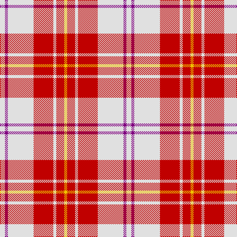

This page is one **sett** — a single exact thread-count. It belongs to the [tartan](/tartans/ln5p3ln26r20ln3r8y3/)
(the same proportion at any scale), whose colour order is pattern [WBWRWRY](/stripes/wbwrwry/).

Sourced from weddslist.  It is a [7 stripe tartan](/stripes/stripes7/).

Original link http://www.weddslist.com/cgi-bin/tartans/pg.pl?source=sts

## Also known as

This cloth is also recorded under:

- MacPherson Dress, Red
- MacPherson Red Dress
- MacPherson, Red

## Thread count
LN/10 P6 LN52 R40 LN6 R16 Y/6

## Palette
Each colour and the base-6 reference it is a variant of.

| Colour | Shade | Base |
|---|---|---|
| LN | <code style="background-color:#E0E0E0;">#E0E0E0</code> `oklch(90.7% 0.000 89.9)` <small>#E0E0E0</small> | W <code style="background-color:#F7F7F7;">#F7F7F7</code> |
| P | <code style="background-color:#800080;">#800080</code> `oklch(42.1% 0.193 328.4)` <small>#800080</small> | B <code style="background-color:#2A418A;">#2A418A</code> |
| R | <code style="background-color:#C00000;">#C00000</code> `oklch(50.7% 0.208 29.2)` <small>#C00000</small> | R <code style="background-color:#CC0000;">#CC0000</code> |
| Y | <code style="background-color:#F0C000;">#F0C000</code> `oklch(82.7% 0.169 90.5)` <small>#F0C000</small> | Y <code style="background-color:#F2BF00;">#F2BF00</code> |

# Sample pattern

## Nearest tartans

The nearest existing variants by ΔTartan distance, with this tartan at the top so the swatches line up against it.

ΔTartan

Tartan

Sett

—

<a href="/ttd/edit/#slug=w5p3w26r20w3r8ly3~x2">MacPherson, Red</a> <a class="nn-out" href="/setts/s7/w5p3w26r20w3r8ly3~x2/" title="open its dictionary page">↗</a>

0.08

<a href="/ttd/edit/#slug=w5dp3w26r20w3r8ly3~x2">MacPherson Dress Red (Dance)</a> <a class="nn-out" href="/setts/s7/w5dp3w26r20w3r8ly3~x2/" title="open its dictionary page">↗</a>

0.77

<a href="/ttd/edit/#slug=w4r2w25r21w3r8ly3~x2">MacPherson Dress Red</a> <a class="nn-out" href="/setts/s7/w4r2w25r21w3r8ly3~x2/" title="open its dictionary page">↗</a>

0.88

<a href="/ttd/edit/#slug=r8dp2r24dp5w25dy2w8~x2">MacGiboney (Personal)</a> <a class="nn-out" href="/setts/s7/r8dp2r24dp5w25dy2w8~x2/" title="open its dictionary page">↗</a>

0.89

<a href="/ttd/edit/#slug=r8m2r24m5w25dy2w8~x2">Lennox Dress District Tartan Tartan Number: 1649. Earliest known date: 1986 Families with the surname 'Lennox' are usually considered related to Clans Stewart or MacFarlane. Some of this surname also choose to wear the distinctive and ancient 'Lennox' tartan. D W Stewart reproduced the sett from a 'lost' portrait of the Countess of Lennox dating from the 16th century. See products available Copyright © Blair Urquhart, Comrie, 2015</a> <a class="nn-out" href="/setts/s7/r8m2r24m5w25dy2w8~x2/" title="open its dictionary page">↗</a>

0.89

<a href="/ttd/edit/#slug=r8p2r24p5w25o2w8~x2">Lennox, dress</a> <a class="nn-out" href="/setts/s7/r8p2r24p5w25o2w8~x2/" title="open its dictionary page">↗</a>

0.91

<a href="/ttd/edit/#slug=r2r1r10r2w10db1w2~x4">Lennox Dress #2</a> <a class="nn-out" href="/setts/s7/r2r1r10r2w10db1w2~x4/" title="open its dictionary page">↗</a>

0.92

<a href="/ttd/edit/#slug=w5k2w30r24w3r8dt3~x2">Arduaine, Red (Dance)</a> <a class="nn-out" href="/setts/s7/w5k2w30r24w3r8dt3~x2/" title="open its dictionary page">↗</a>

0.99

<a href="/ttd/edit/#slug=k1r8dg1r1w8r1k1~x6">Cameron Hose</a> <a class="nn-out" href="/setts/s7/k1r8dg1r1w8r1k1~x6/" title="open its dictionary page">↗</a>

1.04

<a href="/ttd/edit/#slug=w4k2w25r21w3r8ly3~x2">MacPherson Dress Burgundy (Dance)</a> <a class="nn-out" href="/setts/s7/w4k2w25r21w3r8ly3~x2/" title="open its dictionary page">↗</a>

1.18

<a href="/ttd/edit/#slug=r8dp2r24db5w26dy2w8~x2">Lennox Dress</a> <a class="nn-out" href="/setts/s7/r8dp2r24db5w26dy2w8~x2/" title="open its dictionary page">↗</a>

## Neighbour map

Every grey dot is one of 14299 variants placed by the first two principal components of the ΔTartan feature space (44% of its variance). Red is this tartan; blue dots are its nearest — click one to open its page.

<svg viewBox="0 0 640 380" role="img" style="max-width:100%;height:auto;border:1px solid #e0e0e0;border-radius:4px;display:block" xmlns="http://www.w3.org/2000/svg"><image href="/nn/cloud.v1.png" width="640" height="380"/><a href="/setts/s7/w5dp3w26r20w3r8ly3~x2/"><circle cx="266.7" cy="168.8" r="4" fill="#3465a4"><title>MacPherson Dress Red (Dance)</title></circle></a><a href="/setts/s7/w4r2w25r21w3r8ly3~x2/"><circle cx="289.3" cy="154.3" r="4" fill="#3465a4"><title>MacPherson Dress Red</title></circle></a><a href="/setts/s7/r8dp2r24dp5w25dy2w8~x2/"><circle cx="248.3" cy="156.4" r="4" fill="#3465a4"><title>MacGiboney (Personal)</title></circle></a><a href="/setts/s7/r8m2r24m5w25dy2w8~x2/"><circle cx="253.7" cy="158.8" r="4" fill="#3465a4"><title>Lennox Dress District Tartan Tartan Number: 1649. Earliest known date: 1986 Families with the surname 'Lennox' are usually considered related to Clans Stewart or MacFarlane. Some of this surname also choose to wear the distinctive and ancient 'Lennox' tartan. D W Stewart reproduced the sett from a 'lost' portrait of the Countess of Lennox dating from the 16th century. See products available Copyright © Blair Urquhart, Comrie, 2015</title></circle></a><a href="/setts/s7/r8p2r24p5w25o2w8~x2/"><circle cx="249.8" cy="158.4" r="4" fill="#3465a4"><title>Lennox, dress</title></circle></a><a href="/setts/s7/r2r1r10r2w10db1w2~x4/"><circle cx="237.2" cy="158.1" r="4" fill="#3465a4"><title>Lennox Dress #2</title></circle></a><a href="/setts/s7/w5k2w30r24w3r8dt3~x2/"><circle cx="296.8" cy="140.9" r="4" fill="#3465a4"><title>Arduaine, Red (Dance)</title></circle></a><a href="/setts/s7/k1r8dg1r1w8r1k1~x6/"><circle cx="244.6" cy="156.4" r="4" fill="#3465a4"><title>Cameron Hose</title></circle></a><a href="/setts/s7/w4k2w25r21w3r8ly3~x2/"><circle cx="264.9" cy="152.7" r="4" fill="#3465a4"><title>MacPherson Dress Burgundy (Dance)</title></circle></a><a href="/setts/s7/r8dp2r24db5w26dy2w8~x2/"><circle cx="234.2" cy="139.9" r="4" fill="#3465a4"><title>Lennox Dress</title></circle></a><circle cx="265.2" cy="168.6" r="5" fill="#c00000"/></svg>

ID: /setts/s7/w5p3w26r20w3r8ly3~x2/
