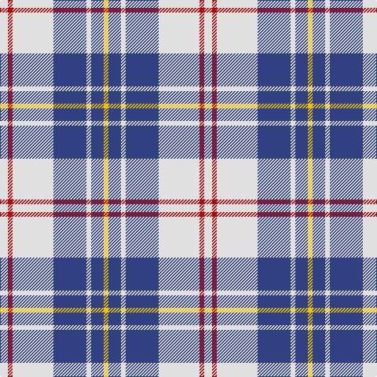

This page is one **sett** — a single exact thread-count. It belongs to the [tartan](/tartans/w5r3w26db21w3db8ly3/)
(the same proportion at any scale), whose colour order is pattern [WRWBWBY](/stripes/wrwbwby/).

Sourced from weddslist.  It is a [7 stripe tartan](/stripes/stripes7/).

Original link http://www.weddslist.com/cgi-bin/tartans/pg.pl?source=sts

## Also known as

This cloth is also recorded under:

- MacPherson, Blue & White

2 attestations — the source records this cloth was collapsed from (oldest owns this page)

<ul>
<li>undated — MacPherson, Blue & White (weddslist, <a href="http://www.weddslist.com/cgi-bin/tartans/pg.pl?source=sts">record</a>)</li>
<li>undated — MacPherson Blue/White Clan Tartan Tartan Number: 1868. Earliest known date: 1980 There are a great number of variations of the Dress MacPherson, many of them modern trade designs which are popular with country dancers. Hugh Macpherson of Edinburgh, kiltmaker and tartan designer some decades ago, supplied samples of these to the Scottish Tartan Society around 1980. See products available Copyright © Blair Urquhart, Comrie, 2015 (house-of-tartan, <a href="http://www.house-of-tartan.scotland.net/house/TartanViewjs.asp?colr=Def&tnam=1868">record</a>)</li>
</ul>

## Thread count
LN/10 R6 LN52 B42 LN6 B16 Y/6

## Palette

Palette: <strong>Tartan Dictionary</strong> <small style="color:#888">(1 of 4 colours)</small>
<table><thead><tr><th>Colour</th><th>Threads</th><th>Shade</th><th>Base</th><th>OKLCh</th></tr></thead><tbody><tr><td>LN/</td><td style="text-align:right;font-variant-numeric:tabular-nums">10</td><td><code style="background-color:#E0E0E0;">#E0E0E0</code> <small style="color:#888">#E0E0E0</small></td><td>W <code style="background-color:#F7F7F7;">#F7F7F7</code></td><td><small style="color:#888">oklch(90.7% 0.000 89.9)</small></td></tr><tr><td>R</td><td style="text-align:right;font-variant-numeric:tabular-nums">6</td><td><code style="background-color:#C00000;">#C00000</code> <small style="color:#888">#C00000</small></td><td>R <code style="background-color:#CC0000;">#CC0000</code></td><td><small style="color:#888">oklch(50.7% 0.208 29.2)</small></td></tr><tr><td>LN</td><td style="text-align:right;font-variant-numeric:tabular-nums">52</td><td><code style="background-color:#E0E0E0;">#E0E0E0</code> <small style="color:#888">#E0E0E0</small></td><td>W <code style="background-color:#F7F7F7;">#F7F7F7</code></td><td><small style="color:#888">oklch(90.7% 0.000 89.9)</small></td></tr><tr><td>B</td><td style="text-align:right;font-variant-numeric:tabular-nums">42</td><td><code style="background-color:#304080;">#304080</code> <small style="color:#888">#304080</small></td><td>B <code style="background-color:#2A418A;">#2A418A</code></td><td><small style="color:#888">oklch(39.4% 0.109 270.2)</small></td></tr><tr><td>LN</td><td style="text-align:right;font-variant-numeric:tabular-nums">6</td><td><code style="background-color:#E0E0E0;">#E0E0E0</code> <small style="color:#888">#E0E0E0</small></td><td>W <code style="background-color:#F7F7F7;">#F7F7F7</code></td><td><small style="color:#888">oklch(90.7% 0.000 89.9)</small></td></tr><tr><td>B</td><td style="text-align:right;font-variant-numeric:tabular-nums">16</td><td><code style="background-color:#304080;">#304080</code> <small style="color:#888">#304080</small></td><td>B <code style="background-color:#2A418A;">#2A418A</code></td><td><small style="color:#888">oklch(39.4% 0.109 270.2)</small></td></tr><tr><td>Y/</td><td style="text-align:right;font-variant-numeric:tabular-nums">6</td><td><code style="background-color:#F0C000;">#F0C000</code> <small style="color:#888">#F0C000</small></td><td>Y <code style="background-color:#F2BF00;">#F2BF00</code></td><td><small style="color:#888">oklch(82.7% 0.169 90.5)</small></td></tr></tbody></table>

# Sample pattern

## Nearest tartans

The nearest existing variants by ΔTartan distance, with this tartan at the top so the swatches line up against it.

ΔTartan

Tartan

Sett

—

<a href="/ttd/edit/#slug=w5r3w26db21w3db8ly3~x2">MacPherson, Blue &amp; White</a> <a class="nn-out" href="/setts/s7/w5r3w26db21w3db8ly3~x2/" title="open its dictionary page">↗</a>

0.51

<a href="/ttd/edit/#slug=w5k3w26db21w3db8ly3~x2">MacPherson Dress Blue (Dance)</a> <a class="nn-out" href="/setts/s7/w5k3w26db21w3db8ly3~x2/" title="open its dictionary page">↗</a>

0.79

<a href="/ttd/edit/#slug=db8t3db28w32dt3w4~x2">Ailsa, Royal Blue (Dance)</a> <a class="nn-out" href="/setts/s6/db8t3db28w32dt3w4~x2/" title="open its dictionary page">↗</a>

1.12

<a href="/ttd/edit/#slug=w16db3w2db3w2db3r5db6w2~x4">Jeux Canada Games '87 (Corporate)</a> <a class="nn-out" href="/setts/s9/w16db3w2db3w2db3r5db6w2~x4/" title="open its dictionary page">↗</a>

1.23

<a href="/ttd/edit/#slug=t8db2t24db5w26k2w8~x2">Lennox Turquoise Dress District Tartan Tartan Number: 8190. Earliest known date: pre 2003 Families with the surname 'Lennox' are usually considered related to Clans Stewart or MacFarlane. Some of this surname also choose to wear the distinctive and ancient 'Lennox' tartan. D W Stewart reproduced the sett from a 'lost' portrait of the Countess of Lennox dating from the 16th century./Threadcount and colours aren't 100% original. Generated manually./ See products available Copyright © Blair Urquhart, Comrie, 2015</a> <a class="nn-out" href="/setts/s7/t8db2t24db5w26k2w8~x2/" title="open its dictionary page">↗</a>

1.24

<a href="/ttd/edit/#slug=w3p3w30k20w3k9ly3~x2">MacPherson Dress (1951)</a> <a class="nn-out" href="/setts/s7/w3p3w30k20w3k9ly3~x2/" title="open its dictionary page">↗</a>

1.27

<a href="/ttd/edit/#slug=dt3n2w2n30w30r2w3~x2">Torridon, Royal Blue (Dance)</a> <a class="nn-out" href="/setts/s7/dt3n2w2n30w30r2w3~x2/" title="open its dictionary page">↗</a>

1.31

<a href="/ttd/edit/#slug=db19ly2db3w7db3w7db9w3db2w19~x2">Yorkshire, The Spirit of</a> <a class="nn-out" href="/setts/s10/db19ly2db3w7db3w7db9w3db2w19~x2/" title="open its dictionary page">↗</a>

1.33

<a href="/ttd/edit/#slug=w5k3w31dp26w4dp10t4~x2">MacPherson Dress Purple</a> <a class="nn-out" href="/setts/s7/w5k3w31dp26w4dp10t4~x2/" title="open its dictionary page">↗</a>

1.36

<a href="/ttd/edit/#slug=k9w4k2w4k2w29k9w4b14lo2~x2">Hannay</a> <a class="nn-out" href="/setts/s10/k9w4k2w4k2w29k9w4b14lo2~x2/" title="open its dictionary page">↗</a>

1.38

<a href="/ttd/edit/#slug=w4k2w26t23w3t8p3~x2">MacPherson Turquoise Dress Tartan Tartan Number: 8183. Earliest known date: Threadcount and colours aren't 100% original. Generated manually. See products available Copyright © Blair Urquhart, Comrie, 2015</a> <a class="nn-out" href="/setts/s7/w4k2w26t23w3t8p3~x2/" title="open its dictionary page">↗</a>

## Neighbour map

Every grey dot is one of 14359 variants placed by the first two principal components of the ΔTartan feature space (44% of its variance). Red is this tartan; blue dots are its nearest — click one to open its page.

<svg viewBox="0 0 640 380" role="img" style="max-width:100%;height:auto;border:1px solid #e0e0e0;border-radius:4px;display:block" xmlns="http://www.w3.org/2000/svg"><image href="/nn/cloud.v1.png" width="640" height="380"/><a href="/setts/s7/w5k3w26db21w3db8ly3~x2/"><circle cx="234.0" cy="178.2" r="4" fill="#3465a4"><title>MacPherson Dress Blue (Dance)</title></circle></a><a href="/setts/s6/db8t3db28w32dt3w4~x2/"><circle cx="242.4" cy="176.6" r="4" fill="#3465a4"><title>Ailsa, Royal Blue (Dance)</title></circle></a><a href="/setts/s9/w16db3w2db3w2db3r5db6w2~x4/"><circle cx="255.4" cy="181.9" r="4" fill="#3465a4"><title>Jeux Canada Games '87 (Corporate)</title></circle></a><a href="/setts/s7/t8db2t24db5w26k2w8~x2/"><circle cx="248.9" cy="177.8" r="4" fill="#3465a4"><title>Lennox Turquoise Dress District Tartan Tartan Number: 8190. Earliest known date: pre 2003 Families with the surname 'Lennox' are usually considered related to Clans Stewart or MacFarlane. Some of this surname also choose to wear the distinctive and ancient 'Lennox' tartan. D W Stewart reproduced the sett from a 'lost' portrait of the Countess of Lennox dating from the 16th century./Threadcount and colours aren't 100% original. Generated manually./ See products available Copyright © Blair Urquhart, Comrie, 2015</title></circle></a><a href="/setts/s7/w3p3w30k20w3k9ly3~x2/"><circle cx="246.6" cy="164.5" r="4" fill="#3465a4"><title>MacPherson Dress (1951)</title></circle></a><a href="/setts/s7/dt3n2w2n30w30r2w3~x2/"><circle cx="284.2" cy="142.5" r="4" fill="#3465a4"><title>Torridon, Royal Blue (Dance)</title></circle></a><a href="/setts/s10/db19ly2db3w7db3w7db9w3db2w19~x2/"><circle cx="264.3" cy="184.9" r="4" fill="#3465a4"><title>Yorkshire, The Spirit of</title></circle></a><a href="/setts/s7/w5k3w31dp26w4dp10t4~x2/"><circle cx="250.4" cy="165.2" r="4" fill="#3465a4"><title>MacPherson Dress Purple</title></circle></a><a href="/setts/s10/k9w4k2w4k2w29k9w4b14lo2~x2/"><circle cx="233.2" cy="128.7" r="4" fill="#3465a4"><title>Hannay</title></circle></a><a href="/setts/s7/w4k2w26t23w3t8p3~x2/"><circle cx="277.7" cy="173.1" r="4" fill="#3465a4"><title>MacPherson Turquoise Dress Tartan Tartan Number: 8183. Earliest known date: Threadcount and colours aren't 100% original. Generated manually. See products available Copyright © Blair Urquhart, Comrie, 2015</title></circle></a><circle cx="240.9" cy="178.8" r="5" fill="#c00000"/></svg>

ID: /setts/s7/w5r3w26db21w3db8ly3~x2/
