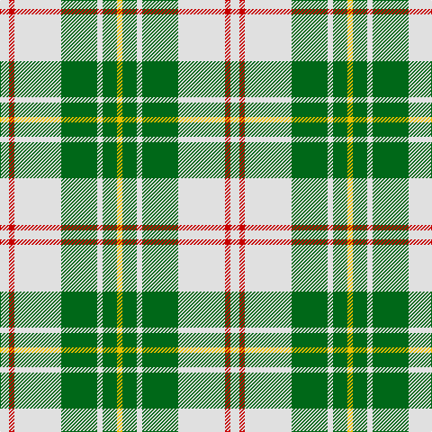

This page is one **sett** — a single exact thread-count. It belongs to the [tartan](/tartans/ln5r3ln26g20ln3g8y3/)
(the same proportion at any scale), whose colour order is pattern [WRWGWGY](/stripes/wrwgwgy/).

Sourced from register-of-tartans.  It is a [7 stripe tartan](/stripes/stripes7/).

Original link https://www.tartanregister.gov.uk/tartanDetails.aspx?ref=2718

## Also known as

This cloth is also recorded under:

- MacPherson Dress, Green
- MacPherson, dress green

4 attestations — the source records this cloth was collapsed from (oldest owns this page)

<ul>
<li>01/01/1980 — MacPherson Dress Green (Dance) (register-of-tartans, <a href="https://www.tartanregister.gov.uk/tartanDetails.aspx?ref=2718">record</a>)</li>
<li>1980 — MacPherson Dress, Green (Dance) (tartans-authority, <a href="http://www.tartansauthority.com/tartan-ferret/display/1870/">record</a>)</li>
<li>undated — MacPherson, dress green (weddslist, <a href="http://www.weddslist.com/cgi-bin/tartans/pg.pl?source=sts">record</a>)</li>
<li>undated — MacPherson Dress Green Tartan Tartan Number: 1870. Earliest known date: c.1980 There are a great number of variations of the Dress MacPherson, many of them modern trade designs which are popular with country dancers. Hugh Macpherson of Edinburgh, kiltmaker and tartan designer some decades ago, supplied samples of these to the Scottish Tartan Society around 1980. See products available Copyright © Blair Urquhart, Comrie, 2015 (house-of-tartan, <a href="http://www.house-of-tartan.scotland.net/house/TartanViewjs.asp?colr=Def&tnam=1870">record</a>)</li>
</ul>

## Register references

External register numbers recorded for this tartan.

- Scottish Register of Tartans: [2718](https://www.tartanregister.gov.uk/tartanDetails.aspx?ref=2718)
- Scottish Tartans Authority (ITI): 1870
- Scottish Tartans World Register: 1870

## Thread count
LN/10 R6 LN52 G40 LN6 G16 Y/6

## Palette
Each colour and the base-6 reference it is a variant of.

| Colour | Shade | Base |
|---|---|---|
| G | <code style="background-color:#006818;">#006818</code> `oklch(45.0% 0.142 145.0)` <small>#006818</small> | G <code style="background-color:#006100;">#006100</code> |
| LN | <code style="background-color:#E0E0E0;">#E0E0E0</code> `oklch(90.7% 0.000 89.9)` <small>#E0E0E0</small> | W <code style="background-color:#F7F7F7;">#F7F7F7</code> |
| R | <code style="background-color:#C80000;">#C80000</code> `oklch(52.3% 0.215 29.2)` <small>#C80000</small> | R <code style="background-color:#CC0000;">#CC0000</code> |
| Y | <code style="background-color:#E8C000;">#E8C000</code> `oklch(81.9% 0.168 93.7)` <small>#E8C000</small> | Y <code style="background-color:#F2BF00;">#F2BF00</code> |

# Sample pattern

## Nearest tartans

The nearest existing variants by ΔTartan distance, with this tartan at the top so the swatches line up against it.

ΔTartan

Tartan

Sett

—

<a href="/ttd/edit/#slug=w5r3w26g20w3g8ly3~x2">MacPherson Dress Green (Dance)</a> <a class="nn-out" href="/setts/s7/w5r3w26g20w3g8ly3~x2/" title="open its dictionary page">↗</a>

0.92

<a href="/ttd/edit/#slug=w38r12w37g32k3w4k3g32r4">MacDiarmid, dress</a> <a class="nn-out" href="/setts/s9/w38r12w37g32k3w4k3g32r4/" title="open its dictionary page">↗</a>

0.92

<a href="/ttd/edit/#slug=w5r3w26g21w3g8ly3~x2">MacPherson Dress Blue (Dance) #2</a> <a class="nn-out" href="/setts/s7/w5r3w26g21w3g8ly3~x2/" title="open its dictionary page">↗</a>

0.99

<a href="/ttd/edit/#slug=w38r12w37g32k3w4k3g32r4~x2">MacDiarmid Dress</a> <a class="nn-out" href="/setts/s9/w38r12w37g32k3w4k3g32r4~x2/" title="open its dictionary page">↗</a>

1.24

<a href="/ttd/edit/#slug=g3r2g27dg3w30dg2w3~x2">Uist, Green (Dance)</a> <a class="nn-out" href="/setts/s7/g3r2g27dg3w30dg2w3~x2/" title="open its dictionary page">↗</a>

1.24

<a href="/ttd/edit/#slug=w1ly8dg3ly1db3ly1~x4">Fraser Yellow #2</a> <a class="nn-out" href="/setts/s6/w1ly8dg3ly1db3ly1~x4/" title="open its dictionary page">↗</a>

1.37

<a href="/ttd/edit/#slug=b6k3b37ly41w3ly6w3~x2">Tilburg Hunting (District)</a> <a class="nn-out" href="/setts/s7/b6k3b37ly41w3ly6w3~x2/" title="open its dictionary page">↗</a>

1.38

<a href="/ttd/edit/#slug=w2o1w2g6w10o6w2g1w2~x2">O'Neill</a> <a class="nn-out" href="/setts/s9/w2o1w2g6w10o6w2g1w2~x2/" title="open its dictionary page">↗</a>

1.42

<a href="/ttd/edit/#slug=w1ly8g3ly1db3ly1~x4">Fraser, Yellow</a> <a class="nn-out" href="/setts/s6/w1ly8g3ly1db3ly1~x4/" title="open its dictionary page">↗</a>

1.43

<a href="/ttd/edit/#slug=k3w25g16w3n25w3~x2">Birnham, Blue (Dance)</a> <a class="nn-out" href="/setts/s6/k3w25g16w3n25w3~x2/" title="open its dictionary page">↗</a>

1.45

<a href="/ttd/edit/#slug=k4w1k1w9g1w1g1w1o4~x4">Puffin (Personal)</a> <a class="nn-out" href="/setts/s9/k4w1k1w9g1w1g1w1o4~x4/" title="open its dictionary page">↗</a>

## Neighbour map

Every grey dot is one of 14299 variants placed by the first two principal components of the ΔTartan feature space (44% of its variance). Red is this tartan; blue dots are its nearest — click one to open its page.

<svg viewBox="0 0 640 380" role="img" style="max-width:100%;height:auto;border:1px solid #e0e0e0;border-radius:4px;display:block" xmlns="http://www.w3.org/2000/svg"><image href="/nn/cloud.v1.png" width="640" height="380"/><a href="/setts/s9/w38r12w37g32k3w4k3g32r4/"><circle cx="224.6" cy="162.0" r="4" fill="#3465a4"><title>MacDiarmid, dress</title></circle></a><a href="/setts/s7/w5r3w26g21w3g8ly3~x2/"><circle cx="262.9" cy="189.6" r="4" fill="#3465a4"><title>MacPherson Dress Blue (Dance) #2</title></circle></a><a href="/setts/s9/w38r12w37g32k3w4k3g32r4~x2/"><circle cx="226.3" cy="162.2" r="4" fill="#3465a4"><title>MacDiarmid Dress</title></circle></a><a href="/setts/s7/g3r2g27dg3w30dg2w3~x2/"><circle cx="267.4" cy="145.0" r="4" fill="#3465a4"><title>Uist, Green (Dance)</title></circle></a><a href="/setts/s6/w1ly8dg3ly1db3ly1~x4/"><circle cx="272.3" cy="191.6" r="4" fill="#3465a4"><title>Fraser Yellow #2</title></circle></a><a href="/setts/s7/b6k3b37ly41w3ly6w3~x2/"><circle cx="288.1" cy="161.3" r="4" fill="#3465a4"><title>Tilburg Hunting (District)</title></circle></a><a href="/setts/s9/w2o1w2g6w10o6w2g1w2~x2/"><circle cx="286.4" cy="191.7" r="4" fill="#3465a4"><title>O'Neill</title></circle></a><a href="/setts/s6/w1ly8g3ly1db3ly1~x4/"><circle cx="279.4" cy="193.8" r="4" fill="#3465a4"><title>Fraser, Yellow</title></circle></a><a href="/setts/s6/k3w25g16w3n25w3~x2/"><circle cx="180.6" cy="199.4" r="4" fill="#3465a4"><title>Birnham, Blue (Dance)</title></circle></a><a href="/setts/s9/k4w1k1w9g1w1g1w1o4~x4/"><circle cx="214.6" cy="146.8" r="4" fill="#3465a4"><title>Puffin (Personal)</title></circle></a><circle cx="245.8" cy="183.0" r="5" fill="#c00000"/></svg>

ID: /setts/s7/w5r3w26g20w3g8ly3~x2/
