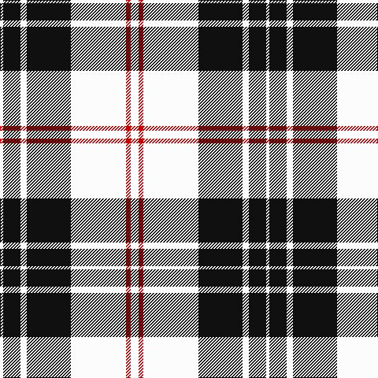

In pattern [WKWKWRW](/stripes/wkwkwrw/).

This was sourced from register-of-tartans.  It is a [7 stripe tartan](/stripes/stripes7/).

Original link https://www.tartanregister.gov.uk/tartanDetails.aspx?ref=2724

## Also known as

This cloth is also recorded under:

- MacPherson, of Cluny

## Attestations

This cloth appears in 4 source records; the oldest owns this page.

- 01/01/1850 — MacPherson of Cluny (Black and White) (register-of-tartans, [record](https://www.tartanregister.gov.uk/tartanDetails.aspx?ref=2724))
- pre 1850 — MacPherson of Cluny (B & W) (tartans-authority, [record](http://www.tartansauthority.com/tartan-ferret/display/1830/))
- undated — MacPherson, of Cluny (weddslist, [record](http://www.weddslist.com/cgi-bin/tartans/pg.pl?source=sts))
- undated — MacPherson of Cluny Clan Tartan Tartan Number: 1830. Earliest known date: 1948 Also known as MacPherson Dress often woven with purple in place of red See products available Copyright © Blair Urquhart, Comrie, 2015 (house-of-tartan, [record](http://www.house-of-tartan.scotland.net/house/TartanViewjs.asp?colr=Def&tnam=1830))

## Register references

External register numbers recorded for this tartan.

- Scottish Register of Tartans: [2724](https://www.tartanregister.gov.uk/tartanDetails.aspx?ref=2724)
- Scottish Tartans Authority (ITI): 1830
- Scottish Tartans World Register: 1830

## Thread count
W/10 R6 W70 K56 W8 K22 W/4

## Palette
Each colour and the base-6 reference it is a variant of.

| Colour | Shade | Base |
|---|---|---|
| K | <code style="background-color:#101010;">#101010</code> `oklch(17.3% 0.000 89.9)` <small>#101010</small> | K <code style="background-color:#000000;">#000000</code> |
| R | <code style="background-color:#C80000;">#C80000</code> `oklch(52.3% 0.215 29.2)` <small>#C80000</small> | R <code style="background-color:#CC0000;">#CC0000</code> |
| W | <code style="background-color:#FCFCFC;">#FCFCFC</code> `oklch(99.1% 0.000 89.9)` <small>#FCFCFC</small> | W <code style="background-color:#F7F7F7;">#F7F7F7</code> |

# Sample pattern

## Nearest tartans

The nearest existing variants by ΔTartan distance.

1. [Forbes Dress (Clans Originaux)](/setts/s7/w6b3w20k2w3k25w3~x2/) — ΔT 0.59
1. [MacPherson - 1842 (VS) Dress](/setts/s7/w1m2w17k11w2k4ly1~x4/) — ΔT 0.96
1. [Highland Park High School (Texas)](/setts/s9/db19w1db6w1db2w2ly2w1ly18~x4/) — ΔT 1.04
1. [MacPherson #10](/setts/s6/r1w14k6w1k3ly1~x4/) — ΔT 1.13
1. [Stutterheim](/setts/s6/k4ly18n44k3ly10k4/) — ΔT 1.13
1. [Gretna Football Club (Corporate)](/setts/s7/w36k8w36k95w4k4r6/) — ΔT 1.18
1. [O'Sullivan-Beare (Family)](/setts/s8/lb40k3lb3k3lb3o8k24o8~x2/) — ΔT 1.20
1. [MacPherson Dress (1842)](/setts/s7/w3r1w30k20w3k9ly1~x2/) — ΔT 1.24
1. [McPartlin (Personal)](/setts/s5/k27w29k5w14r2~x2/) — ΔT 1.25
1. [MacPherson Dress (1951)](/setts/s7/w3p3w30k20w3k9ly3~x2/) — ΔT 1.29

## Neighbour map

Every grey dot is one of 14299 variants placed by the first two principal components of the ΔTartan feature space (44% of its variance). Red is this tartan; blue dots are its nearest — click one to open its page.

<svg viewBox="0 0 640 380" role="img" style="max-width:100%;height:auto;border:1px solid #e0e0e0;border-radius:4px;display:block" xmlns="http://www.w3.org/2000/svg"><image href="/nn/cloud.v1.png" width="640" height="380"/><a href="/setts/s7/w6b3w20k2w3k25w3~x2/"><circle cx="282.1" cy="169.7" r="4" fill="#3465a4"><title>Forbes Dress (Clans Originaux)</title></circle></a><a href="/setts/s7/w1m2w17k11w2k4ly1~x4/"><circle cx="281.9" cy="139.9" r="4" fill="#3465a4"><title>MacPherson - 1842 (VS) Dress</title></circle></a><a href="/setts/s9/db19w1db6w1db2w2ly2w1ly18~x4/"><circle cx="306.4" cy="136.1" r="4" fill="#3465a4"><title>Highland Park High School (Texas)</title></circle></a><a href="/setts/s6/r1w14k6w1k3ly1~x4/"><circle cx="301.4" cy="149.5" r="4" fill="#3465a4"><title>MacPherson #10</title></circle></a><a href="/setts/s6/k4ly18n44k3ly10k4/"><circle cx="305.9" cy="177.5" r="4" fill="#3465a4"><title>Stutterheim</title></circle></a><a href="/setts/s7/w36k8w36k95w4k4r6/"><circle cx="346.4" cy="144.0" r="4" fill="#3465a4"><title>Gretna Football Club (Corporate)</title></circle></a><a href="/setts/s8/lb40k3lb3k3lb3o8k24o8~x2/"><circle cx="273.8" cy="161.4" r="4" fill="#3465a4"><title>O'Sullivan-Beare (Family)</title></circle></a><a href="/setts/s7/w3r1w30k20w3k9ly1~x2/"><circle cx="322.5" cy="120.7" r="4" fill="#3465a4"><title>MacPherson Dress (1842)</title></circle></a><a href="/setts/s5/k27w29k5w14r2~x2/"><circle cx="299.8" cy="200.8" r="4" fill="#3465a4"><title>McPartlin (Personal)</title></circle></a><a href="/setts/s7/w3p3w30k20w3k9ly3~x2/"><circle cx="247.6" cy="163.6" r="4" fill="#3465a4"><title>MacPherson Dress (1951)</title></circle></a><circle cx="302.1" cy="157.5" r="5" fill="#c00000"/></svg>

ID: /setts/s7/w5r3w35k28w4k11w2~x2/
