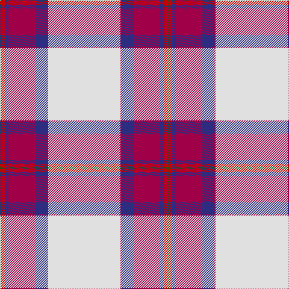

**Bands:** [GRBRBRW](/stripes/grbrbrw/) · **Stripes:** [G R DB M DB M W](/stripes/stripes7/) G R DB M DB M W

This was sourced from house-of-tartan.  It is a [7 band tartan](/bands/bands7/).

Original link http://www.house-of-tartan.scotland.net/house/TartanViewjs.asp?colr=Def&tnam=8177

## Thread count
G/2 Ra6 DB6 R44 DB20 R2 LN/120

## Palette
Each colour and its ΔE from the base-6 reference it is a variant of.

| Colour | Shade | Base | ΔE (OKLab) |
|---|---|---|---|
| DB | <code style="background-color:#2C2C80;">#2C2C80</code> `#2C2C80` | B <code style="background-color:#2A418A;">#2A418A</code> | 0.06 |
| G | <code style="background-color:#006818;">#006818</code> `#006818` | G <code style="background-color:#006100;">#006100</code> | 0.02 |
| LN | <code style="background-color:#E0E0E0;">#E0E0E0</code> `#E0E0E0` | W <code style="background-color:#F7F7F7;">#F7F7F7</code> | 0.07 |
| R | <code style="background-color:#A00048;">#A00048</code> `#A00048` | R <code style="background-color:#CC0000;">#CC0000</code> | 0.12 |
| Ra | <code style="background-color:#C80000;">#C80000</code> `#C80000` | R <code style="background-color:#CC0000;">#CC0000</code> | 0.01 |

# Sample pattern

## Nearest tartans

The nearest existing variants by ΔTartan distance.

1. [Unidentified Arisaid](/setts/s9/w216k8dg24g24w4k4r45w8r12/) — ΔT 1.37
1. [Stewart Dress, Purple (Dance)](/setts/s10/w55dp12lo2dp3w2g10dp9dp2dp6w2~x2/) — ΔT 1.40
1. [Unidentified Blanket](/setts/s8/w50k1r12w1dg12r13w1r2~x2/) — ΔT 1.40
1. [Young, Christina](/setts/s6/w54k7r7lo6ly4r1~x2/) — ΔT 1.47
1. [MacGregor Dress Burgundy (Dance)](/setts/s6/w52r22w6r8k1r3~x2/) — ΔT 1.48
1. [Wilson's Blanket Pattern](/setts/s8/w50k1r14w1dg14r14w1r2~x4/) — ΔT 1.49
1. [Unidentified, Blanket](/setts/s8/w50k1r12w1g12r13w1r2~x2/) — ΔT 1.50
1. [Grotto Dove (Dance)](/setts/s11/w102db20w4db4w4db4dg20r18db3r10w4/) — ΔT 1.51
1. [Bruce of Kinnaird Dress (Dance)](/setts/s10/w45r9k2w8k2ly1k10db8dp12w2~x2/) — ΔT 1.52
1. [Drummond of Perth Dress (Dance)](/setts/s9/w50k3g10g11w1k1r20w3r5~x2/) — ΔT 1.52

## Neighbour map

Every grey dot is one of 14313 variants placed by the first two principal components of the ΔTartan feature space (44% of its variance). Red is this tartan; blue dots are its nearest — click one to open its page.

<svg viewBox="0 0 640 380" role="img" style="max-width:100%;height:auto;border:1px solid #e0e0e0;border-radius:4px;display:block" xmlns="http://www.w3.org/2000/svg"><image href="/nn/cloud.v1.png" width="640" height="380"/><a href="/setts/s9/w216k8dg24g24w4k4r45w8r12/"><circle cx="397.6" cy="43.1" r="4" fill="#3465a4"><title>Unidentified Arisaid</title></circle></a><a href="/setts/s10/w55dp12lo2dp3w2g10dp9dp2dp6w2~x2/"><circle cx="295.9" cy="59.3" r="4" fill="#3465a4"><title>Stewart Dress, Purple (Dance)</title></circle></a><a href="/setts/s8/w50k1r12w1dg12r13w1r2~x2/"><circle cx="365.2" cy="75.1" r="4" fill="#3465a4"><title>Unidentified Blanket</title></circle></a><a href="/setts/s6/w54k7r7lo6ly4r1~x2/"><circle cx="416.8" cy="72.4" r="4" fill="#3465a4"><title>Young, Christina</title></circle></a><a href="/setts/s6/w52r22w6r8k1r3~x2/"><circle cx="396.9" cy="91.7" r="4" fill="#3465a4"><title>MacGregor Dress Burgundy (Dance)</title></circle></a><a href="/setts/s8/w50k1r14w1dg14r14w1r2~x4/"><circle cx="330.3" cy="70.2" r="4" fill="#3465a4"><title>Wilson's Blanket Pattern</title></circle></a><a href="/setts/s8/w50k1r12w1g12r13w1r2~x2/"><circle cx="364.6" cy="76.9" r="4" fill="#3465a4"><title>Unidentified, Blanket</title></circle></a><a href="/setts/s11/w102db20w4db4w4db4dg20r18db3r10w4/"><circle cx="340.9" cy="63.1" r="4" fill="#3465a4"><title>Grotto Dove (Dance)</title></circle></a><a href="/setts/s10/w45r9k2w8k2ly1k10db8dp12w2~x2/"><circle cx="268.2" cy="37.3" r="4" fill="#3465a4"><title>Bruce of Kinnaird Dress (Dance)</title></circle></a><a href="/setts/s9/w50k3g10g11w1k1r20w3r5~x2/"><circle cx="290.6" cy="60.6" r="4" fill="#3465a4"><title>Drummond of Perth Dress (Dance)</title></circle></a><circle cx="362.4" cy="63.5" r="5" fill="#c00000"/></svg>

ID: /setts/s7/w60m1db10m22db3r3g1~x2/
