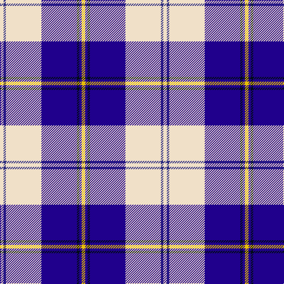

In pattern [WBWBKBY](/patterns/wbwbkby/).

This was sourced from tartans-authority.  It is a [7 stripes tartan](/stripes/stripes7/).

Original link http://www.tartansauthority.com/tartan-ferret/display/7594/

## Attestations

This cloth appears in 2 source records; the oldest owns this page.

- March 2008 — Torridon, Saphire (Dance) (tartans-authority, [record](http://www.tartansauthority.com/tartan-ferret/display/7594/))
- undated — Torridon Saphire (register-of-tartans, [record](https://www.tartanregister.gov.uk/tartanDetails.aspx?ref=5618))

## Thread count
W/6 DB4 W60 DBa60 K4 DBa4 Y/6

## Palette
Each colour and its ΔE from the base-6 reference it is a variant of.

| Colour | Shade | Base | ΔE (OKLab) |
|---|---|---|---|
| DB | <code style="background-color:#2C2C80;">#2C2C80</code> `#2C2C80` | B <code style="background-color:#2C4084;">#2C4084</code> | 0.05 |
| DBa | <code style="background-color:#20008C;">#20008C</code> `#20008C` | B <code style="background-color:#2C4084;">#2C4084</code> | 0.12 |
| K | <code style="background-color:#000C14;">#000C14</code> `#000C14` | K <code style="background-color:#000000;">#000000</code> | 0.15 |
| W | <code style="background-color:#F0E0C8;">#F0E0C8</code> `#F0E0C8` | W <code style="background-color:#F4F4F0;">#F4F4F0</code> | 0.06 |
| Y | <code style="background-color:#E8C000;">#E8C000</code> `#E8C000` | Y <code style="background-color:#E8C000;">#E8C000</code> | 0.00 |

# Sample pattern

## Nearest tartans

The nearest existing variants by ΔTartan distance.

1. [Cunningham, Dress Blue (Dance)](/setts/s7/b6ba4k4ba56w60ba4w6-b2474e8-ba1c0070-k101010-we0e0e0/) — ΔT 0.95
1. [Cunningham, Dress Blue (Dance) Fashion Tartan Tartan Number: 4642. Earliest known date: 01/01/2002 Like so many of the invented 'Dance' tartans this one is not known by the relevant Clan Cunningham Association (USA). /Threadcount and colours aren't 100% original. Generated manually./ See products available Copyright © Blair Urquhart, Comrie, 2015](/setts/s7/b8ba4k4ba80w80ba4w8-b2888c4-ba2c2c80-k101010-we0e0e0/) — ΔT 1.04
1. [Eildon/Longniddry Blue Dress Fashion Tartan Tartan Number: 4799. Earliest known date: 01/01/1980 A Dancers' Fancy from Dalgliesh. This appears under three different names - Longniddry #5486, Eildon #4799 and Harmony Eildon #87 (original Scottish Tartans Authority references). Needs resolving. Sample in Scottish Tartans Authority's Dalgety Collection. /Threadcount and colours aren't 100% original. Generated manually./ See products available Copyright © Blair Urquhart, Comrie, 2015](/setts/s8/b60ba4w4ba4b8bb20w50b8-b202060-ba2888c4-bb5c8ca8-we0e0e0/) — ΔT 1.18
1. [Sinclair Dress (Dance)](/setts/s7/b8r4b62k20g8w42g4-b38409c-g006818-k101010-rc80000-we0e0e0/) — ΔT 1.23
1. [Jack Sinclair (Personal)](/setts/s7/b8r4b80k22g4w32r4-b6495ed-g006818-k101010-rcc1100-wf8f8f8/) — ΔT 1.25
1. [St Andrews Links Dress](/setts/s7/w60b8w6ba4r4ba48wa4-b8968cd-ba551a8b-rcd5555-wfdf5e6-waffffff/) — ΔT 1.27
1. [Harmony Eildon (Dance)](/setts/s8/b82ba4w4ba4b10bb24w62b8-b2c2c80-ba5c8ca8-bb2888c4-we0e0e0/) — ΔT 1.31
1. [Stewart of Appin Htg Dress](/setts/s10/b16r6b72ba6bb20w68r8w6r6w16-b003478-ba788cb4-bb281414-r8c0000-wf8f8f8/) — ΔT 1.31
1. [Ailsa, Royal Blue (Dance)](/setts/s6/b16ba6b56w64bb6w8-b2c2c80-ba5c8ca8-bb003c64-wf0e0c8/) — ΔT 1.34
1. [Harris, Royal Blue (Dance)](/setts/s10/w6b4k8b4w4b52r8w60r4w6-b1c0070-k101010-rc80000-wf0e0c8/) — ΔT 1.36

## Neighbour map

Every grey dot is one of 15726 variants placed by the first two principal components of the ΔTartan feature space (44% of its variance). Red is this tartan; blue dots are its nearest — click one to open its page.

<svg viewBox="0 0 640 380" role="img" style="max-width:100%;height:auto;border:1px solid #e0e0e0;border-radius:4px;display:block" xmlns="http://www.w3.org/2000/svg"><image href="/nn/cloud.v1.png" width="640" height="380"/><a href="/setts/s7/b6ba4k4ba56w60ba4w6-b2474e8-ba1c0070-k101010-we0e0e0/"><circle cx="265.7" cy="142.3" r="4" fill="#3465a4"><title>Cunningham, Dress Blue (Dance)</title></circle></a><a href="/setts/s7/b8ba4k4ba80w80ba4w8-b2888c4-ba2c2c80-k101010-we0e0e0/"><circle cx="286.0" cy="130.0" r="4" fill="#3465a4"><title>Cunningham, Dress Blue (Dance) Fashion Tartan Tartan Number: 4642. Earliest known date: 01/01/2002 Like so many of the invented 'Dance' tartans this one is not known by the relevant Clan Cunningham Association (USA). /Threadcount and colours aren't 100% original. Generated manually./ See products available Copyright © Blair Urquhart, Comrie, 2015</title></circle></a><a href="/setts/s8/b60ba4w4ba4b8bb20w50b8-b202060-ba2888c4-bb5c8ca8-we0e0e0/"><circle cx="240.6" cy="147.5" r="4" fill="#3465a4"><title>Eildon/Longniddry Blue Dress Fashion Tartan Tartan Number: 4799. Earliest known date: 01/01/1980 A Dancers' Fancy from Dalgliesh. This appears under three different names - Longniddry #5486, Eildon #4799 and Harmony Eildon #87 (original Scottish Tartans Authority references). Needs resolving. Sample in Scottish Tartans Authority's Dalgety Collection. /Threadcount and colours aren't 100% original. Generated manually./ See products available Copyright © Blair Urquhart, Comrie, 2015</title></circle></a><a href="/setts/s7/b8r4b62k20g8w42g4-b38409c-g006818-k101010-rc80000-we0e0e0/"><circle cx="210.0" cy="143.4" r="4" fill="#3465a4"><title>Sinclair Dress (Dance)</title></circle></a><a href="/setts/s7/b8r4b80k22g4w32r4-b6495ed-g006818-k101010-rcc1100-wf8f8f8/"><circle cx="283.7" cy="120.0" r="4" fill="#3465a4"><title>Jack Sinclair (Personal)</title></circle></a><a href="/setts/s7/w60b8w6ba4r4ba48wa4-b8968cd-ba551a8b-rcd5555-wfdf5e6-waffffff/"><circle cx="246.0" cy="117.4" r="4" fill="#3465a4"><title>St Andrews Links Dress</title></circle></a><a href="/setts/s8/b82ba4w4ba4b10bb24w62b8-b2c2c80-ba5c8ca8-bb2888c4-we0e0e0/"><circle cx="275.4" cy="133.9" r="4" fill="#3465a4"><title>Harmony Eildon (Dance)</title></circle></a><a href="/setts/s10/b16r6b72ba6bb20w68r8w6r6w16-b003478-ba788cb4-bb281414-r8c0000-wf8f8f8/"><circle cx="165.0" cy="121.0" r="4" fill="#3465a4"><title>Stewart of Appin Htg Dress</title></circle></a><a href="/setts/s6/b16ba6b56w64bb6w8-b2c2c80-ba5c8ca8-bb003c64-wf0e0c8/"><circle cx="241.3" cy="177.6" r="4" fill="#3465a4"><title>Ailsa, Royal Blue (Dance)</title></circle></a><a href="/setts/s10/w6b4k8b4w4b52r8w60r4w6-b1c0070-k101010-rc80000-wf0e0c8/"><circle cx="255.7" cy="115.4" r="4" fill="#3465a4"><title>Harris, Royal Blue (Dance)</title></circle></a><circle cx="236.0" cy="123.5" r="5" fill="#c00000"/></svg>

ID: /setts/s7/w6b4w60ba60k4ba4y6-b2c2c80-ba20008c-k000c14-wf0e0c8-ye8c000/
