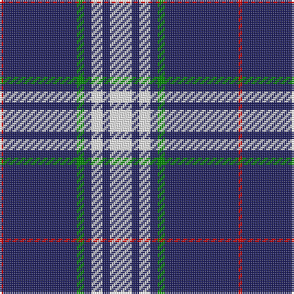

**Bands:** [RBGBWBW](/stripes/rbgbwbw/) · **Stripes:** [R DB G DB W DB W](/stripes/stripes7/) R DB G DB W DB W

This was sourced from register-of-tartans.  It is a [7 band tartan](/bands/bands7/).

Original link https://www.tartanregister.gov.uk/tartanDetails.aspx?ref=11068

## Attestations

This cloth appears in 2 source records; the oldest owns this page.

- 01/03/2014 — Gonzaga University’s True Blue and White (register-of-tartans, [record](https://www.tartanregister.gov.uk/tartanDetails.aspx?ref=11068))
- 2014 — Gonzaga University's True Blue and W (tartans-authority, [record](http://www.tartansauthority.com/tartan-ferret/display/11068/))

## Register references

External register numbers recorded for this tartan.

- Scottish Register of Tartans: [11068](https://www.tartanregister.gov.uk/tartanDetails.aspx?ref=11068)

## Variants

Other setts woven to the same stripe pattern.

- [Ikelman #4 (Personal)](/setts/s7/r10db15g2db2w1db1w1~x4/)

## Thread count
R/2 DB40 G4 DB4 W6 DB4 W/12

## Palette
Each colour and its ΔE from the base-6 reference it is a variant of.

| Colour | Shade | Base | ΔE (OKLab) |
|---|---|---|---|
| DB | <code style="background-color:#202060;">#202060</code> `#202060` | B <code style="background-color:#2A418A;">#2A418A</code> | 0.11 |
| G | <code style="background-color:#008B00;">#008B00</code> `#008B00` | G <code style="background-color:#006100;">#006100</code> | 0.13 |
| R | <code style="background-color:#DC0000;">#DC0000</code> `#DC0000` | R <code style="background-color:#CC0000;">#CC0000</code> | 0.03 |
| W | <code style="background-color:#FFFFFF;">#FFFFFF</code> `#FFFFFF` | W <code style="background-color:#F7F7F7;">#F7F7F7</code> | 0.02 |

# Sample pattern

## Nearest tartans

The nearest existing variants by ΔTartan distance.

1. [Baker Dress Family Tartan Tartan Number: 2180. Earliest known date: 1999 STS notes 'Sample in trade specimens file.' See products available Copyright © Blair Urquhart, Comrie, 2015](/setts/s8/db28ly3w1ly3db4w2r1w5~x4/) — ΔT 0.89
1. [Baker (Name)](/setts/s8/db28lo3w1lo3db4w2dp1w5~x4/) — ΔT 0.89
1. [Baker](/setts/s8/db28o3w1o3db4w2dp1w5~x4/) — ΔT 0.92
1. [University of North Carolina at Greensboro, The](/setts/s9/db96ly11db8ly11db16ly6w4ly16w8/) — ΔT 1.20
1. [California Riverside, University of (Corporate)](/setts/s10/db42k6db3k3db3w5db17w7lo10k3~x2/) — ΔT 1.23
1. [Baker Family Tartan Tartan Number: 613. Earliest known date: pre 2003 STS notes 'Sample in trade specimens file.' See products available Copyright © Blair Urquhart, Comrie, 2015](/setts/s8/db28dr3w1dr3db4w2dp1w5~x4/) — ΔT 1.33
1. [Baker](/setts/s8/db28o3w1o3db4w2p1w5~x4/) — ΔT 1.36
1. [Antigonish](/setts/s8/t4db1t4db24w6db4w1db2~x4/) — ΔT 1.38
1. [Royal Troon Golf Club, The](/setts/s8/lo3db4w10dg2w2dg5db34ly3~x2/) — ΔT 1.40
1. [Ikelman No 1](/setts/s6/w8k16w2db2w1k1~x4/) — ΔT 1.46

## Neighbour map

Every grey dot is one of 14313 variants placed by the first two principal components of the ΔTartan feature space (44% of its variance). Red is this tartan; blue dots are its nearest — click one to open its page.

<svg viewBox="0 0 640 380" role="img" style="max-width:100%;height:auto;border:1px solid #e0e0e0;border-radius:4px;display:block" xmlns="http://www.w3.org/2000/svg"><image href="/nn/cloud.v1.png" width="640" height="380"/><a href="/setts/s8/db28ly3w1ly3db4w2r1w5~x4/"><circle cx="413.2" cy="112.8" r="4" fill="#3465a4"><title>Baker Dress Family Tartan Tartan Number: 2180. Earliest known date: 1999 STS notes 'Sample in trade specimens file.' See products available Copyright © Blair Urquhart, Comrie, 2015</title></circle></a><a href="/setts/s8/db28lo3w1lo3db4w2dp1w5~x4/"><circle cx="413.8" cy="115.7" r="4" fill="#3465a4"><title>Baker (Name)</title></circle></a><a href="/setts/s8/db28o3w1o3db4w2dp1w5~x4/"><circle cx="415.0" cy="115.9" r="4" fill="#3465a4"><title>Baker</title></circle></a><a href="/setts/s9/db96ly11db8ly11db16ly6w4ly16w8/"><circle cx="425.8" cy="130.0" r="4" fill="#3465a4"><title>University of North Carolina at Greensboro, The</title></circle></a><a href="/setts/s10/db42k6db3k3db3w5db17w7lo10k3~x2/"><circle cx="352.9" cy="148.5" r="4" fill="#3465a4"><title>California Riverside, University of (Corporate)</title></circle></a><a href="/setts/s8/db28dr3w1dr3db4w2dp1w5~x4/"><circle cx="428.5" cy="122.5" r="4" fill="#3465a4"><title>Baker Family Tartan Tartan Number: 613. Earliest known date: pre 2003 STS notes 'Sample in trade specimens file.' See products available Copyright © Blair Urquhart, Comrie, 2015</title></circle></a><a href="/setts/s8/db28o3w1o3db4w2p1w5~x4/"><circle cx="436.0" cy="125.3" r="4" fill="#3465a4"><title>Baker</title></circle></a><a href="/setts/s8/t4db1t4db24w6db4w1db2~x4/"><circle cx="417.0" cy="151.1" r="4" fill="#3465a4"><title>Antigonish</title></circle></a><a href="/setts/s8/lo3db4w10dg2w2dg5db34ly3~x2/"><circle cx="304.2" cy="117.6" r="4" fill="#3465a4"><title>Royal Troon Golf Club, The</title></circle></a><a href="/setts/s6/w8k16w2db2w1k1~x4/"><circle cx="325.9" cy="175.9" r="4" fill="#3465a4"><title>Ikelman No 1</title></circle></a><circle cx="377.2" cy="139.0" r="5" fill="#c00000"/></svg>

ID: /setts/s7/w6db2w3db2g2db20r1~x2/
