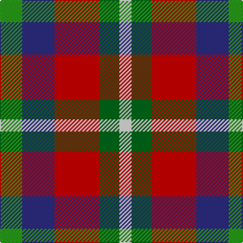

**Bands:** [GGGBRGW](/stripes/gggbrgw/) · **Stripes:** [G G G DB R G W](/stripes/stripes7/) G G G DB R G W

This was sourced from tartans-authority.  It is a [7 band tartan](/bands/bands7/).

Original link http://www.tartansauthority.com/tartan-ferret/display/7828/

## Thread count
Gb/10 Gb8 G4 DB32 R44 Ga20 LN/12

## Palette
Each colour and its ΔE from the base-6 reference it is a variant of.

| Colour | Shade | Base | ΔE (OKLab) |
|---|---|---|---|
| DB | <code style="background-color:#2C2C80;">#2C2C80</code> `#2C2C80` | B <code style="background-color:#2A418A;">#2A418A</code> | 0.06 |
| G | <code style="background-color:#289C18;">#289C18</code> `#289C18` | G <code style="background-color:#006100;">#006100</code> | 0.19 |
| Ga | <code style="background-color:#006818;">#006818</code> `#006818` | G <code style="background-color:#006100;">#006100</code> | 0.02 |
| Gb | <code style="background-color:#289C18;">#289C18</code> `#289C18` | G <code style="background-color:#006100;">#006100</code> | 0.19 |
| LN | <code style="background-color:#E0E0E0;">#E0E0E0</code> `#E0E0E0` | W <code style="background-color:#F7F7F7;">#F7F7F7</code> | 0.07 |
| R | <code style="background-color:#C80000;">#C80000</code> `#C80000` | R <code style="background-color:#CC0000;">#CC0000</code> | 0.01 |

# Sample pattern

## Nearest tartans

The nearest existing variants by ΔTartan distance.

1. [Porcupine City of](/setts/s7/r10n3db1lb8db1lo2g5~x4/) — ΔT 0.73
1. [Nicolson of Taransay (Personal)](/setts/s7/w6g10r22db16g2k4k5~x2/) — ΔT 0.78
1. [Unidentified No 14](/setts/s9/r22t6db10ly4r4w4dg22db8ly3/) — ΔT 0.87
1. [Brittany Hunting French Fancy Tartan Tartan Number: 5977. Earliest known date: 2003 For Richard and Anne-Marie Duclos of Le Coudray-Montceaux, France. Based on the Breton National at 3902. The term Randonnée (Walking) is used in the sense of the Scottish category, Hunting. See products available Copyright © Blair Urquhart, Comrie, 2015](/setts/s9/t4dy27lr8k4lr8k4lr8r11ly3~x2/) — ΔT 0.88
1. [Unnamed No 14](/setts/s9/r22t6db10ly4r4w4g22db8ly3/) — ΔT 0.93
1. [Hackett Hunting (Personal)](/setts/s8/k20lo4r4lo20y20lb5y2g2~x2/) — ΔT 1.01
1. [Ontario Northern Canadian District Tartan Tartan Number: 956. Earliest known date: 1967 The six colours represent the nickel bearing rocks (grey), the snow (white), the sky and the lakes (blue), gold, the forests and fields (green), and the Indian Nation (red brown). See products available Copyright © Blair Urquhart, Comrie, 2015](/setts/s7/dy17o5db2w12db2ly4g7~x2/) — ΔT 1.02
1. [Wilson's, No 121](/setts/s7/t4p3g1g9w1r8k1~x4/) — ΔT 1.04
1. [Wallace Memorial Centenary](/setts/s7/lb2lg19k2dt15g2r20lg2~x2/) — ΔT 1.05
1. [Isle of Skye (District)](/setts/s11/lb24dg3lb3dg3lb3dg10o12dp12o12o2o3~x2/) — ΔT 1.06

## Neighbour map

Every grey dot is one of 14313 variants placed by the first two principal components of the ΔTartan feature space (44% of its variance). Red is this tartan; blue dots are its nearest — click one to open its page.

<svg viewBox="0 0 640 380" role="img" style="max-width:100%;height:auto;border:1px solid #e0e0e0;border-radius:4px;display:block" xmlns="http://www.w3.org/2000/svg"><image href="/nn/cloud.v1.png" width="640" height="380"/><a href="/setts/s7/r10n3db1lb8db1lo2g5~x4/"><circle cx="116.6" cy="163.2" r="4" fill="#3465a4"><title>Porcupine City of</title></circle></a><a href="/setts/s7/w6g10r22db16g2k4k5~x2/"><circle cx="104.8" cy="160.1" r="4" fill="#3465a4"><title>Nicolson of Taransay (Personal)</title></circle></a><a href="/setts/s9/r22t6db10ly4r4w4dg22db8ly3/"><circle cx="87.9" cy="161.2" r="4" fill="#3465a4"><title>Unidentified No 14</title></circle></a><a href="/setts/s9/t4dy27lr8k4lr8k4lr8r11ly3~x2/"><circle cx="119.6" cy="150.4" r="4" fill="#3465a4"><title>Brittany Hunting French Fancy Tartan Tartan Number: 5977. Earliest known date: 2003 For Richard and Anne-Marie Duclos of Le Coudray-Montceaux, France. Based on the Breton National at 3902. The term Randonnée (Walking) is used in the sense of the Scottish category, Hunting. See products available Copyright © Blair Urquhart, Comrie, 2015</title></circle></a><a href="/setts/s9/r22t6db10ly4r4w4g22db8ly3/"><circle cx="89.7" cy="163.6" r="4" fill="#3465a4"><title>Unnamed No 14</title></circle></a><a href="/setts/s8/k20lo4r4lo20y20lb5y2g2~x2/"><circle cx="117.6" cy="159.0" r="4" fill="#3465a4"><title>Hackett Hunting (Personal)</title></circle></a><a href="/setts/s7/dy17o5db2w12db2ly4g7~x2/"><circle cx="87.8" cy="166.3" r="4" fill="#3465a4"><title>Ontario Northern Canadian District Tartan Tartan Number: 956. Earliest known date: 1967 The six colours represent the nickel bearing rocks (grey), the snow (white), the sky and the lakes (blue), gold, the forests and fields (green), and the Indian Nation (red brown). See products available Copyright © Blair Urquhart, Comrie, 2015</title></circle></a><a href="/setts/s7/t4p3g1g9w1r8k1~x4/"><circle cx="97.5" cy="149.9" r="4" fill="#3465a4"><title>Wilson's, No 121</title></circle></a><a href="/setts/s7/lb2lg19k2dt15g2r20lg2~x2/"><circle cx="139.1" cy="152.6" r="4" fill="#3465a4"><title>Wallace Memorial Centenary</title></circle></a><a href="/setts/s11/lb24dg3lb3dg3lb3dg10o12dp12o12o2o3~x2/"><circle cx="105.7" cy="131.2" r="4" fill="#3465a4"><title>Isle of Skye (District)</title></circle></a><circle cx="105.7" cy="161.1" r="5" fill="#c00000"/></svg>

ID: /setts/s7/w6g10r22db16g2g4g5~x2/
