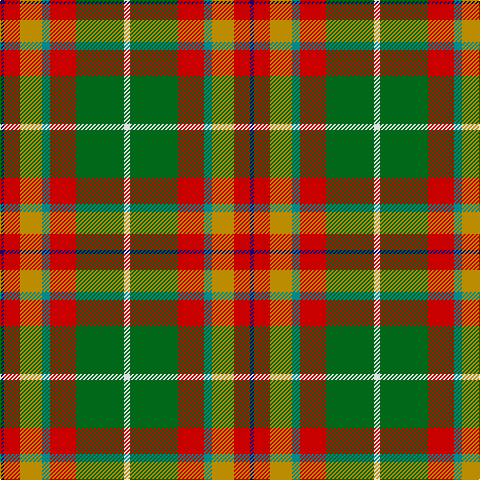

In pattern [BRYGRGW](/patterns/brygrgw/).

This was sourced from tartans-authority.  It is a [7 stripes tartan](/stripes/stripes7/).

Original link http://www.tartansauthority.com/tartan-ferret/display/8556/

## Thread count
DB/4 R16 DY22 B8 R26 G48 LN/6

## Palette
Each colour and its ΔE from the base-6 reference it is a variant of.

| Colour | Shade | Base | ΔE (OKLab) |
|---|---|---|---|
| B | <code style="background-color:#048888;">#048888</code> `#048888` | G <code style="background-color:#006400;">#006400</code> | 0.18 |
| DB | <code style="background-color:#1C0070;">#1C0070</code> `#1C0070` | B <code style="background-color:#2C4084;">#2C4084</code> | 0.14 |
| DY | <code style="background-color:#BC8C00;">#BC8C00</code> `#BC8C00` | Y <code style="background-color:#E8C000;">#E8C000</code> | 0.16 |
| G | <code style="background-color:#006818;">#006818</code> `#006818` | G <code style="background-color:#006400;">#006400</code> | 0.02 |
| LN | <code style="background-color:#E0E0E0;">#E0E0E0</code> `#E0E0E0` | W <code style="background-color:#F4F4F0;">#F4F4F0</code> | 0.06 |
| R | <code style="background-color:#C80000;">#C80000</code> `#C80000` | R <code style="background-color:#C80000;">#C80000</code> | 0.00 |

# Sample pattern

## Nearest tartans

The nearest existing variants by ΔTartan distance.

1. [Brittany National Walking](/setts/s9/b8g54y16k8y16k8y16r22ya6-b2888c4-g604000-k101010-rb03000-ya08858-yae8c000/) — ΔT 1.02
1. [George Watson's College](/setts/s7/b6r48y6g24w6g24ra6-b2888c4-g006818-r880000-rac80000-wfcfcfc-ye8c000/) — ΔT 1.07
1. [Porcupine City of](/setts/s7/r40b12ba4w32ba4y8g20-b5c5c5c-ba1c0070-g006818-rb03000-wc0c0c0-yd09800/) — ΔT 1.07
1. [Brittany Hunting French Fancy Tartan Tartan Number: 5977. Earliest known date: 2003 For Richard and Anne-Marie Duclos of Le Coudray-Montceaux, France. Based on the Breton National at 3902. The term Randonnée (Walking) is used in the sense of the Scottish category, Hunting. See products available Copyright © Blair Urquhart, Comrie, 2015](/setts/s9/b8g54y16k8y16k8y16r22ya6-b4898c4-g60441c-k101010-rb03000-yc8b898-yae8c000/) — ΔT 1.12
1. [Hackett Hunting (Personal)](/setts/s8/k40y8r8y40g40w10g4ga4-g5c6428-ga006818-k101010-rc80000-we8ccb8-ya08858/) — ΔT 1.16
1. [Craik, of Assington](/setts/s8/b16r44b4g32r8g16k4y8-b304080-g008000-k000000-rc00000-yf0c000/) — ΔT 1.17
1. [Sawyer Family Tartan Tartan Number: 2162. Earliest known date: 1994 Information from Dr. Phil Smith, Narvon, USA. See products available Copyright © Blair Urquhart, Comrie, 2015](/setts/s8/g8w4g40b4k16r32ba4r8-b2c2c80-ba5c8ca8-g006818-k101010-rc80000-we0e0e0/) — ΔT 1.18
1. [Bathija (Name)](/setts/s7/y8g36b8r16b16ra42w2-b1474b4-g006818-ra00000-rac80000-wfcfcfc-yfccc00/) — ΔT 1.19
1. [Barbour - Muted](/setts/s7/y8r4y42b22w4ra42ya8-b1c1c1c-ra00000-ra98481c-wfcfcfc-yd8b000-yafccc00/) — ΔT 1.20
1. [Barbour Dress](/setts/s7/r8b4r42ba22w4ra40rb6-b4c3428-ba141e46-rb07430-ra888888-rbc8002c-wf8f8f8/) — ΔT 1.23

## Neighbour map

Every grey dot is one of 15726 variants placed by the first two principal components of the ΔTartan feature space (44% of its variance). Red is this tartan; blue dots are its nearest — click one to open its page.

<svg viewBox="0 0 640 380" role="img" style="max-width:100%;height:auto;border:1px solid #e0e0e0;border-radius:4px;display:block" xmlns="http://www.w3.org/2000/svg"><image href="/nn/cloud.v1.png" width="640" height="380"/><a href="/setts/s9/b8g54y16k8y16k8y16r22ya6-b2888c4-g604000-k101010-rb03000-ya08858-yae8c000/"><circle cx="149.3" cy="166.9" r="4" fill="#3465a4"><title>Brittany National Walking</title></circle></a><a href="/setts/s7/b6r48y6g24w6g24ra6-b2888c4-g006818-r880000-rac80000-wfcfcfc-ye8c000/"><circle cx="175.5" cy="171.2" r="4" fill="#3465a4"><title>George Watson's College</title></circle></a><a href="/setts/s7/r40b12ba4w32ba4y8g20-b5c5c5c-ba1c0070-g006818-rb03000-wc0c0c0-yd09800/"><circle cx="113.6" cy="162.7" r="4" fill="#3465a4"><title>Porcupine City of</title></circle></a><a href="/setts/s9/b8g54y16k8y16k8y16r22ya6-b4898c4-g60441c-k101010-rb03000-yc8b898-yae8c000/"><circle cx="116.4" cy="150.4" r="4" fill="#3465a4"><title>Brittany Hunting French Fancy Tartan Tartan Number: 5977. Earliest known date: 2003 For Richard and Anne-Marie Duclos of Le Coudray-Montceaux, France. Based on the Breton National at 3902. The term Randonnée (Walking) is used in the sense of the Scottish category, Hunting. See products available Copyright © Blair Urquhart, Comrie, 2015</title></circle></a><a href="/setts/s8/k40y8r8y40g40w10g4ga4-g5c6428-ga006818-k101010-rc80000-we8ccb8-ya08858/"><circle cx="113.7" cy="157.7" r="4" fill="#3465a4"><title>Hackett Hunting (Personal)</title></circle></a><a href="/setts/s8/b16r44b4g32r8g16k4y8-b304080-g008000-k000000-rc00000-yf0c000/"><circle cx="186.5" cy="169.9" r="4" fill="#3465a4"><title>Craik, of Assington</title></circle></a><a href="/setts/s8/g8w4g40b4k16r32ba4r8-b2c2c80-ba5c8ca8-g006818-k101010-rc80000-we0e0e0/"><circle cx="179.3" cy="154.4" r="4" fill="#3465a4"><title>Sawyer Family Tartan Tartan Number: 2162. Earliest known date: 1994 Information from Dr. Phil Smith, Narvon, USA. See products available Copyright © Blair Urquhart, Comrie, 2015</title></circle></a><a href="/setts/s7/y8g36b8r16b16ra42w2-b1474b4-g006818-ra00000-rac80000-wfcfcfc-yfccc00/"><circle cx="151.7" cy="140.9" r="4" fill="#3465a4"><title>Bathija (Name)</title></circle></a><a href="/setts/s7/y8r4y42b22w4ra42ya8-b1c1c1c-ra00000-ra98481c-wfcfcfc-yd8b000-yafccc00/"><circle cx="146.9" cy="146.1" r="4" fill="#3465a4"><title>Barbour - Muted</title></circle></a><a href="/setts/s7/r8b4r42ba22w4ra40rb6-b4c3428-ba141e46-rb07430-ra888888-rbc8002c-wf8f8f8/"><circle cx="186.9" cy="165.1" r="4" fill="#3465a4"><title>Barbour Dress</title></circle></a><circle cx="160.1" cy="164.9" r="5" fill="#c00000"/></svg>

ID: /setts/s7/w6g48r26ga8y22r16b4-b1c0070-g006818-ga048888-rc80000-we0e0e0-ybc8c00/
