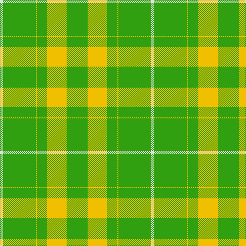

In pattern [GGYGYGW](/stripes/ggygygw/).

This was sourced from weddslist.  It is a [7 stripe tartan](/stripes/stripes7/).

Original link http://www.weddslist.com/cgi-bin/tartans/pg.pl?source=sts

## Thread count
LN/6 G64 Y2 G20 Y38 G20 G/1

## Palette
Each colour and the base-6 reference it is a variant of.

| Colour | Shade | Base |
|---|---|---|
| G | <code style="background-color:#30A010;">#30A010</code> `oklch(61.9% 0.195 140.5)` <small>#30A010</small> | G <code style="background-color:#006100;">#006100</code> |
| LN | <code style="background-color:#E0E0E0;">#E0E0E0</code> `oklch(90.7% 0.000 89.9)` <small>#E0E0E0</small> | W <code style="background-color:#F7F7F7;">#F7F7F7</code> |
| Y | <code style="background-color:#F0C000;">#F0C000</code> `oklch(82.7% 0.169 90.5)` <small>#F0C000</small> | Y <code style="background-color:#F2BF00;">#F2BF00</code> |

# Sample pattern

## Nearest tartans

The nearest existing variants by ΔTartan distance.

1. [Unidentified Plaid 11](/setts/s10/g32o2g2o2g2o12g22w1g1w3~x2/) — ΔT 2.16
1. [Welsh Assembly](/setts/s8/g5y9g4w5g30r2g4r2~x2/) — ΔT 2.66
1. [Jubilation Tartan](/setts/s8/g8w2g11w13g30w13g11g2~x2/) — ΔT 2.73
1. [Loch Laggan (District)](/setts/s6/r4g2r1g20k1g1~x4/) — ΔT 2.73
1. [MacBeorn](/setts/s7/g55dg6g7dg17ly1dg2ly2~x2/) — ΔT 2.73
1. [Logan](/setts/s7/g10r4g1r4g15r4g1~x4/) — ΔT 2.84
1. [St. Christopher (Corporate)](/setts/s8/dg5r3dg3lo2dg1ly8dg24lo2~x2/) — ΔT 2.89
1. [Delta Lambda Phi (Corporate)](/setts/s12/lo5k1lo6g20w1g3w1g3w1g30k1lo2~x2/) — ΔT 2.94
1. [Scottish Scouts](/setts/s7/r3g22db16g14r2g6ly1~x2/) — ΔT 3.03
1. [Montreal](/setts/s10/lo78g10r2g1r2g6lo2g3lo2g43~x2/) — ΔT 3.08

## Neighbour map

Every grey dot is one of 14299 variants placed by the first two principal components of the ΔTartan feature space (44% of its variance). Red is this tartan; blue dots are its nearest — click one to open its page.

<svg viewBox="0 0 640 380" role="img" style="max-width:100%;height:auto;border:1px solid #e0e0e0;border-radius:4px;display:block" xmlns="http://www.w3.org/2000/svg"><image href="/nn/cloud.v1.png" width="640" height="380"/><a href="/setts/s10/g32o2g2o2g2o12g22w1g1w3~x2/"><circle cx="567.7" cy="181.5" r="4" fill="#3465a4"><title>Unidentified Plaid 11</title></circle></a><a href="/setts/s8/g5y9g4w5g30r2g4r2~x2/"><circle cx="442.1" cy="186.8" r="4" fill="#3465a4"><title>Welsh Assembly</title></circle></a><a href="/setts/s8/g8w2g11w13g30w13g11g2~x2/"><circle cx="431.4" cy="233.3" r="4" fill="#3465a4"><title>Jubilation Tartan</title></circle></a><a href="/setts/s6/r4g2r1g20k1g1~x4/"><circle cx="555.3" cy="183.2" r="4" fill="#3465a4"><title>Loch Laggan (District)</title></circle></a><a href="/setts/s7/g55dg6g7dg17ly1dg2ly2~x2/"><circle cx="514.1" cy="156.9" r="4" fill="#3465a4"><title>MacBeorn</title></circle></a><a href="/setts/s7/g10r4g1r4g15r4g1~x4/"><circle cx="445.0" cy="223.1" r="4" fill="#3465a4"><title>Logan</title></circle></a><a href="/setts/s8/dg5r3dg3lo2dg1ly8dg24lo2~x2/"><circle cx="442.4" cy="158.4" r="4" fill="#3465a4"><title>St. Christopher (Corporate)</title></circle></a><a href="/setts/s12/lo5k1lo6g20w1g3w1g3w1g30k1lo2~x2/"><circle cx="514.6" cy="131.6" r="4" fill="#3465a4"><title>Delta Lambda Phi (Corporate)</title></circle></a><a href="/setts/s7/r3g22db16g14r2g6ly1~x2/"><circle cx="408.6" cy="202.2" r="4" fill="#3465a4"><title>Scottish Scouts</title></circle></a><a href="/setts/s10/lo78g10r2g1r2g6lo2g3lo2g43~x2/"><circle cx="503.0" cy="141.8" r="4" fill="#3465a4"><title>Montreal</title></circle></a><circle cx="516.7" cy="180.2" r="5" fill="#c00000"/></svg>

ID: /setts/s7/w6g64ly2g20ly38g20g1/
