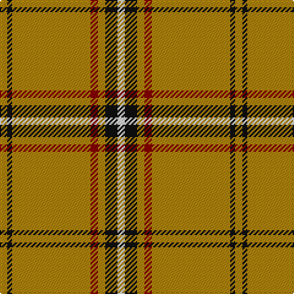

In pattern [WKYRYKY](/patterns/wkyryky/).

This was sourced from register-of-tartans.  It is a [7 stripes tartan](/stripes/stripes7/).

Original link https://www.tartanregister.gov.uk/tartanDetails.aspx?ref=375

## Attestations

This cloth appears in 2 source records; the oldest owns this page.

- 01/05/2005 — Bro-Dreger (register-of-tartans, [record](https://www.tartanregister.gov.uk/tartanDetails.aspx?ref=375))
- 2005 May — Bro-Dreger (Corporate) (tartans-authority, [record](http://www.tartansauthority.com/tartan-ferret/display/6650/))

## Thread count
DY/6 K4 DY64 DR6 DY6 K10 LN/6

## Palette
Each colour and its ΔE from the base-6 reference it is a variant of.

| Colour | Shade | Base | ΔE (OKLab) |
|---|---|---|---|
| DR | <code style="background-color:#880000;">#880000</code> `#880000` | R <code style="background-color:#C80000;">#C80000</code> | 0.14 |
| DY | <code style="background-color:#B0840C;">#B0840C</code> `#B0840C` | Y <code style="background-color:#E8C000;">#E8C000</code> | 0.19 |
| K | <code style="background-color:#101010;">#101010</code> `#101010` | K <code style="background-color:#000000;">#000000</code> | 0.17 |
| LN | <code style="background-color:#E0E0E0;">#E0E0E0</code> `#E0E0E0` | W <code style="background-color:#F4F4F0;">#F4F4F0</code> | 0.06 |

# Sample pattern

ID: /setts/s7/w6k10y6r6y64k4y6-k101010-r880000-we0e0e0-yb0840c/
