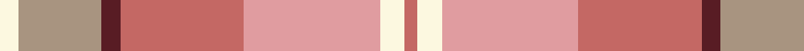

In pattern [RWYRBYW](/stripes/rwyrbyw/).

This was sourced from register-of-tartans.  It is a [7 stripe tartan](/stripes/stripes7/).

Original link https://www.tartanregister.gov.uk/tartanDetails.aspx?ref=4039

## Also known as

This cloth is also recorded under:

- Susan G Komen 06

## Attestations

This cloth appears in 2 source records; the oldest owns this page.

- 01/01/2006 — Susan G Komen 06 (register-of-tartans, [record](https://www.tartanregister.gov.uk/tartanDetails.aspx?ref=4039))
- 2006 — Susan G Komen (Fashion) (tartans-authority, [record](http://www.tartansauthority.com/tartan-ferret/display/7332/))

## Register references

External register numbers recorded for this tartan.

- Scottish Register of Tartans: [4039](https://www.tartanregister.gov.uk/tartanDetails.aspx?ref=4039)
- Scottish Tartans Authority (ITI): 7332

## Thread count
LY/6 N27 DR6 LT40 LR44 LY8 LT/4

## Palette
Each colour and the base-6 reference it is a variant of.

| Colour | Shade | Base |
|---|---|---|
| DR | <code style="background-color:#581C24;">#581C24</code> `oklch(32.3% 0.088 15.7)` <small>#581C24</small> | B <code style="background-color:#2A418A;">#2A418A</code> |
| LR | <code style="background-color:#E09CA0;">#E09CA0</code> `oklch(76.0% 0.082 15.3)` <small>#E09CA0</small> | Y <code style="background-color:#F2BF00;">#F2BF00</code> |
| LT | <code style="background-color:#C46864;">#C46864</code> `oklch(62.3% 0.118 23.6)` <small>#C46864</small> | R <code style="background-color:#CC0000;">#CC0000</code> |
| LY | <code style="background-color:#FCF8E0;">#FCF8E0</code> `oklch(97.6% 0.032 99.2)` <small>#FCF8E0</small> | W <code style="background-color:#F7F7F7;">#F7F7F7</code> |
| N | <code style="background-color:#A89480;">#A89480</code> `oklch(67.9% 0.037 67.1)` <small>#A89480</small> | Y <code style="background-color:#F2BF00;">#F2BF00</code> |
| R | <code style="background-color:#C80000;">#C80000</code> `oklch(52.3% 0.215 29.2)` <small>#C80000</small> | R <code style="background-color:#CC0000;">#CC0000</code> |

# Sample pattern

## Nearest tartans

The nearest existing variants by ΔTartan distance, with this tartan at the top so the swatches line up against it.

ΔTartan

Tartan

Sett

—

<a href="/ttd/edit/#slug=w6lr27dr6o40lr44w8o4">Susan G Komen 06</a> <a class="nn-out" href="/setts/s7/w6lr27dr6o40lr44w8o4/" title="open its dictionary page">↗</a>

1.50

<a href="/ttd/edit/#slug=o24lo8dr2lo8dr2lo8o15g2~x2">Unidentified from Winnipeg</a> <a class="nn-out" href="/setts/s8/o24lo8dr2lo8dr2lo8o15g2~x2/" title="open its dictionary page">↗</a>

1.51

<a href="/ttd/edit/#slug=r12w4r3lo18r3ly4g2~x2">Golden Pheasant</a> <a class="nn-out" href="/setts/s7/r12w4r3lo18r3ly4g2~x2/" title="open its dictionary page">↗</a>

1.56

<a href="/ttd/edit/#slug=lo23r22m52r8w6lo18">Lady Boys of Bangkok (Corporate)</a> <a class="nn-out" href="/setts/s6/lo23r22m52r8w6lo18/" title="open its dictionary page">↗</a>

1.74

<a href="/ttd/edit/#slug=o2o2o15w10o2y15o2y2~x2">Bannockbane, Grey</a> <a class="nn-out" href="/setts/s8/o2o2o15w10o2y15o2y2~x2/" title="open its dictionary page">↗</a>

1.84

<a href="/ttd/edit/#slug=lr2o1r10o12o10lr6r10o1lr2~x2">Unidentified, Sett</a> <a class="nn-out" href="/setts/s9/lr2o1r10o12o10lr6r10o1lr2~x2/" title="open its dictionary page">↗</a>

1.85

<a href="/ttd/edit/#slug=m4lb2w11ly9y16o16ly2lb4~x2">Takashimaya Dm Rose</a> <a class="nn-out" href="/setts/s8/m4lb2w11ly9y16o16ly2lb4~x2/" title="open its dictionary page">↗</a>

1.90

<a href="/ttd/edit/#slug=y25w2t4lo7t4w2lo25w2t4lo7~x2">O'Monaghan (Personal)</a> <a class="nn-out" href="/setts/s10/y25w2t4lo7t4w2lo25w2t4lo7~x2/" title="open its dictionary page">↗</a>

1.91

<a href="/ttd/edit/#slug=o2dy2o15dy2w10lo15dy2lo2~x2">Bannockbane Grey #2</a> <a class="nn-out" href="/setts/s8/o2dy2o15dy2w10lo15dy2lo2~x2/" title="open its dictionary page">↗</a>

2.01

<a href="/ttd/edit/#slug=t24r27g20lo6g20r2w3~x2">Buchanhaven Heritage</a> <a class="nn-out" href="/setts/s7/t24r27g20lo6g20r2w3~x2/" title="open its dictionary page">↗</a>

2.07

<a href="/ttd/edit/#slug=r5lp2y24lr2y2lr2y6lr8r6lr8ly4~x2">Tasmanian</a> <a class="nn-out" href="/setts/s11/r5lp2y24lr2y2lr2y6lr8r6lr8ly4~x2/" title="open its dictionary page">↗</a>

## Neighbour map

Every grey dot is one of 14299 variants placed by the first two principal components of the ΔTartan feature space (44% of its variance). Red is this tartan; blue dots are its nearest — click one to open its page.

<svg viewBox="0 0 640 380" role="img" style="max-width:100%;height:auto;border:1px solid #e0e0e0;border-radius:4px;display:block" xmlns="http://www.w3.org/2000/svg"><image href="/nn/cloud.v1.png" width="640" height="380"/><a href="/setts/s8/o24lo8dr2lo8dr2lo8o15g2~x2/"><circle cx="230.4" cy="187.7" r="4" fill="#3465a4"><title>Unidentified from Winnipeg</title></circle></a><a href="/setts/s7/r12w4r3lo18r3ly4g2~x2/"><circle cx="283.4" cy="219.2" r="4" fill="#3465a4"><title>Golden Pheasant</title></circle></a><a href="/setts/s6/lo23r22m52r8w6lo18/"><circle cx="228.7" cy="219.4" r="4" fill="#3465a4"><title>Lady Boys of Bangkok (Corporate)</title></circle></a><a href="/setts/s8/o2o2o15w10o2y15o2y2~x2/"><circle cx="220.7" cy="217.2" r="4" fill="#3465a4"><title>Bannockbane, Grey</title></circle></a><a href="/setts/s9/lr2o1r10o12o10lr6r10o1lr2~x2/"><circle cx="260.7" cy="220.0" r="4" fill="#3465a4"><title>Unidentified, Sett</title></circle></a><a href="/setts/s8/m4lb2w11ly9y16o16ly2lb4~x2/"><circle cx="110.2" cy="198.5" r="4" fill="#3465a4"><title>Takashimaya Dm Rose</title></circle></a><a href="/setts/s10/y25w2t4lo7t4w2lo25w2t4lo7~x2/"><circle cx="212.4" cy="171.2" r="4" fill="#3465a4"><title>O'Monaghan (Personal)</title></circle></a><a href="/setts/s8/o2dy2o15dy2w10lo15dy2lo2~x2/"><circle cx="214.4" cy="214.2" r="4" fill="#3465a4"><title>Bannockbane Grey #2</title></circle></a><a href="/setts/s7/t24r27g20lo6g20r2w3~x2/"><circle cx="225.6" cy="208.4" r="4" fill="#3465a4"><title>Buchanhaven Heritage</title></circle></a><a href="/setts/s11/r5lp2y24lr2y2lr2y6lr8r6lr8ly4~x2/"><circle cx="293.0" cy="176.1" r="4" fill="#3465a4"><title>Tasmanian</title></circle></a><circle cx="219.1" cy="195.6" r="5" fill="#c00000"/></svg>

ID: /setts/s7/w6lr27dr6o40lr44w8o4/
