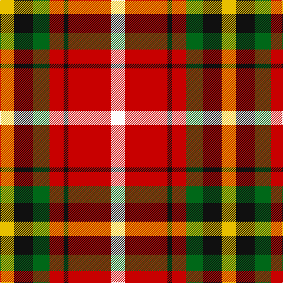

In pattern [WRKRGKY](/stripes/wrkrgky/).

This was sourced from register-of-tartans.  It is a [7 stripe tartan](/stripes/stripes7/).

Original link https://www.tartanregister.gov.uk/tartanDetails.aspx?ref=4102

## Register references

External register numbers recorded for this tartan.

- Scottish Register of Tartans: [4102](https://www.tartanregister.gov.uk/tartanDetails.aspx?ref=4102)
- Scottish Tartans Authority (ITI): 6275

## Thread count
Y/24 K32 G28 R24 K8 R72 W/24

## Palette
Each colour and the base-6 reference it is a variant of.

| Colour | Shade | Base |
|---|---|---|
| G | <code style="background-color:#006818;">#006818</code> `oklch(45.0% 0.142 145.0)` <small>#006818</small> | G <code style="background-color:#006100;">#006100</code> |
| K | <code style="background-color:#101010;">#101010</code> `oklch(17.3% 0.000 89.9)` <small>#101010</small> | K <code style="background-color:#000000;">#000000</code> |
| R | <code style="background-color:#C80000;">#C80000</code> `oklch(52.3% 0.215 29.2)` <small>#C80000</small> | R <code style="background-color:#CC0000;">#CC0000</code> |
| W | <code style="background-color:#FCFCFC;">#FCFCFC</code> `oklch(99.1% 0.000 89.9)` <small>#FCFCFC</small> | W <code style="background-color:#F7F7F7;">#F7F7F7</code> |
| Y | <code style="background-color:#E8C000;">#E8C000</code> `oklch(81.9% 0.168 93.7)` <small>#E8C000</small> | Y <code style="background-color:#F2BF00;">#F2BF00</code> |

# Sample pattern

## Nearest tartans

The nearest existing variants by ΔTartan distance.

1. [Abbink, Ingmar (Personal)](/setts/s5/r39t22k11ly22g5~x2/) — ΔT 1.22
1. [Melieres, Carolyn (Personal)](/setts/s10/ly4w2ly2w8r16g3r3g8r6k2~x2/) — ΔT 1.25
1. [Rose, White dress](/setts/s6/r32db6k6g6w18k3/) — ΔT 1.27
1. [Scottish American Athletic Assoc](/setts/s5/ly32k21r16lr6dt4~x2/) — ΔT 1.29
1. [Keeling](/setts/s7/ly17g7ly6r43k5o6k13~x2/) — ΔT 1.35
1. [Thirkill](/setts/s9/w4k2r15k2r5y7dg7k2ly4~x2/) — ΔT 1.36
1. [Aboyne II (Fashion)](/setts/s6/r2ly1r5k4g5w1~x4/) — ΔT 1.37
1. [De Maynard (Personal)](/setts/s8/dp2o9g8o4ly1o4db10w2~x4/) — ΔT 1.44
1. [Wilson's, No 2](/setts/s8/dp2r11t9dp11ly2g13r21w2~x2/) — ΔT 1.45
1. [Montrose](/setts/s9/lb2k2r14dg15k8lb7r14k2lb2/) — ΔT 1.45

## Neighbour map

Every grey dot is one of 14299 variants placed by the first two principal components of the ΔTartan feature space (44% of its variance). Red is this tartan; blue dots are its nearest — click one to open its page.

<svg viewBox="0 0 640 380" role="img" style="max-width:100%;height:auto;border:1px solid #e0e0e0;border-radius:4px;display:block" xmlns="http://www.w3.org/2000/svg"><image href="/nn/cloud.v1.png" width="640" height="380"/><a href="/setts/s5/r39t22k11ly22g5~x2/"><circle cx="130.8" cy="203.4" r="4" fill="#3465a4"><title>Abbink, Ingmar (Personal)</title></circle></a><a href="/setts/s10/ly4w2ly2w8r16g3r3g8r6k2~x2/"><circle cx="174.1" cy="156.3" r="4" fill="#3465a4"><title>Melieres, Carolyn (Personal)</title></circle></a><a href="/setts/s6/r32db6k6g6w18k3/"><circle cx="180.3" cy="154.9" r="4" fill="#3465a4"><title>Rose, White dress</title></circle></a><a href="/setts/s5/ly32k21r16lr6dt4~x2/"><circle cx="130.7" cy="196.8" r="4" fill="#3465a4"><title>Scottish American Athletic Assoc</title></circle></a><a href="/setts/s7/ly17g7ly6r43k5o6k13~x2/"><circle cx="162.5" cy="148.0" r="4" fill="#3465a4"><title>Keeling</title></circle></a><a href="/setts/s9/w4k2r15k2r5y7dg7k2ly4~x2/"><circle cx="121.0" cy="157.4" r="4" fill="#3465a4"><title>Thirkill</title></circle></a><a href="/setts/s6/r2ly1r5k4g5w1~x4/"><circle cx="113.6" cy="221.6" r="4" fill="#3465a4"><title>Aboyne II (Fashion)</title></circle></a><a href="/setts/s8/dp2o9g8o4ly1o4db10w2~x4/"><circle cx="141.3" cy="162.2" r="4" fill="#3465a4"><title>De Maynard (Personal)</title></circle></a><a href="/setts/s8/dp2r11t9dp11ly2g13r21w2~x2/"><circle cx="170.8" cy="159.6" r="4" fill="#3465a4"><title>Wilson's, No 2</title></circle></a><a href="/setts/s9/lb2k2r14dg15k8lb7r14k2lb2/"><circle cx="159.2" cy="183.9" r="4" fill="#3465a4"><title>Montrose</title></circle></a><circle cx="149.6" cy="180.2" r="5" fill="#c00000"/></svg>

ID: /setts/s7/w6r18k2r6g7k8ly6~x4/
