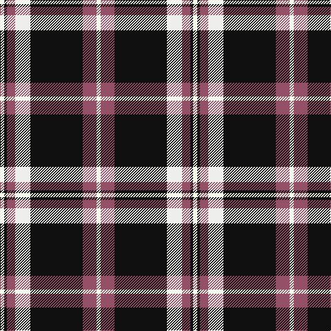

In pattern [WKRWKRW](/patterns/wkrwkrw/).

This was sourced from register-of-tartans.  It is a [7 stripes tartan](/stripes/stripes7/).

Original link https://www.tartanregister.gov.uk/tartanDetails.aspx?ref=10050

## Thread count
W/6 K4 LT12 Wa22 K76 LT20 W/6

## Palette
Each colour and its ΔE from the base-6 reference it is a variant of.

| Colour | Shade | Base | ΔE (OKLab) |
|---|---|---|---|
| K | <code style="background-color:#101010;">#101010</code> `#101010` | K <code style="background-color:#000000;">#000000</code> | 0.17 |
| LT | <code style="background-color:#945067;">#945067</code> `#945067` | R <code style="background-color:#C80000;">#C80000</code> | 0.14 |
| W | <code style="background-color:#F7FEEE;">#F7FEEE</code> `#F7FEEE` | W <code style="background-color:#F4F4F0;">#F4F4F0</code> | 0.03 |
| Wa | <code style="background-color:#EEEEEC;">#EEEEEC</code> `#EEEEEC` | W <code style="background-color:#F4F4F0;">#F4F4F0</code> | 0.02 |

# Sample pattern

ID: /setts/s7/w6r20k76wa22r12k4w6-k101010-r945067-wf7feee-waeeeeec/
