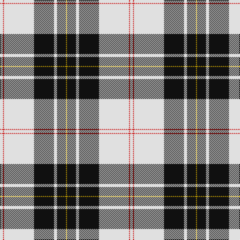

In pattern [WRWKWKY](/patterns/wrwkwky/).

This was sourced from register-of-tartans.  It is a [7 stripes tartan](/stripes/stripes7/).

Original link https://www.tartanregister.gov.uk/tartanDetails.aspx?ref=2713

## Thread count
LN/6 R2 LN60 K40 LN6 K18 Ya/2

## Palette
Each colour and its ΔE from the base-6 reference it is a variant of.

| Colour | Shade | Base | ΔE (OKLab) |
|---|---|---|---|
| K | <code style="background-color:#101010;">#101010</code> `#101010` | K <code style="background-color:#000000;">#000000</code> | 0.17 |
| LN | <code style="background-color:#E0E0E0;">#E0E0E0</code> `#E0E0E0` | W <code style="background-color:#F7F7F7;">#F7F7F7</code> | 0.07 |
| R | <code style="background-color:#C80000;">#C80000</code> `#C80000` | R <code style="background-color:#CC0000;">#CC0000</code> | 0.01 |
| W | <code style="background-color:#FCFCFC;">#FCFCFC</code> `#FCFCFC` | W <code style="background-color:#F7F7F7;">#F7F7F7</code> | 0.01 |
| Y | <code style="background-color:#E8C000;">#E8C000</code> `#E8C000` | Y <code style="background-color:#F2BF00;">#F2BF00</code> | 0.02 |
| Ya | <code style="background-color:#D8B000;">#D8B000</code> `#D8B000` | Y <code style="background-color:#F2BF00;">#F2BF00</code> | 0.06 |

# Sample pattern

## Nearest tartans

The nearest existing variants by ΔTartan distance.

1. [MacPherson 6](/setts/s7/w6r2w60k40w6k18y2-k000000-rc00000-we0e0e0-yf0c000/) — ΔT 0.65
1. [MacPherson Dress](/setts/s7/w3r1w30k20w3k9y1-k000000-rc80000-wd0d0d0-yffc800/) — ΔT 0.85
1. [MacPherson - 1842 (VS) Dress](/setts/s7/w4r8w68k44w8k16y4-k101010-ra00048-we0e0e0-yd8b000/) — ΔT 0.95
1. [Caithness Glass (Corporate)](/setts/s6/r2w20y4w32b80w2-b1c1c50-rc80000-wfcfcec-ye8c000/) — ΔT 1.10
1. [Unidentified (shirt fabric)](/setts/s9/w5b3w25k2w2k16g8k1w4-b2c2c80-g009420-k101010-we0e0e0/) — ΔT 1.13
1. [Gretna Football Club (Corporate)](/setts/s7/w36k8w36k95w4k4r6-k101010-rc80000-wfcfcdc/) — ΔT 1.17
1. [Richecourt, Baron of (Personal)](/setts/s7/w8k60r2k2r6w24y6-k101010-rc80000-wfcfcfc-ye8c000/) — ΔT 1.17
1. [St. Piran Dress](/setts/s8/r8w38g4w16g4w16k76w8-g003820-k101010-rc80000-we0e0e0/) — ΔT 1.20
1. [MacPherson of Cluny Clan Tartan Tartan Number: 1830. Earliest known date: 1948 Also known as MacPherson Dress often woven with purple in place of red See products available Copyright © Blair Urquhart, Comrie, 2015](/setts/s7/w10r6w70k56w8k22w4-k101010-rc80000-we0e0e0/) — ΔT 1.21
1. [MacPherson of Cluny (Black and White)](/setts/s7/w10r6w70k56w8k22w4-k101010-rc80000-wfcfcfc/) — ΔT 1.24

## Neighbour map

Every grey dot is one of 15726 variants placed by the first two principal components of the ΔTartan feature space (44% of its variance). Red is this tartan; blue dots are its nearest — click one to open its page.

<svg viewBox="0 0 640 380" role="img" style="max-width:100%;height:auto;border:1px solid #e0e0e0;border-radius:4px;display:block" xmlns="http://www.w3.org/2000/svg"><image href="/nn/cloud.v1.png" width="640" height="380"/><a href="/setts/s7/w6r2w60k40w6k18y2-k000000-rc00000-we0e0e0-yf0c000/"><circle cx="318.2" cy="125.7" r="4" fill="#3465a4"><title>MacPherson 6</title></circle></a><a href="/setts/s7/w3r1w30k20w3k9y1-k000000-rc80000-wd0d0d0-yffc800/"><circle cx="320.3" cy="127.6" r="4" fill="#3465a4"><title>MacPherson Dress</title></circle></a><a href="/setts/s7/w4r8w68k44w8k16y4-k101010-ra00048-we0e0e0-yd8b000/"><circle cx="280.2" cy="142.9" r="4" fill="#3465a4"><title>MacPherson - 1842 (VS) Dress</title></circle></a><a href="/setts/s6/r2w20y4w32b80w2-b1c1c50-rc80000-wfcfcec-ye8c000/"><circle cx="350.8" cy="115.6" r="4" fill="#3465a4"><title>Caithness Glass (Corporate)</title></circle></a><a href="/setts/s9/w5b3w25k2w2k16g8k1w4-b2c2c80-g009420-k101010-we0e0e0/"><circle cx="275.5" cy="119.7" r="4" fill="#3465a4"><title>Unidentified (shirt fabric)</title></circle></a><a href="/setts/s7/w36k8w36k95w4k4r6-k101010-rc80000-wfcfcdc/"><circle cx="344.9" cy="146.7" r="4" fill="#3465a4"><title>Gretna Football Club (Corporate)</title></circle></a><a href="/setts/s7/w8k60r2k2r6w24y6-k101010-rc80000-wfcfcfc-ye8c000/"><circle cx="327.4" cy="114.8" r="4" fill="#3465a4"><title>Richecourt, Baron of (Personal)</title></circle></a><a href="/setts/s8/r8w38g4w16g4w16k76w8-g003820-k101010-rc80000-we0e0e0/"><circle cx="255.1" cy="133.9" r="4" fill="#3465a4"><title>St. Piran Dress</title></circle></a><a href="/setts/s7/w10r6w70k56w8k22w4-k101010-rc80000-we0e0e0/"><circle cx="305.9" cy="164.7" r="4" fill="#3465a4"><title>MacPherson of Cluny Clan Tartan Tartan Number: 1830. Earliest known date: 1948 Also known as MacPherson Dress often woven with purple in place of red See products available Copyright © Blair Urquhart, Comrie, 2015</title></circle></a><a href="/setts/s7/w10r6w70k56w8k22w4-k101010-rc80000-wfcfcfc/"><circle cx="301.1" cy="161.0" r="4" fill="#3465a4"><title>MacPherson of Cluny (Black and White)</title></circle></a><circle cx="320.5" cy="123.3" r="5" fill="#c00000"/></svg>

ID: /setts/s7/w6r2w60k40w6k18y2-k101010-rc80000-we0e0e0-yd8b000/
